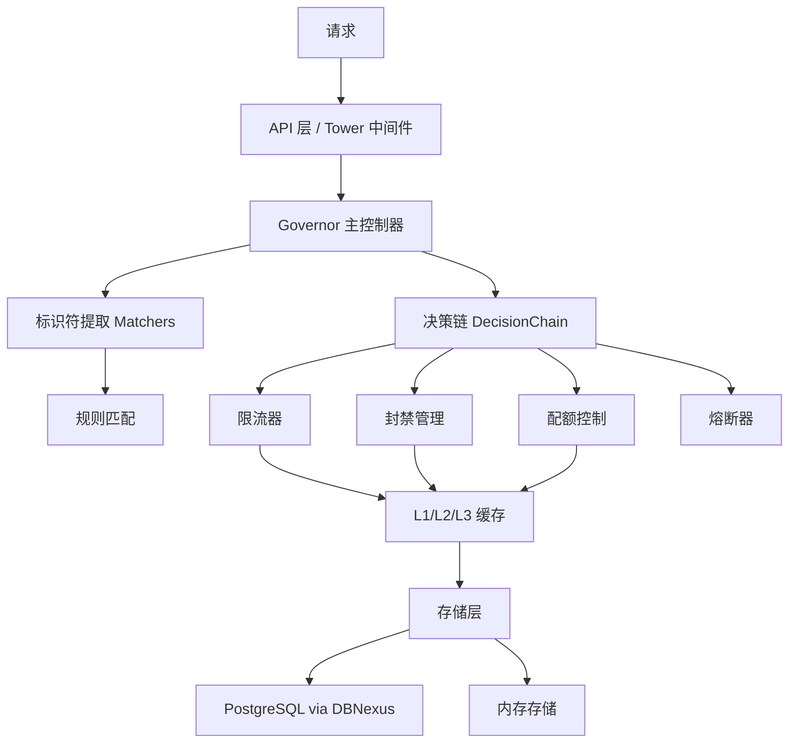

<div align="center">

# Limiteron

[](https://github.com/Kirky-X/limiteron/actions/workflows/ci.yml) [](https://crates.io/crates/limiteron) [](https://docs.rs/limiteron) [](https://crates.io/crates/limiteron) [](LICENSE) 

**Rust 统一流量控制框架** — 限流、配额管理、熔断、封禁一体化解决方案。

</div>

[English](./README_EN.md)

---

## ✨ 核心特性

- **多种限流算法**：令牌桶（Token Bucket）、固定窗口（Fixed Window）、滑动窗口（Sliding Window）、并发控制、GCRA
- **封禁管理**：IP / User / MAC / Geo 封禁、自动封禁、优先级体系、YAML 文件批量加载与热重载
- **配额控制**：周期性配额分配、配额预警、配额透支
- **熔断器**：自动故障转移、状态恢复、降级策略
- **标识符匹配**：IP、用户 ID、设备 ID、API Key、地理位置、设备信息、自定义匹配器
- **多存储后端**：内存存储开箱即用；通过 DBNexus 支持 PostgreSQL 持久化；缓存经 oxcache 统一管理
- **可观测性**：Prometheus 指标、OpenTelemetry 追踪、审计日志、日志脱敏
- **高性能**：P99 延迟 < 200μs，令牌桶吞吐 12M+ ops/s
- **声明式宏**：`#[flow_control]` 宏简化限流配置
- **Tower 中间件**：HTTP 中间件层集成
- **Admin REST API**：封禁 / 配额 / 状态管理端点

## 📦 快速开始

### 安装

```bash
cargo add limiteron
```

或手动添加到 `Cargo.toml`：

```toml
[dependencies]
limiteron = { version = "0.2.3", features = ["macros"] }
```

### 基础使用

**令牌桶限流器：**

```rust
use limiteron::limiters::{Limiter, TokenBucketLimiter};

#[tokio::main]
async fn main() -> Result<(), Box<dyn std::error::Error>> {
    // 10 个令牌，每秒补充 1 个
    let limiter = TokenBucketLimiter::new(10, 1);

    match limiter.allow(1).await? {
        true => println!("✅ 请求允许"),
        false => println!("❌ 请求被限流"),
    }
    Ok(())
}
```

**声明式宏：**

```rust
use limiteron::flow_control;

#[flow_control(rate = "100/s", quota = "10000/m", concurrency = 50)]
async fn api_handler(user_id: &str) -> Result<String, limiteron::error::LimiteronError> {
    Ok(format!("处理用户 {} 的请求", user_id))
}
```

**Governor 端到端控制：**

```rust
use limiteron::Governor;

let governor = Governor::new().await;
```

更多示例见 [`examples/`](examples/) 目录。

## 🔧 特性标志

Limiteron 默认不启用任何可选功能，按需开启：

| 预设 | 说明 | 启用的特性 |
|------|------|-----------|
| `minimal` | 核心限流 + PostgreSQL | `postgres` |
| `standard` | 核心 + 基础高级功能 | `postgres`, `ban-manager`, `quota-control`, `circuit-breaker` |
| `full` | 所有功能 | 全部特性 |

常用单独特性：

| 特性 | 描述 |
|------|------|
| `postgres` | PostgreSQL 存储（DBNexus） |
| `ban-manager` | 封禁管理 |
| `quota-control` | 配额控制 |
| `circuit-breaker` | 熔断器 |
| `cache-storage` | 缓存存储（oxcache Redis 集成） |
| `macros` | `#[flow_control]` 宏支持 |
| `telemetry` | OpenTelemetry 追踪 |
| `monitoring` | Prometheus 指标 |
| `tower-middleware` | Tower HTTP 中间件 |
| `admin-api` | 管理 REST API |
| `multi-tenant` | 多租户支持 |
| `geo-matching` | 地理位置匹配 |
| `device-matching` | 设备信息匹配 |

完整特性列表见 [Cargo.toml](Cargo.toml) 的 `[features]` 段。

## 🏗️ 架构


```mermaid
graph TB
    A[请求] --> B[API 层 / Tower 中间件]
    B --> C[Governor 主控制器]
    C --> D[标识符提取 Matchers]
    C --> E[决策链 DecisionChain]
    D --> F[规则匹配]
    E --> G[限流器]
    E --> H[封禁管理]
    E --> I[配额控制]
    E --> J[熔断器]
    G --> K[L1/L2/L3 缓存]
    H --> K
    I --> K
    K --> L[存储层]
    L --> M[PostgreSQL via DBNexus]
    L --> N[内存存储]
```

核心模块：

| 模块 | 路径 | 说明 |
|------|------|------|
| Governor | `src/governor.rs` | 主控制器，端到端流量控制 |
| Limiters | `src/limiters/` | 限流算法（令牌桶、固定窗口、滑动窗口、GCRA、并发） |
| Matchers | `src/matchers/` | 标识符提取与规则匹配 |
| Ban | `src/ban/` | 封禁管理、文件加载、热重载 |
| Quota | `src/quota/` | 配额控制 |
| Circuit | `src/circuit/` | 熔断器 |
| Storage | `src/storage/` | 存储 trait 与内存实现 |
| Adapters | `src/adapters/` | DBNexus 存储适配器（PostgreSQL） |
| Cache | `src/cache/` | oxcache 统一缓存服务 |
| DecisionChain | `src/decision_chain/` | 策略决策引擎 |
| Middleware | `src/middleware/` | Tower HTTP 中间件 |
| Admin | `src/admin/` | 管理 REST API |
| Telemetry | `src/telemetry/` | 指标与追踪 |

## 📚 文档

- 📖 [用户指南](docs/USER_GUIDE.md) — 详细使用教程
- 🔧 [API 参考](docs/API_REFERENCE.md) — API 文档
- ❓ [常见问题](docs/FAQ.md) — FAQ 与故障排除
- 📦 [示例](examples/) — 代码示例
- 📝 [更新日志](CHANGELOG.md) — 版本变更记录
- 🤝 [贡献指南](CONTRIBUTING.md) — 参与贡献

API 文档：[docs.rs/limiteron](https://docs.rs/limiteron)

## 🤝 贡献

欢迎贡献！详见 [CONTRIBUTING.md](CONTRIBUTING.md)。

## 📋 更新日志

详见 [CHANGELOG.md](CHANGELOG.md)。

## 📄 许可证

MIT License, Copyright (c) 2026 Kirky.X。详见 [LICENSE](LICENSE)。
