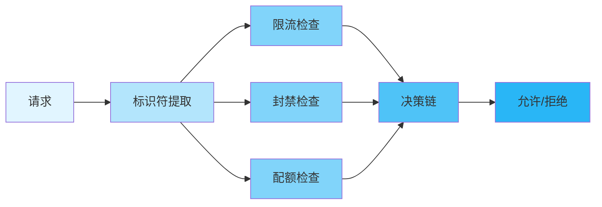
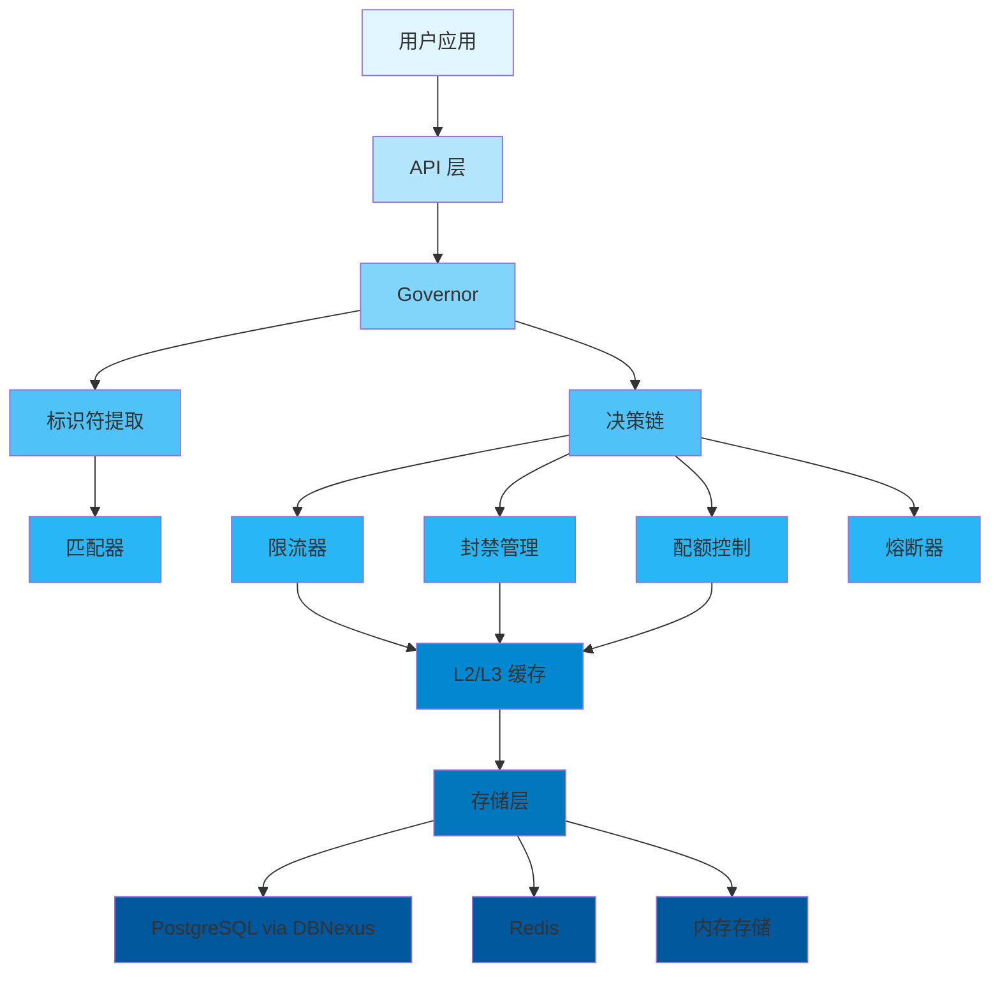
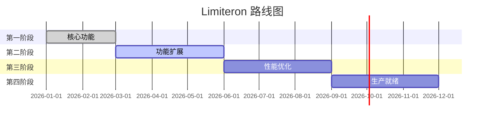

<div align="center">

<p>
  
</p>

<p>
  
  
  
  <a href="https://github.com/Kirky-X/limiteron/actions/workflows/ci.yml"></a>
  <a href="https://codecov.io/gh/Kirky-X/limiteron"></a>
  <a href="https://github.com/Kirky-X/limiteron/actions/workflows/benchmark.yml"></a>
  
  
  
  
  
</p>

<p align="center">
  <strong>Rust 统一流量控制框架</strong>
</p>

<p align="center">
  <a href="#-特性">特性</a> •
  <a href="#-快速开始">快速开始</a> •
  <a href="#-文档">文档</a> •
  <a href="#-示例">示例</a> •
  <a href="#-贡献">贡献</a>
</p>

</div>

---

## 📋 目录

<details open>
<summary>点击展开</summary>

- [✨ 特性](#✨-特性)
- [🎯 使用场景](#🎯-使用场景)
- [🚀 快速开始](#🚀-快速开始)
  - [安装](#安装)
  - [基本用法](#基本用法)
- [📚 文档](#📚-文档)
- [🎨 示例](#🎨-示例)
- [🏗️ 架构](#🏗️-架构)
- [⚙️ 配置](#⚙️-配置)
- [🧪 测试](#🧪-测试)
- [📊 性能](#📊-性能)
- [🔒 安全](#🔒-安全)
- [🗺️ 路线图](#🗺️-路线图)
- [🤝 贡献](#🤝-贡献)
- [📄 许可证](#📄-许可证)
- [🙏 致谢](#🙏-致谢)

</details>

---

## <span id="✨-特性">✨ 特性</span>

<table>
<tr>
<td width="50%">

### 🎯 核心特性

- ✅ **多种限流算法** - 令牌桶、固定窗口、滑动窗口、并发控制
- ✅ **封禁管理** - IP 封禁、自动封禁、封禁优先级
- ✅ **配额控制** - 配额分配、配额预警、配额透支
- ✅ **熔断器** - 自动故障转移、状态恢复、降级策略

</td>
<td width="50%">

### ⚡ 高级特性

- 🚀 **高性能** - P99 延迟 < 200μs
- 🔐 **安全可靠** - 内存安全、SQL 注入防护
- 🌐 **多存储支持** - 通过 DBNexus 支持 PostgreSQL、内存存储；支持 Redis 存储
- 📦 **易于使用** - 宏支持、简洁 API

</td>
</tr>
</table>

<div align="center">

### 🎨 特性亮点

</div>


```mermaid
graph LR
    A[请求] --> B[标识符提取]
    B --> C[限流检查]
    B --> D[封禁检查]
    B --> E[配额检查]
    C --> F[决策链]
    D --> F
    E --> F
    F --> G[允许/拒绝]

    style A fill:#e1f5ff
    style B fill:#b3e5fc
    style C fill:#81d4fa
    style D fill:#81d4fa
    style E fill:#81d4fa
    style F fill:#4fc3f7
    style G fill:#29b6f6
```

---

## 🎯 使用场景

<details>
<summary><b>💼 企业应用</b></summary>

<br>

```rust
use limiteron::limiters::{Limiter, TokenBucketLimiter};

async fn enterprise_api() -> Result<(), Box<dyn std::error::Error>> {
    let limiter = TokenBucketLimiter::new(100, 10); // 100 个令牌，每秒补充 10 个

    // 限流检查
    match limiter.allow(1).await {
        Ok(true) => {
            // 处理请求
            process_request().await;
        }
        Ok(false) => {
            eprintln!("超出限流限制");
        }
        Err(e) => {
            eprintln!("错误: {:?}", e);
        }
    }

    Ok(())
}

async fn process_request() {
    println!("处理请求...");
}
```

适用于需要高并发和高可靠性的企业应用。

</details>

<details>
<summary><b>🔧 API 服务</b></summary>

<br>

```rust
use limiteron::flow_control;

#[flow_control(rate = "100/s", quota = "10000/m", concurrency = 50)]
async fn api_handler(user_id: &str) -> Result<String, limiteron::error::FlowGuardError> {
    // API 业务逻辑
    Ok(format!("处理用户 {} 的请求", user_id))
}
```

适用于保护 API 服务免受滥用和 DDoS 攻击。

</details>

<details>
<summary><b>🌐 Web 应用</b></summary>

<br>

```rust
use limiteron::ban_manager::{BanManager, BanManagerConfig, BanTarget};
use limiteron::adapters::StorageFactory;
use std::sync::Arc;

async fn web_app() -> Result<(), Box<dyn std::error::Error>> {
    // 使用 DBNexus 工厂创建存储
    let mut factory = StorageFactory::from_dsn("postgresql://localhost/limiteron");
    factory.initialize(None).await?;
    let ban_storage = factory.create_ban_storage().await?;
    let ban_manager = BanManager::with_dependencies(ban_storage, BanManagerConfig::default()).await?;

    // 检查用户是否被封禁
    let user_target = BanTarget::UserId("user123".to_string());
    if let Some(ban_detail) = ban_manager.is_banned(&user_target).await? {
        println!("用户已被封禁: {}", ban_detail.reason);
        return Err("用户已被封禁".into());
    }

    // 处理请求
    println!("处理 user123 的请求");
    Ok(())
}
```

适用于需要防止恶意用户和爬虫的 Web 应用。

**或者使用 Mock 存储进行测试：**

```rust
use limiteron::ban_manager::{BanManager, BanTarget};
use limiteron::storage::MockBanStorage;
use std::sync::Arc;

async fn web_app_test() -> Result<(), Box<dyn std::error::Error>> {
    // 创建存储和封禁管理器
    let storage = Arc::new(MockBanStorage::default());
    let ban_manager = BanManager::new().await?;

    // 检查用户是否被封禁
    let user_target = BanTarget::UserId("user123".to_string());
    if let Some(ban_record) = ban_manager.is_banned(&user_target).await? {
        println!("用户被封禁: {:?}", ban_record);
        return Err("用户被封禁".into());
    }

    // 处理请求
    println!("处理 user123 的请求");
    Ok(())
}
```

</details>

---

## <span id="🚀-快速开始">🚀 快速开始</span>

### 安装

<table>
<tr>
<td width="50%">

#### 🦀 Cargo

```toml
[dependencies]
limiteron = { version = "0.2", features = ["macros"] }
```

</td>
<td width="50%">

#### 🔧 特性配置

```toml
[dependencies]
limiteron = { version = "0.2", features = ["postgres", "redis-storage", "macros"] }
```

</td>
</tr>
</table>

### 特性标志

<div align="center">

#### 🎛️ 可选特性配置

</div>

Limiteron 使用 feature flags 来控制功能启用，默认只启用内存存储：

<table>
<tr>
<td width="50%">

**预定义组合**
```toml
# 最小化：仅核心限流
limiteron = { version = "0.2", features = ["minimal"] }

# 标准：核心 + 基础高级功能
limiteron = { version = "0.2", features = ["standard"] }

# 完整：所有功能
limiteron = { version = "0.2", features = ["full"] }
```

</td>
<td width="50%">

**单独特性**
```toml
# 存储后端
limiteron = { version = "0.2", features = ["postgres", "redis-storage"] }

# 高级功能
limiteron = { version = "0.2", features = ["ban-manager", "quota-control", "circuit-breaker"] }

# 宏支持
limiteron = { version = "0.2", features = ["macros"] }
```

</td>
</tr>
</table>

<details>
<summary><b>📋 完整特性列表</b></summary>

<br>

| 特性 | 描述 | 默认 |
|------|------|------|
| `postgres` | PostgreSQL 存储（DBNexus） | ❌ |
| `redis-storage` | RedisStorage 存储后端（Storage/BanStorage/QuotaStorage） | ❌ |
| `ban-manager` | 封禁管理 | ❌ |
| `quota-control` | 配额控制 | ❌ |
| `circuit-breaker` | 熔断器 | ❌ |
| `cache-service` | 统一缓存服务（支持 DI） | ❌ |
| `cache-storage` | 缓存存储（oxcache Redis 集成） | ❌ |
| `lua-script` | Lua 脚本支持（oxcache） | ❌ |
| `tower-middleware` | Tower 中间件集成 | ❌ |
| `event-system` | 事件系统 | ❌ |
| `macros` | 宏支持 | ❌ |
| `telemetry` | 遥测和追踪 | ❌ |
| `monitoring` | Prometheus 指标 | ❌ |
| `metrics` | DBNexus 指标导出 | ❌ |
| `config-watcher` | 配置热更新 | ❌ |
| `config-security` | 配置安全验证 | ❌ |
| `validation` | 请求验证 | ❌ |
| `fallback` | 降级策略 | ❌ |
| `audit-log` | 审计日志 | ❌ |
| `log-redaction` | 日志脱敏 | ❌ |
| `parallel-checker` | 并行封禁检查 | ❌ |
| `geo-matching` | 地理位置匹配 | ❌ |
| `device-matching` | 设备信息匹配 | ❌ |
| `gcra` | GCRA 限流算法 | ❌ |
| `custom-limiter` | 自定义限流器支持 | ❌ |
| `multi-tenant` | 多租户支持 | ❌ |
| `admin-api` | 管理 REST API | ❌ |
| `webhook` | Webhook 通知 | ❌ |

</details>

### 基本用法

<div align="center">

#### 🎬 5 分钟快速开始

</div>

<table>
<tr>
<td width="50%">

**步骤 1: 添加依赖**

```toml
[dependencies]
limiteron = { version = "0.2", features = ["macros"] }
```

</td>
<td width="50%">

**步骤 2: 使用宏**

```rust
use limiteron::flow_control;

#[flow_control(rate = "10/s")]
async fn api_call() -> Result<String, limiteron::error::FlowGuardError> {
    Ok("成功".to_string())
}
```

</td>
</tr>
</table>

<details>
<summary><b>📖 完整示例</b></summary>

<br>

```rust
use limiteron::limiters::{Limiter, TokenBucketLimiter};

#[tokio::main]
async fn main() -> Result<(), Box<dyn std::error::Error>> {
    // 步骤 1: 创建限流器
    let limiter = TokenBucketLimiter::new(10, 1); // 10 个令牌，每秒补充 1 个

    // 步骤 2: 检查限流
    match limiter.allow(1).await {
        Ok(true) => println!("✅ 请求允许"),
        Ok(false) => println!("❌ 请求被限流"),
        Err(e) => println!("❌ 错误: {:?}", e),
    }

    // 步骤 3: 使用成本
    match limiter.allow(2).await {
        Ok(true) => println!("✅ 成本为 2 的请求允许"),
        Ok(false) => println!("❌ 成本为 2 的请求被限流"),
        Err(e) => println!("❌ 错误: {:?}", e),
    }

    Ok(())
}
```

</details>

---

## <span id="📚-文档">📚 文档</span>

<div align="center">

<table>
<tr>
<td align="center" width="25%">
<a href="docs/USER_GUIDE.md">
<br>
<b>用户指南</b>
</a><br>
完整使用指南
</td>
<td align="center" width="25%">
<a href="docs/API_REFERENCE.md">
<br>
<b>API 参考</b>
</a><br>
完整 API 文档
</td>
<td align="center" width="25%">
<a href="docs/FAQ.md">
<br>
<b>常见问题</b>
</a><br>
常见问题解答
</td>
<td align="center" width="25%">
<a href="examples/">
<br>
<b>示例</b>
</a><br>
代码示例
</td>
</tr>
</table>

</div>

### 📖 更多资源

- 🎓 [用户指南](docs/USER_GUIDE.md) - 详细教程
- 🔧 [API 参考](docs/API_REFERENCE.md) - API 文档
- ❓ [常见问题](docs/FAQ.md) - 常见问题解答
- 🐛 [故障排除](docs/FAQ.md#troubleshooting) - 常见问题和解决方案

---

## <span id="🎨-示例">🎨 示例</span>

<div align="center">

### 💡 实用示例

</div>

<table>
<tr>
<td width="50%">

#### 📝 示例 1: 基础限流

```rust
use limiteron::limiters::{Limiter, TokenBucketLimiter};

#[tokio::main]
async fn main() -> Result<(), Box<dyn std::error::Error>> {
    let limiter = TokenBucketLimiter::new(10, 1);

    for i in 0..15 {
        match limiter.allow(1).await {
            Ok(true) => println!("请求 {} ✅", i),
            Ok(false) => println!("请求 {} ❌", i),
            Err(e) => println!("请求 {} 错误: {:?}", i, e),
        }
    }

    Ok(())
}
```

<details>
<summary>查看输出</summary>

```
请求 0 ✅
请求 1 ✅
...
请求 9 ✅
请求 10 ❌
...
请求 14 ❌
✅ 前 10 个请求允许，其余被限流
```

</details>

</td>
<td width="50%">

#### 🔥 示例 2: 使用宏

```rust
use limiteron::flow_control;

#[flow_control(rate = "100/s", quota = "10000/m", concurrency = 50)]
async fn api_handler(user_id: &str) -> Result<String, Box<dyn std::error::Error>> {
    // API 业务逻辑
    Ok(format!("处理用户 {} 的请求", user_id))
}

#[tokio::main]
async fn main() -> Result<(), Box<dyn std::error::Error>> {
    let result = api_handler("user123").await?;
    println!("{}", result);
    Ok(())
}
```

<details>
<summary>查看输出</summary>

```
处理用户 user123 的请求
✅ 宏自动处理限流
```

</details>

</td>
</tr>
</table>

<div align="center">

**[📂 查看所有示例 →](examples/)**

</div>

---

## <span id="🏗️-架构">🏗️ 架构</span>

<div align="center">

### 系统概览

</div>


```mermaid
graph TB
    A[用户应用] --> B[API 层]
    B --> C[Governor]
    C --> D[标识符提取]
    C --> E[决策链]
    D --> F[匹配器]
    E --> G[限流器]
    E --> H[封禁管理]
    E --> I[配额控制]
    E --> J[熔断器]
    G --> K[L2/L3 缓存]
    H --> K
    I --> K
    K --> L[存储层]
    L --> M[PostgreSQL via DBNexus]
    L --> N[Redis]
    L --> O[内存存储]

    style A fill:#e1f5ff
    style B fill:#b3e5fc
    style C fill:#81d4fa
    style D fill:#4fc3f7
    style E fill:#4fc3f7
    style F fill:#29b6f6
    style G fill:#29b6f6
    style H fill:#29b6f6
    style I fill:#29b6f6
    style J fill:#29b6f6
    style K fill:#0288d1
    style L fill:#0277bd
    style M fill:#01579b
    style N fill:#01579b
    style O fill:#01579b
```

<details>
<summary><b>📐 组件详情</b></summary>

<br>

| 组件 | 描述 | 状态 |
|------|------|------|
| **Governor** | 主控制器，端到端流量控制 | ✅ 稳定 |
| **Matchers** | 标识符提取（IP、用户 ID、设备 ID 等） | ✅ 稳定 |
| **Limiters** | 多种限流算法 | ✅ 稳定 |
| **封禁管理** | IP 封禁、自动封禁 | ✅ 稳定 |
| **配额控制** | 配额分配、配额预警 | ✅ 稳定 |
| **熔断器** | 自动故障转移、状态恢复 | ✅ 稳定 |
| **缓存** | L2/L3 缓存支持 | ✅ 稳定 |
| **存储层** | PostgreSQL via DBNexus、Redis、内存 | ✅ 稳定 |

</details>

<details>
<summary><b>💾 存储后端</b></summary>

<br>

Limiteron 支持多种存储后端，通过 trait 抽象实现可插拔：

| 存储后端 | 模块 | 特性 | 说明 |
|---------|------|------|------|
| **MemoryStorage** | `src/storage/mod.rs` | （始终可用） | 内存存储，适用于单实例开发和测试 |
| **DBNexusStorageAdapter** | `src/adapters/dbnexus_storage.rs` | `postgres` | 通过 DBNexus 支持 PostgreSQL，生产级持久化 |
| **RedisStorage** | `src/storage/redis.rs` | `redis-storage` | Redis 存储后端，实现 `Storage`/`BanStorage`/`QuotaStorage` trait，适用于多实例分布式场景 |

**RedisStorage 使用示例：**

```rust
use limiteron::storage::RedisStorage;
use limiteron::storage::Storage;

let redis_storage = RedisStorage::new("redis://127.0.0.1:6379").await?;
// 或从已有 client 创建
// let redis_storage = RedisStorage::from_client(client);

// RedisStorage 实现 Storage / BanStorage / QuotaStorage trait
let governor = Governor::builder()
    .with_storage(Arc::new(redis_storage))
    .build()
    .await?;
```

</details>

---

## <span id="⚙️-配置">⚙️ 配置</span>

<div align="center">

### 🎛️ 配置选项

</div>

Limiteron 使用 TOML 格式的配置文件（`config.toml`），支持环境变量覆盖。

<table>
<tr>
<td width="50%">

**TOML 配置 (config.toml)**

```toml
version = "1.0"

[global]
storage = "memory"
cache = "memory"
metrics = "prometheus"

[[rules]]
id = "api_rate_limit"
name = "API Rate Limit"
priority = 100

[rules.matchers]
type = "User"
user_ids = ["*"]

[[rules.limiters]]
type = "TokenBucket"
capacity = 1000
refill_rate = 100

[rules.action]
on_exceed = "reject"
```

</td>
<td width="50%">

**环境变量覆盖**

```bash
# 覆盖全局存储
export LIMITERON_GLOBAL_STORAGE=redis
```

**加载配置**

```rust
use limiteron::ConfigLoader;

let config = ConfigLoader::load_from_file("config.toml")?;
```

</td>
</tr>
</table>

<details>
<summary><b>🔧 所有配置选项</b></summary>

<br>

| 选项 | 类型 | 默认值 | 描述 |
|------|------|--------|------|
| `version` | String | "0.1.0" | 配置版本 |
| `global.storage` | String | "memory" | 存储类型: postgres (通过 DBNexus) / redis / memory |
| `global.cache` | String | "memory" | 缓存类型: memory/redis |
| `global.metrics` | String | "prometheus" | 指标类型 |
| `rules[].id` | String | - | 规则标识符 |
| `rules[].name` | String | - | 规则名称 |
| `rules[].priority` | u16 | 100 | 规则优先级 |
| `rules[].limiters[].capacity` | u64 | - | 限流器容量 |
| `rules[].limiters[].refill_rate` | u64 | - | 限流器补充速率 |
| `rate_limit` | String | "100/s" | 速率限制 |
| `quota_limit` | String | "10000/m" | 配额限制 |
| `concurrency_limit` | Integer | 50 | 并发限制 |
| `l2_capacity` | Integer | 10000 | L2 缓存容量 |
| `l3_capacity` | Integer | 100000 | L3 缓存容量 |
| `enable_metrics` | Boolean | false | 启用指标 |
| `enable_tracing` | Boolean | false | 启用追踪 |

</details>

**ConfigBuilder（编程方式）**

```rust
use limiteron::ConfigBuilder;

let config = ConfigBuilder::new()
    .with_storage("memory")
    .with_rule(|rule| {
        rule.id("default")
            .token_bucket(1000, 100)
    })
    .build()?;
```

---

## <span id="🧪-测试">🧪 测试</span>

**测试状态: 2000+ 个测试全部通过 ✅**

| 测试类型 | 测试数量 | 状态 |
|---------|---------|------|
| 单元测试 | 1700+ | ✅ 通过 |
| 集成测试 | 161 | ✅ 通过 |
| 文档测试 | 145+ | ✅ 通过 |

```bash
# 运行所有测试
cargo test --all-features

# 运行单元测试
cargo test --lib

# 运行集成测试（需要 Docker 服务）
cargo test --test integration_tests -- --ignored

# 运行特定测试
cargo test test_name

# 运行基准测试
cargo bench

# 生成覆盖率报告
cargo tarpaulin --out Html
```

详细测试文档: [TESTING.md](./docs/TESTING.md)
覆盖率报告: [COVERAGE_REPORT.md](./docs/COVERAGE_REPORT.md)

---

## <span id="📊-性能">📊 性能</span>

<div align="center">

### ⚡ 基准测试结果

</div>

> **注意:** 以下数据来自综合测试的实际基准测试结果 (2026-01-19)。

<table>
<tr>
<td width="50%">

**吞吐量**

| 限流器类型 | 实际 | 目标 | 达标率 |
|------------|------|------|--------|
| TokenBucket | **12M+ ops/s** | 500K ops/s | ✅ 24x |
| FixedWindow | **20M+ ops/s** | 300K ops/s | ✅ 66x |
| ConcurrencyLimiter | **12M+ ops/s** | 200K ops/s | ✅ 60x |

</td>
<td width="50%">

**延迟**

| 百分位 | TokenBucket | FixedWindow |
|--------|-------------|-------------|
| P50 | < 100ns | < 100ns |
| P95 | < 200ns | < 150ns |
| P99 | < 1µs | < 500ns |

</td>
</tr>
</table>

#### 并发测试结果

| 测试项 | 结果 | 状态 |
|--------|------|------|
| 数据一致性 | 100% | ✅ 通过 |
| 高并发稳定性 | 50/100 并发 | ✅ 通过 |
| 限流正确性 | 1000/1000 | ✅ 通过 |

<details>
<summary><b>📈 详细基准测试</b></summary>

<br>

```bash
# 运行性能测试
cd temp/comprehensive_test
./target/release/functional_test    # 功能测试
./target/release/performance_test   # 性能测试
./target/release/concurrency_test   # 并发测试
```

**示例输出:**
```
功能测试: 7/7 通过 (100%)
TokenBucket: 12,088,759 ops/s
FixedWindow: 19,920,188 ops/s
ConcurrencyLimiter: 11,891,237 ops/s
并发测试: 100% 数据一致性
```

</details>

---

## <span id="🔒-安全">🔒 安全</span>

<div align="center">

### 🛡️ 安全特性

</div>

<table>
<tr>
<td align="center" width="25%">
<br>
<b>内存安全</b><br>
Rust 保证内存安全
</td>
<td align="center" width="25%">
<br>
<b>输入验证</b><br>
全面的输入检查
</td>
<td align="center" width="25%">
<br>
<b>SQL 注入防护</b><br>
参数化查询
</td>
<td align="center" width="25%">
<br>
<b>密码保护</b><br>
安全的密码存储
</td>
</tr>
</table>

<details>
<summary><b>🔐 安全详情</b></summary>

<br>

### 安全措施

- ✅ **内存保护** - Rust 内存安全保证
- ✅ **输入验证** - IP 地址、用户 ID、MAC 地址验证
- ✅ **SQL 注入防护** - 使用参数化查询
- ✅ **密码保护** - 使用 secrecy 库处理敏感数据
- ✅ **审计日志** - 完整的操作跟踪

### 报告安全问题

请通过 GitHub Issues 报告安全漏洞。

</details>

---

## <span id="🗺️-路线图">🗺️ 路线图</span>

<div align="center">

### 🎯 开发计划

</div>


```mermaid
gantt
    title Limiteron 路线图
    dateFormat  YYYY-MM
    section 第一阶段
    核心功能           :done, 2026-01, 2026-03
    section 第二阶段
    功能扩展      :active, 2026-03, 2026-06
    section 第三阶段
    性能优化 :2026-06, 2026-09
    section 第四阶段
    生产就绪        :2026-09, 2026-12
```

<table>
<tr>
<td width="50%">

### ✅ 已完成

- [x] 核心限流
- [x] 封禁管理
- [x] 配额控制
- [x] 熔断器
- [x] 单元和集成测试
- [x] 宏支持
- [x] 通过 DBNexus 支持 PostgreSQL 存储
- [x] RedisStorage 存储后端（v0.2.0）
- [x] Governor 优雅关闭与健康检测（v0.2.0）
- [x] ConfigLoader 环境变量覆盖（v0.2.0）
- [x] CircuitBreaker `new()` 默认构造（v0.2.0）
- [x] 95%+ 测试覆盖率（v0.2.0）
- [x] pangu 工业级 harness 完整（v0.2.0）
- [x] diting 全维度代码审查（v0.2.0）
- [x] 文档完善与 20 个示例（v0.2.0）

</td>
<td width="50%">

### 🚧 进行中

- [ ] 性能优化
- [ ] 监控和追踪改进

</td>
</tr>
<tr>
<td width="50%">

### 🔜 v0.2.1 计划

- [ ] Tower 中间件集成完善
- [ ] 事件系统增强
- [ ] 更多存储后端测试覆盖
- [ ] 性能基准测试更新

</td>
<td width="50%">

### 🎯 v0.3.0 计划

- [ ] 分布式限流（跨实例 Redis Lua 协调）
- [ ] Governor shutdown 完整实现（后台任务等待/状态刷新/连接释放/Drop trait）
- [ ] MySQL/SQLite 存储支持（待 DBNexus 支持）
- [ ] HTB 分层令牌桶
- [ ] Bulkhead 隔离

</td>
</tr>
<tr>
<td width="50%">

### 📋 计划中

- [ ] Lua 脚本增强
- [ ] 自定义匹配器扩展
- [ ] 更多存储后端
- [ ] Web UI 管理界面

</td>
<td width="50%">

### 💡 未来想法

- [ ] 机器学习驱动的限流
- [ ] 更多限流算法
- [ ] 社区插件系统

</td>
<td width="50%">

</td>
</tr>
</table>

---

## <span id="🤝-贡献">🤝 贡献</span>

<div align="center">

### 💖 欢迎贡献！

</div>

<table>
<tr>
<td width="33%" align="center">

### 🐛 报告问题

发现 Bug？<br>
[创建 Issue](../../issues)

</td>
<td width="33%" align="center">

### 💡 功能建议

有建议？<br>
[开始讨论](../../discussions)

</td>
<td width="33%" align="center">

### 🔧 提交代码

想贡献？<br>
[Fork & PR](../../pulls)

</td>
</tr>
</table>

<details>
<summary><b>📝 贡献指南</b></summary>

<br>

### 如何贡献

1. **Fork** 仓库
2. **Clone** 你的 fork: `git clone https://github.com/yourusername/limiteron.git`
3. **Create** 分支: `git checkout -b feature/amazing-feature`
4. **Make** 你的更改
5. **Test** 你的更改: `cargo test --all-features`
6. **Commit** 你的更改: `git commit -m 'Add amazing feature'`
7. **Push** 到分支: `git push origin feature/amazing-feature`
8. **Create** Pull Request

### 代码风格

- 遵循 Rust 标准编码约定
- 编写全面的测试
- 更新文档
- 为新功能添加示例

</details>

---

## <span id="📄-许可证">📄 许可证</span>

<div align="center">

本项目采用 Apache 2.0 许可证:

[](LICENSE)

</div>

---

## <span id="🙏-致谢">🙏 致谢</span>

<div align="center">

### 使用优秀工具构建

</div>

<table>
<tr>
<td align="center" width="25%">
<a href="https://www.rust-lang.org/">
<br>
<b>Rust</b>
</a>
</td>
<td align="center" width="25%">
<a href="https://github.com/">
<br>
<b>GitHub</b>
</a>
</td>
<td align="center" width="25%">
<br>
<b>开源</b>
</td>
<td align="center" width="25%">
<br>
<b>社区</b>
</td>
</tr>
</table>

### 特别感谢

- 🌟 **依赖** - 基于这些优秀项目构建:
  - [tokio](https://tokio.rs/) - 异步运行时
  - [sqlx](https://github.com/launchbadge/sqlx) - 异步 SQL 工具包
  - [dbnexus](https://github.com/) - 数据库抽象层
  - [redis](https://github.com/redis-rs/redis-rs) - Redis 客户端
  - [dashmap](https://github.com/xacrimon/dashmap) - 并发 HashMap
  - [lru](https://github.com/jeromefroe/lru-rs) - LRU 缓存

- 👥 **贡献者** - 感谢所有贡献者！
- 💬 **社区** - 特别感谢社区成员

---

## 📞 联系与支持

<div align="center">

<table>
<tr>
<td align="center" width="33%">
<a href="../../issues">
<br>
<b>Issues</b>
</a><br>
报告 Bug 和错误
</td>
<td align="center" width="33%">
<a href="../../discussions">
<br>
<b>讨论</b>
</a><br>
提问和分享想法
</td>
<td align="center" width="33%">
<a href="https://github.com/Kirky-X/limiteron">
<br>
<b>GitHub</b>
</a><br>
查看源代码
</td>
</tr>
</table>

### 保持联系

[](https://github.com/Kirky-X/limiteron)

</div>

---

## ⭐ Star 历史

<div align="center">

[](https://star-history.com/#Kirky-X/limiteron&Date)

</div>

---

<div align="center">

### 💝 支持本项目

如果你觉得这个项目有用，请考虑给它一个 ⭐️！

**由 Kirky.X 用 ❤️ 构建**

[⬆ 返回顶部](#readme)

---

<sub>© 2026 Kirky.X. 保留所有权利。</sub>

</div>
