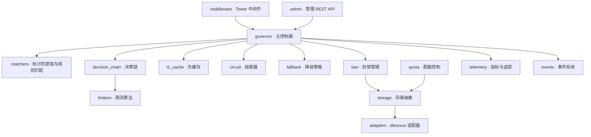
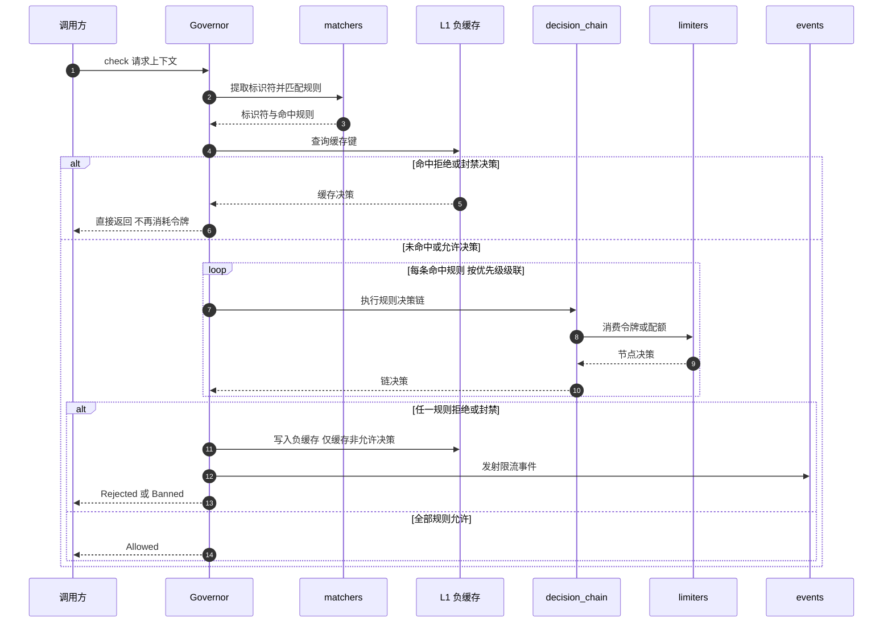

<div align="center">


[](https://github.com/Kirky-X/limiteron/actions/workflows/ci.yml) [](https://crates.io/crates/limiteron) [](https://docs.rs/limiteron) [](https://crates.io/crates/limiteron) [](LICENSE) [](https://www.rust-lang.org/)

**中文** | [English](README_EN.md)

**Rust 统一流量控制框架**

[✨ 功能特性](#-功能特性) • [🚀 快速开始](#-快速开始) • [📚 文档](#-文档) • [💻 示例](#-示例) • [🤝 参与贡献](#-参与贡献)

</div>

---

<div align="center">

| 🚦 多维限流 | 🛡️ 纵深管控 | 🔌 可插拔底座 | 📈 生产可观测 |
|:---:|:---:|:---:|:---:|
| 令牌桶、滑动/固定窗口、并发控制、GCRA、HTB 分层令牌桶 | 封禁、配额、熔断、降级沿一条决策链协同执行 | 内存存储开箱即用，经 dbnexus 与 oxcache 接入持久化与分布式缓存 | Prometheus 指标、OTLP 追踪导出、HMAC 链式审计日志 |

</div>

---

## 📋 目录

<details open>
<summary>📑 目录</summary>

- [✨ 功能特性](#-功能特性)
- [🚀 快速开始](#-快速开始)
- [🎨 特性标志](#-特性标志)
- [📚 文档](#-文档)
- [💻 示例](#-示例)
- [🏗️ 架构](#️-架构)
- [🎯 核心决策流程](#-核心决策流程)
- [🔗 生态与集成](#-生态与集成)
- [🧪 测试](#-测试)
- [📊 性能](#-性能)
- [🔒 安全](#-安全)
- [🗺️ 开发路线图](#️-开发路线图)
- [🤝 参与贡献](#-参与贡献)
- [📋 更新日志](#-更新日志)
- [📄 许可证](#-许可证)
- [🙏 致谢](#-致谢)
- [📞 联系与支持](#-联系与支持)
- [⭐ Star 历史](#-star-历史)

</details>

---

## ✨ 功能特性

<table>
<tr>
<td width="50%" valign="top">

### 🎯 流量治理

- ✅ **多种限流算法** — 令牌桶（Token Bucket）、滑动窗口、分片滑动窗口、固定窗口、并发控制、GCRA、HTB 分层令牌桶（`src/limiters/`）
- ✅ **封禁管理** — IP / 用户 / MAC / Geo 目标封禁、CIDR 网段封禁、优先级体系、YAML 批量加载与热重载、跨实例同步（`ban-sync`）
- ✅ **配额控制** — 周期性配额分配、配额预警、配额透支（`src/quota/`）
- ✅ **熔断与降级** — 自动故障转移、状态恢复、降级策略（`src/circuit/`、`src/fallback.rs`）

</td>
<td width="50%" valign="top">

### ⚡ 工程能力

- 🚀 **高性能** — 令牌桶吞吐 12M+ ops/s、P99 延迟 < 1µs（见[性能](#-性能)）
- 🧩 **声明式接入** — `#[flow_control]` 过程宏、Tower 中间件、Admin REST API、`limiteron-cli`
- 🏢 **多租户** — tenant+key 复合决策键，缓存/封禁/配额按租户隔离
- 📈 **可观测性** — Prometheus 指标、OTLP 追踪导出、HMAC-SHA256 链式审计日志、K8s 探针端点
- 🔐 **安全内建** — 标识符 key 消毒、日志脱敏、Webhook 签名防重放、Admin RBAC

</td>
</tr>
</table>

<details>
<summary><b>📦 完整能力清单</b></summary>

<br>

- 决策链（DecisionChain）：按优先级级联执行多条规则，支持短路（`src/decision_chain/`）
- 标识符匹配：IP、用户 ID、设备 ID、API Key、地理位置（MaxMindDB）、设备信息（woothee）、自定义匹配器（`src/matchers/`）
- L1 负缓存：仅缓存拒绝/封禁决策，命中不绕过限流与封禁语义（`src/l1_cache.rs`）
- 分布式限流：`DistributedLimiter` trait + 内存实现 + Redis Lua 实现（`distributed` + `lua-script`）
- 批量 API：批量决策检查、批量令牌预取（`BatchTokenPrefetcher`）
- 热更新：`POST /api/v1/config` 原子换配置、配置文件监听（`config-watcher`）、confers 集成热重载
- 事件系统：`EventEmitter` / `EventDispatcher`、Transactional Outbox、Webhook 外发签名
- 探针端点：`/healthz`、`/readyz`、`/metrics`（bypass 认证）
- 国际化：ICU4X locale 感知格式化（`i18n`）
- 限流预检：`Limiter::peek(cost)` / `remaining()` 非消费查询与 IETF `RateLimit-*` 头数据

</details>

---

## 🚀 快速开始

### 📦 安装

```bash
cargo add limiteron
```

环境要求：Rust 1.97.1+（见 [rust-toolchain.toml](rust-toolchain.toml)）。默认特性为空（`default = []`），核心限流零外部存储依赖；需要持久化时启用存储特性：

```toml
[dependencies]
limiteron = { version = "0.3.0-rc.3", features = ["macros"] }
```

### 💡 最小可运行示例

以下示例来自 [`examples/src/bin/simple_rate_limit.rs`](examples/src/bin/simple_rate_limit.rs)，演示最基本的令牌桶限流：

```rust
use limiteron::limiters::{Limiter, TokenBucketLimiter};

#[tokio::main]
async fn main() -> Result<(), Box<dyn std::error::Error>> {
    // 容量 10，每秒补充 1 个令牌
    let limiter = TokenBucketLimiter::new(10, 1);

    for i in 0..15 {
        match limiter.allow(1).await {
            Ok(true) => println!("请求 {} 允许", i),
            Ok(false) => println!("请求 {} 被限流", i),
            Err(e) => println!("请求 {} 错误: {:?}", i, e),
        }
    }
    Ok(())
}
```

运行方式：

```bash
cargo run -p limiteron-examples --bin simple_rate_limit
```

**声明式宏**（`macros` 特性，摘自现有示例风格）：

```rust
use limiteron::flow_control;

#[flow_control(rate = "100/s", quota = "10000/m", concurrency = 50)]
async fn api_handler(user_id: &str) -> Result<String, limiteron::error::LimiteronError> {
    Ok(format!("处理用户 {} 的请求", user_id))
}
```

### 🧭 核心概念

- **Governor**：主控制器（`src/governor.rs`），输入 `RequestContext`，输出 `Decision`
- **FlowControlConfig**：`version` / `global` / `rules` 三层配置，支持文件加载与环境变量覆盖（`ConfigLoader::load_from_file_with_env`）
- **Decision**：三态结果 `Allowed` / `Rejected` / `Banned`（`src/error/mod.rs`）
- **DecisionChain**：按优先级级联执行的责任链，节点即 `Limiter`（`src/decision_chain/`）
- **存储抽象**：`Storage` / `BanStorage` / `QuotaStorage`（`src/storage/`），内存实现开箱即用，dbnexus 适配器提供 PostgreSQL / SQLite / MySQL

---

## 🎨 特性标志

Limiteron 默认不启用任何可选功能（`default = []`），按需组合。以下内容逐项对应 [Cargo.toml](Cargo.toml) 的 `[features]` 段：

**特性预设**

| 预设 | 说明 | 启用的特性 |
|------|------|------------|
| `minimal` | 核心限流，无外部存储依赖 | 无 |
| `standard` | 核心功能 + SQLite 持久化 | `sqlite`、`ban-manager`、`quota-control`、`circuit-breaker` |
| `full` | 全部功能组合（含 `postgres`，不含 `sqlite` / `mysql` / `cli`） | 25 项特性，见 Cargo.toml |

<details>
<summary><b>📋 全部特性（按类别）</b></summary>

<br>

<table>
<tr><th>类别</th><th>特性</th><th>说明</th><th>默认</th></tr>
<tr><td rowspan="5">存储后端</td><td><code>postgres</code></td><td>PostgreSQL 存储（dbnexus 服务端驱动 + sea-orm）</td><td>❌</td></tr>
<tr><td><code>sqlite</code></td><td>SQLite 存储（dbnexus 嵌入式驱动，本地默认后端）</td><td>❌</td></tr>
<tr><td><code>mysql</code></td><td>MySQL 存储（dbnexus 服务端驱动）</td><td>❌</td></tr>
<tr><td><code>cache-storage</code></td><td>缓存存储（oxcache Redis 后端）</td><td>❌</td></tr>
<tr><td><code>lua-script</code></td><td>Redis Lua 脚本执行（经 oxcache <code>eval_lua</code>）</td><td>❌</td></tr>
<tr><td rowspan="8">核心功能</td><td><code>ban-manager</code></td><td>封禁管理（目标封禁、优先级、文件加载）</td><td>❌</td></tr>
<tr><td><code>bulkhead</code></td><td>舱壁隔离：按资源组分池 + 独立并发预算与隔离指标</td><td>❌</td></tr>
<tr><td><code>quota-control</code></td><td>配额控制</td><td>❌</td></tr>
<tr><td><code>circuit-breaker</code></td><td>熔断器</td><td>❌</td></tr>
<tr><td><code>fallback</code></td><td>降级策略（FallbackManager）</td><td>❌</td></tr>
<tr><td><code>custom-limiter</code></td><td>自定义限流器扩展</td><td>❌</td></tr>
<tr><td><code>cache-service</code></td><td>统一缓存服务（DI 支持）</td><td>❌</td></tr>
<tr><td><code>gcra</code></td><td>GCRA 限流算法</td><td>❌</td></tr>
<tr><td rowspan="3">安全</td><td><code>log-redaction</code></td><td>日志脱敏</td><td>❌</td></tr>
<tr><td><code>config-security</code></td><td>配置安全校验</td><td>❌</td></tr>
<tr><td><code>validation</code></td><td>标识符输入校验（IP / 用户 ID / MAC）</td><td>❌</td></tr>
<tr><td>性能</td><td><code>parallel-checker</code></td><td>并行封禁检查</td><td>❌</td></tr>
<tr><td rowspan="2">高级匹配</td><td><code>geo-matching</code></td><td>地理位置匹配（MaxMindDB）</td><td>❌</td></tr>
<tr><td><code>device-matching</code></td><td>设备信息匹配（woothee User-Agent 解析）</td><td>❌</td></tr>
<tr><td rowspan="2">控制面</td><td><code>admin-api</code></td><td>管理 REST API（axum，含 RBAC 与限流自保护）</td><td>❌</td></tr>
<tr><td><code>cli</code></td><td><code>limiteron-cli</code> 二进制：规则文件校验 / 导出 / apply dry-run</td><td>❌</td></tr>
<tr><td rowspan="5">可观测性</td><td><code>telemetry</code></td><td>追踪初始化（tracing-subscriber）</td><td>❌</td></tr>
<tr><td><code>monitoring</code></td><td>Prometheus 指标</td><td>❌</td></tr>
<tr><td><code>metrics</code></td><td>Governor allow / reject / ban 三点指标（隐含 <code>monitoring</code>）</td><td>❌</td></tr>
<tr><td><code>audit-log</code></td><td>审计日志（HMAC-SHA256 链式签名与篡改检测）</td><td>❌</td></tr>
<tr><td><code>otlp</code></td><td>OTLP/HTTP 追踪导出</td><td>❌</td></tr>
<tr><td rowspan="3">工具</td><td><code>macros</code></td><td><code>#[flow_control]</code> 声明式宏（limiteron-macros）</td><td>❌</td></tr>
<tr><td><code>config-watcher</code></td><td>配置文件监听与热重载</td><td>❌</td></tr>
<tr><td><code>webhook</code></td><td>Webhook 外发（HMAC-SHA256 签名头 + 时间戳防重放）</td><td>❌</td></tr>
<tr><td rowspan="2">事件</td><td><code>event-system</code></td><td>事件系统（EventEmitter / Dispatcher / Outbox）</td><td>❌</td></tr>
<tr><td><code>ban-sync</code></td><td>封禁跨实例同步（oxcache Pub/Sub 广播）</td><td>❌</td></tr>
<tr><td>多租户</td><td><code>multi-tenant</code></td><td>tenant+key 复合决策键与按租户隔离</td><td>❌</td></tr>
<tr><td>中间件</td><td><code>tower-middleware</code></td><td>Tower Layer / Service 集成</td><td>❌</td></tr>
<tr><td>分布式</td><td><code>distributed</code></td><td><code>DistributedLimiter</code> trait + 内存实现（Redis 实现需另启用 <code>lua-script</code>）</td><td>❌</td></tr>
<tr><td rowspan="3">限流算法</td><td><code>adaptive-limiting</code></td><td>AIMD 自适应并发限流器（延迟/错误率反馈调窗）</td><td>❌</td></tr>
<tr><td><code>priority-queue</code></td><td>兼容声明，启用无效果</td><td>❌</td></tr>
<tr><td><code>admission-control</code></td><td>兼容声明，启用无效果</td><td>❌</td></tr>
<tr><td rowspan="5">生态集成</td><td><code>kit</code></td><td>trait-kit <code>LimiteronModule</code> 集成（健康/生命周期端口）</td><td>❌</td></tr>
<tr><td><code>i18n</code></td><td>ICU4X 国际化格式化</td><td>❌</td></tr>
<tr><td><code>inklog</code></td><td>inklog 结构化日志集成</td><td>❌</td></tr>
<tr><td><code>config-confers</code></td><td>confers 配置源加载</td><td>❌</td></tr>
<tr><td><code>config-confers-reload</code></td><td>confers 热重载（隐含 <code>config-confers</code>）</td><td>❌</td></tr>
<tr><td rowspan="3">开发/测试</td><td><code>test-clock</code></td><td><code>MockClock</code> 测试时钟（外部测试消费者专用）</td><td>❌</td></tr>
<tr><td><code>chaos-testing</code></td><td>混沌测试（故障/延迟注入，仅测试用途）</td><td>❌</td></tr>
<tr><td><code>legacy_tests</code></td><td>遗留测试标记</td><td>❌</td></tr>
</table>

</details>

> ⚠️ **存储驱动互斥**：`postgres` / `sqlite` / `mysql` 均走 dbnexus，嵌入式与服务端驱动不可共存于同一构建，请勿使用 `--all-features`，应使用显式特性组合。
>
> ⚠️ **no-op 特性**：`priority-queue`、`admission-control` 仅为下游兼容声明，启用无任何效果，请勿依赖其做能力判断。

---

## 📚 文档

| 文档 | 说明 |
|------|------|
| [📖 用户指南](docs/USER_GUIDE.md) | 从安装、核心概念到进阶用法与故障排除的完整教程 |
| [📘 API 参考](docs/API_REFERENCE.md) | 全部公开 API 的详细说明 |
| [🏗️ 架构文档](docs/ARCHITECTURE.md) | 设计理念、模块划分与扩展机制 |
| [❓ FAQ](docs/FAQ.md) | 常见问题解答与故障排除 |
| [🧪 测试指南](docs/TESTING.md) | 测试分类、运行命令与覆盖率说明 |
| [🧬 测试场景固化](docs/TEST_SCENARIOS.md) | 测试金字塔基线与 E2E 场景定义 |
| [📈 覆盖率报告](docs/COVERAGE_REPORT.md) | 历史基线数据（v0.1.0 时期生成，待 CI 覆盖率更新） |
| [🔒 安全文档](docs/SECURITY.md) | 安全设计、版本支持策略与漏洞报告流程 |
| [📋 更新日志](docs/CHANGELOG.md) | 每个版本的变更记录 |
| [🤝 贡献指南](docs/CONTRIBUTING.md) | 如何参与项目开发 |
| [📦 docs.rs 在线文档](https://docs.rs/limiteron) | 自动生成的最新 API 文档 |
| [📦 crates.io](https://crates.io/crates/limiteron) | 发布页面 |

---

## 💻 示例

[`examples/`](examples/) 是 workspace 内的独立子 crate（`limiteron-examples`），含 21 个可运行示例。运行需要 feature 的示例时先启用对应特性：

```bash
cargo run -p limiteron-examples --bin simple_rate_limit
cargo run -p limiteron-examples --features "ban-manager,admin-api" --bin ban_http_api
```

| 示例 | 说明 |
|------|------|
| `simple_rate_limit` | 最基本的令牌桶限流使用方式 |
| `rate_limiters` | 五种限流算法：令牌桶、滑动窗口、固定窗口、并发限制器、GCRA |
| `macro_usage` | `flow_control` 宏的使用方式与当前版本的限制 |
| `governor_demo` | Governor 三种构造模式、请求检查、决策解析与统计信息 |
| `matchers_demo` | 标识符提取器、请求上下文与规则匹配器的完整使用流程 |
| `decision_chain` | 责任链决策：组合多个限流器、按优先级执行、支持短路 |
| `custom_matchers` | 自定义匹配器 trait 实现、注册表与内置 Header / TimeWindow 匹配器 |
| `authorization_demo` | 授权提供者 trait 实现与内置 `SimpleAuthorizationProvider` |
| `graceful_shutdown` | 监听 Ctrl+C 并调用 `Governor::shutdown()` 幂等优雅关闭 |
| `circuit_breaker` | 熔断器：故障检测、熔断打开、半开恢复探测与超时恢复 |
| `quota_control` | 配额消费跟踪、限额执行与用量百分比计算 |
| `ban_manager` | IP / 用户 ID / MAC 目标的封禁创建、查询、更新与移除 |
| `ban_file_loader` | 从 YAML 加载封禁规则并支持文件变更热重载 |
| `ban_http_api` | 启动 AdminServer 并通过 HTTP 调用封禁管理端点 |
| `validation_demo` | 统一验证模块：IP、用户 ID、MAC、API Key、封禁目标校验 |
| `storage_factory` | 通过 `StorageFactory` 从 DSN 创建 Postgres / MySQL / SQLite 后端 |
| `fallback_demo` | 降级策略管理器：策略配置、故障注入、降级执行与孤岛模式 |
| `audit_log_demo` | 审计日志：事件记录、配置、统计与签名验证 |
| `tower_middleware` | 将 Governor 流量控制集成到 Tower Service 处理链 |
| `telemetry_demo` | Prometheus 指标采集与 OpenTelemetry 分布式追踪 |
| `device_geo_matching` | User-Agent 解析、设备识别、IP 地理查询与地理条件匹配 |

---

## 🏗️ 架构

Limiteron 采用分层架构：接入层（Tower 中间件、Admin API）将流量交给 **Governor** 主控制器；Governor 经 **matchers** 提取标识符并匹配规则，再沿规则各自的 **decision_chain** 决策链级联执行，链上节点为 **limiters** 中的限流算法实例；封禁、配额、熔断、降级作为领域组件参与决策；状态经 **storage** 抽象落地，默认内存实现，生产可切换 **adapters** 提供的 dbnexus（PostgreSQL / SQLite / MySQL）持久化；**telemetry** 与 **events** 提供指标、追踪与事件外发。


```mermaid
flowchart TD
    MW["middleware · Tower 中间件"] --> GV["governor · 主控制器"]
    ADM["admin · 管理 REST API"] --> GV
    GV --> MT["matchers · 标识符提取与规则匹配"]
    GV --> DC["decision_chain · 决策链"]
    GV --> L1["l1_cache · 负缓存"]
    GV --> CB["circuit · 熔断器"]
    GV --> FB["fallback · 降级策略"]
    DC --> LM["limiters · 限流算法"]
    GV --> BN["ban · 封禁管理"]
    BN --> ST["storage · 存储抽象"]
    QU["quota · 配额控制"] --> ST
    ST --> AD["adapters · dbnexus 适配器"]
    GV --> TE["telemetry · 指标与追踪"]
    GV --> EV["events · 事件系统"]
```

| 模块 | 路径 | 职责 |
|------|------|------|
| Governor | `src/governor.rs` | 主控制器：标识符提取、规则匹配、级联决策、统计与自省 |
| Limiters | `src/limiters/` | 令牌桶、滑动/分片滑动/固定窗口、并发、GCRA、HTB、AIMD 自适应、配额限流器 |
| Matchers | `src/matchers/` | 标识符提取器、规则匹配引擎、自定义匹配器注册表 |
| DecisionChain | `src/decision_chain/` | 按优先级级联的责任链与链级统计 |
| Ban | `src/ban/` | 封禁类型、YAML 文件加载与热重载 |
| Quota | `src/quota/` | 配额控制器与周期窗口 |
| Circuit | `src/circuit/` | 熔断器 |
| Storage | `src/storage/` | `Storage` / `BanStorage` / `QuotaStorage` trait、内存实现、并行封禁检查器 |
| Adapters | `src/adapters/` | dbnexus 存储适配器与 `StorageFactory`（DSN 创建） |
| Cache | `src/cache/` | oxcache 统一缓存服务 |
| Events | `src/events/` | 事件发射/分发、Outbox、Webhook 签名、封禁同步 |
| Middleware | `src/middleware/` | Tower Layer / Service、限流响应头 |
| Admin | `src/admin/` | 管理 REST API 服务器、RBAC、K8s 探针 |
| Telemetry | `src/telemetry/` | Prometheus 指标、OTLP 导出 |

<details>
<summary><b>💾 存储后端</b></summary>

<br>

| 后端 | 模块 | 特性 | 说明 |
|------|------|------|------|
| MemoryStorage | `src/storage/` | 始终可用 | 内存存储，适合单机开发与测试 |
| DBNexus 适配器 | `src/adapters/` | `postgres` / `sqlite` / `mysql` | 经 dbnexus 持久化，`StorageFactory` 从 DSN 创建 |

> **说明**：`RedisStorage` 与 `redis-storage` 特性已在 v0.2.1 移除，缓存统一经 oxcache 管理（启用 `cache-storage` 即使用 Redis 缓存后端）。

</details>

深入设计见[架构文档](docs/ARCHITECTURE.md)。

---

## 🎯 核心决策流程

一次 `Governor::check(context)` 的完整决策路径（提炼自 `src/governor.rs`）：


```mermaid
sequenceDiagram
    autonumber
    participant C as 调用方
    participant G as Governor
    participant M as matchers
    participant L as L1 负缓存
    participant D as decision_chain
    participant R as limiters
    participant E as events

    C->>G: check 请求上下文
    G->>M: 提取标识符并匹配规则
    M-->>G: 标识符与命中规则
    G->>L: 查询缓存键
    alt 命中拒绝或封禁决策
        L-->>G: 缓存决策
        G-->>C: 直接返回 不再消耗令牌
    else 未命中或允许决策
        loop 每条命中规则 按优先级级联
            G->>D: 执行规则决策链
            D->>R: 消费令牌或配额
            R-->>D: 节点决策
            D-->>G: 链决策
        end
        alt 任一规则拒绝或封禁
            G->>L: 写入负缓存 仅缓存非允许决策
            G->>E: 发射限流事件
            G-->>C: Rejected 或 Banned
        else 全部规则允许
            G-->>C: Allowed
        end
    end
```

关键语义（均可在源码中对应）：

- **规则匹配只计算一次**，命中规则贯穿整个检查流程
- **负缓存 fail-closed**：仅拒绝/封禁决策入 L1 缓存，"允许"决策永不入缓存，任何请求都必须真实执行限流检查
- **级联执行**：任一规则拒绝即拒绝，全部允许才放行
- 启用 `parallel-checker` 时，封禁检查先于缓存读取执行，被封禁标识符无法借缓存绕过

---

## 🔗 生态与集成

Limiteron 与同工作区的兄弟 crate 深度协作，均通过 feature 显式启用、默认不引入：

| 集成 | 特性 | 说明 |
|------|------|------|
| [dbnexus](https://github.com/Kirky-X/dbnexus) | `postgres` / `sqlite` / `mysql` | 数据库抽象层，提供持久化存储适配器与指标传递 |
| [oxcache](https://github.com/Kirky-X/oxcache) | `cache-service` / `cache-storage` / `lua-script` / `ban-sync` | 统一缓存服务、Redis Lua 执行、Pub/Sub 封禁广播 |
| [trait-kit](https://github.com/Kirky-X/trait-kit) | `kit` | `LimiteronModule` 模块化接入 + 健康/生命周期端口 |
| [inklog](https://github.com/Kirky-X/inklog) | `inklog` | 结构化日志（console/file/database sinks），含 `SinkRateLimit` 限流端口 |
| [confers](https://github.com/Kirky-X/confers) | `config-confers` / `config-confers-reload` | 配置源加载与热重载（验证失败自动回滚） |

另通过 `i18n` 特性集成 [ICU4X](https://github.com/unicode-org/icu4x) 提供 locale 感知格式化。

---

## 🧪 测试

**测试策略矩阵**

| 层级 | 承载 | 说明 |
|------|------|------|
| 单元测试 | `src/**` 内联 `#[cfg(test)]` | 覆盖 governor、limiters、ban、quota、circuit、matchers 等模块 |
| 集成/端到端 | `tests/` 顶层目标与子目录 | `unified_tests`、`integration_tests`、`e2e_tests`、`common_tests`、`security_tests`、`admin_security_tests`、`chaos_tests`、`e2e_advanced`、`probes_e2e`、`otlp_export_tests` 等 |
| 属性测试 | `tests/property_tests/` | proptest：并发、固定窗口、滑动窗口、令牌桶 |
| 文档测试 | 文档注释代码块 | 随 `cargo test` 编译执行 |
| 基准测试 | `benches/` | criterion：throughput / latency / memory / regression |

**测试规模**（按 `#[test]` / `#[tokio::test]` 属性 grep 统计，截至 v0.3.0-rc.3）：

| 统计项 | 数量 |
|--------|------|
| 库内测试函数（`src/`） | 2,160（#[test] 1,410 + #[tokio::test] 750） |
| 外部测试函数（`tests/`） | 599（#[test] 157 + #[tokio::test] 442） |
| 属性测试组（proptest） | 4 |

**运行命令**（与 [CI](.github/workflows/ci.yml) 一致）：

```bash
# CI 全量测试口径
cargo test --workspace --no-default-features --features full

# 库单元测试
cargo test --features full --lib

# 统一集成测试（按 feature 显式启用）
cargo test --test unified_tests --features "ban-manager,quota-control,circuit-breaker"

# 覆盖率门禁（CI 与 lefthook pre-push 均启用，行覆盖率 ≥ 80%）
cargo llvm-cov --workspace --no-default-features --features full --lib --fail-under-lines 80
```

> 📌 `postgres` / `sqlite` / `mysql` 互斥，`--all-features` 会触发 dbnexus 编译错误，请始终使用显式特性组合。

详细测试说明见[测试指南](docs/TESTING.md)与[测试场景固化](docs/TEST_SCENARIOS.md)。

---

## 📊 性能

> **说明**：以下数据为 2026-01-19 综合性能测试的实际结果。

<table>
<tr>
<td width="50%" valign="top">

**吞吐量**

| 限流器 | 实测 | 目标 | 达成 |
|--------|------|------|------|
| TokenBucket | **12M+ ops/s** | 500K ops/s | ✅ 24x |
| FixedWindow | **20M+ ops/s** | 300K ops/s | ✅ 66x |
| ConcurrencyLimiter | **12M+ ops/s** | 200K ops/s | ✅ 60x |

</td>
<td width="50%" valign="top">

**延迟**

| 分位 | TokenBucket | FixedWindow |
|------|-------------|-------------|
| P50 | < 100ns | < 100ns |
| P95 | < 200ns | < 150ns |
| P99 | < 1µs | < 500ns |

</td>
</tr>
</table>

<details>
<summary><b>📈 详细基准数据</b></summary>

<br>

```text
TokenBucket: 12,088,759 ops/s
FixedWindow: 19,920,188 ops/s
ConcurrencyLimiter: 11,891,237 ops/s
并发测试：数据一致性 100%，限流正确性 1000/1000
```

</details>

**基准设施**：仓库自带四组 criterion 基准（均需 `full` 特性），用于复现与回归检测：

| 基准 | 文件 | 内容 |
|------|------|------|
| 吞吐量 | `benches/throughput.rs` | 单线程/并发吞吐量与扩展曲线 |
| 延迟 | `benches/latency.rs` | P50/P90/P99/P99.9 延迟测量与操作对比 |
| 内存 | `benches/memory.rs` | 键规模内存占用、数据结构对比、泄漏检测 |
| 回归 | `benches/regression.rs` | 历史基准存储与自动对比告警 |

```bash
cargo bench --features full
```

---

## 🔒 安全

**漏洞报告**：请勿通过公开 issue 报告安全漏洞，请使用 GitHub [Security Advisories](https://github.com/Kirky-X/limiteron/security/advisories/new) 私密披露通道（"Report a vulnerability"）。维护者承诺 48 小时内确认、7 天内给出初步评估，采用协调披露。完整流程见 [SECURITY.md](SECURITY.md) 与[安全文档](docs/SECURITY.md)。

**安全设计要点**（均可在源码与[安全文档](docs/SECURITY.md)中对应）：

- **输入防线** — 标识符 key 消毒（ASCII 白名单 + 128 字符截断，防 key 注入与同形字符攻击）；IP / 用户 ID / MAC 格式校验（`src/validation.rs`）
- **算法边界** — 令牌桶时间差与补充使用饱和运算封顶；配额窗口内置时钟回退防护
- **Admin 自保护** — 管理端点自身限流 + 分桶内存上限 + 多 key 令牌认证与 admin/viewer 角色矩阵（RBAC）
- **数据保护** — secrecy 保护敏感数据、日志脱敏（`log-redaction`）、审计事件 HMAC-SHA256 链式签名与篡改检测
- **传输防线** — 可信代理 X-Forwarded-For 提取；Webhook 外发签名 + 时间戳防重放 + URL 校验（SSRF）
- **供应链** — rustls-webpki 最低版本锁（CVE-2025-48369）；[cargo-deny](deny.toml) 校验漏洞/许可证/重复依赖；CI Security 任务与 pre-push 钩子运行 `cargo deny check` 与 `cargo audit`

---

## 🗺️ 开发路线图

<table>
<tr>
<td width="12%" align="center"><b>✅ 已完成</b></td>
<td>核心限流算法、封禁管理、配额控制、熔断器、<code>#[flow_control]</code> 宏、单元与集成测试体系、PostgreSQL / SQLite 存储（经 dbnexus）、Governor 优雅关闭与健康检查、ConfigLoader 环境变量覆盖（v0.2.0）；Tower 中间件完善、事件系统增强、RedisStorage 移除并统一经 oxcache 缓存（v0.2.1）</td>
</tr>
<tr>
<td width="12%" align="center"><b>✅ v0.3.0-rc.3 已交付</b></td>
<td>MySQL 存储、HTB 分层令牌桶、舱壁隔离、AIMD 自适应并发限流、Redis 分布式限流器（跨实例 Lua 协调）、多租户贯穿 Governor、K8s 探针端点、Admin RBAC、CIDR 网段封禁、OTLP 追踪导出、<code>limiteron-cli</code>、Webhook 签名、事件 Outbox、封禁跨实例同步（详见<a href="docs/CHANGELOG.md">更新日志</a>）</td>
</tr>
<tr>
<td width="12%" align="center"><b>🚧 进行中</b></td>
<td>性能优化、监控与追踪增强</td>
</tr>
<tr>
<td width="12%" align="center"><b>📋 计划中</b></td>
<td>Governor shutdown 完整实现（后台任务等待/状态落盘/连接释放/Drop trait）、Lua 脚本增强、自定义匹配器扩展、更多存储后端、Web UI 管理界面</td>
</tr>
<tr>
<td width="12%" align="center"><b>💡 未来想法</b></td>
<td>机器学习驱动的限流、更多限流算法、社区插件系统</td>
</tr>
</table>

---

## 🤝 参与贡献

欢迎任何形式的贡献！开发环境、TDD 工作流、代码规范与 PR 流程详见[贡献指南](docs/CONTRIBUTING.md)。

<table>
<tr>
<td width="33%" align="center">

### 🐛 报告问题

发现了 Bug？<br>
[创建 Issue](../../issues)

</td>
<td width="33%" align="center">

### 💡 功能建议

有好想法？<br>
[发起讨论](../../discussions)

</td>
<td width="33%" align="center">

### 🔧 提交代码

想参与开发？<br>
[Fork & PR](../../pulls)

</td>
</tr>
</table>

<details>
<summary><b>🔧 开发环境基线</b></summary>

<br>

- **工具链**：Rust 1.97.1（[rust-toolchain.toml](rust-toolchain.toml) 统一锁定）
- **提交信息**：遵循 Conventional Commits（`feat` / `fix` / `refactor` / `docs` / `test` / `chore` 等）
- **lefthook 钩子**（`lefthook install` 启用）：
  - pre-commit：`cargo fmt --all -- --check`、`cargo clippy --all-targets --no-default-features --features full -- -D warnings`、`cargo deny check`、私钥扫描
  - commit-msg：Conventional Commits 格式校验
  - pre-push：`cargo audit`、行覆盖率 ≥ 80% 门禁

```bash
git clone https://github.com/yourusername/limiteron.git
cd limiteron
lefthook install
cargo test --workspace --no-default-features --features full
```

</details>

---

## 📋 更新日志

完整变更记录见 [CHANGELOG.md](docs/CHANGELOG.md)。近期版本要点：

- **0.3.0-rc.3**（2026-09-10）— 多租户贯穿 Governor、CIDR 网段封禁、Admin RBAC、OTLP 追踪导出、MySQL 存储、HTB 分层令牌桶、舱壁隔离、AIMD 自适应限流、`limiteron-cli`、Webhook 签名、事件 Outbox、封禁跨实例同步
- **0.3.0-rc.2**（2026-09-03）— 文档同步至 0.3 线、workspace 依赖路径本地化、`Cargo.lock` 纳入版本控制
- **0.2.10**（2026-07-22）— 新增 76 个边界与异常场景测试、sea-orm 升级至 2.0 稳定版、清理未使用依赖

---

## 📄 许可证

本项目基于 MIT + Commons Clause 许可证发布，商业使用需单独授权。详见 [LICENSE](LICENSE)。Copyright (c) 2026 Kirky.X🌠。

---

## 🙏 致谢

- 🌟 **依赖项目** — 本项目构建在这些优秀的项目之上：
  - [tokio](https://tokio.rs/) — 异步运行时
  - [dbnexus](https://github.com/Kirky-X/dbnexus) — 数据库抽象层
  - [oxcache](https://github.com/Kirky-X/oxcache) — 统一缓存服务
  - [trait-kit](https://github.com/Kirky-X/trait-kit) — trait 集成模块
  - [inklog](https://github.com/Kirky-X/inklog) — 结构化日志
  - [dashmap](https://github.com/xacrimon/dashmap) — 并发 HashMap
- 👥 **贡献者** — 感谢所有贡献者！
- 💬 **社区** — 特别感谢社区成员的支持

---

## 📞 联系与支持

- 🐛 [Issues](https://github.com/Kirky-X/limiteron/issues) — 报告 Bug 与问题
- 💬 [Discussions](https://github.com/Kirky-X/limiteron/discussions) — 提问与交流想法
- 📦 [GitHub 仓库](https://github.com/Kirky-X/limiteron) — 查看源代码
- 🤝 维护者：Kirky.X

---

## ⭐ Star 历史

[](https://star-history.com/#Kirky-X/limiteron&Date)

### 💝 支持本项目

如果您觉得这个项目有用，请考虑给它一个 ⭐️！

**Built with ❤️ by Kirky.X**
