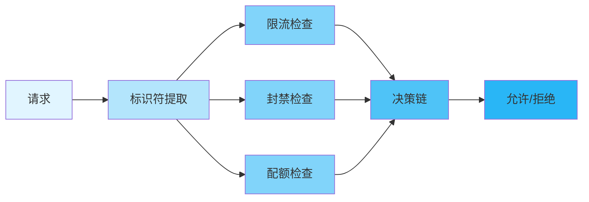
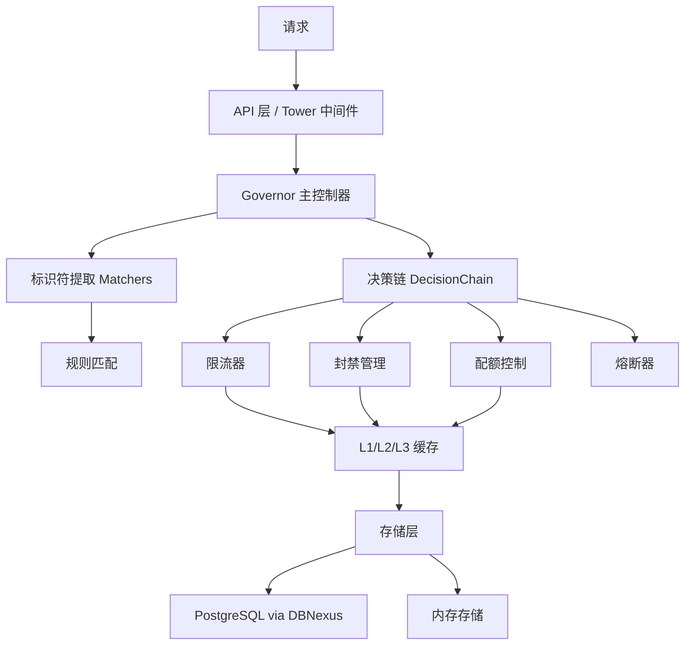
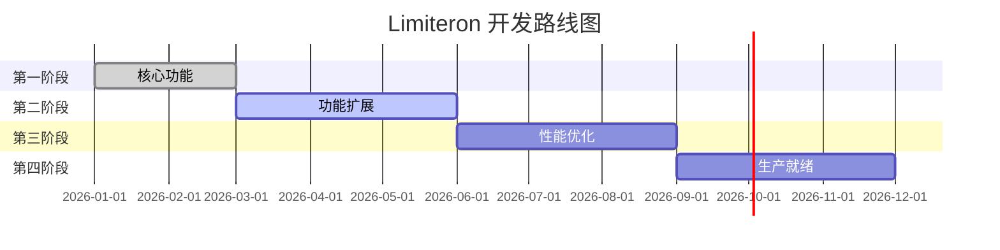

<div align="center">


[](https://github.com/Kirky-X/limiteron/actions/workflows/ci.yml) [](https://crates.io/crates/limiteron) [](https://docs.rs/limiteron) [](https://crates.io/crates/limiteron) [](LICENSE) [](https://www.rust-lang.org/)

**中文** | [English](README_EN.md)

**Rust 统一流量控制框架** — 限流、配额管理、熔断、封禁一体化解决方案。

[✨ 功能特性](#-功能特性) • [🚀 快速开始](#-快速开始) • [📚 文档](#-文档) • [💻 示例](#-示例) • [🤝 参与贡献](#-参与贡献)

</div>

---

## 📋 目录

<details open>
<summary>点击展开</summary>

- [✨ 功能特性](#-功能特性)
- [🚀 快速开始](#-快速开始)
  - [📦 安装](#-安装)
  - [💡 基本用法](#-基本用法)
- [🎨 特性标志](#-特性标志)
- [📚 文档](#-文档)
- [💻 示例](#-示例)
- [🏗️ 架构](#️-架构)
- [🎯 使用场景](#-使用场景)
- [⚙️ 配置](#️-配置)
- [🧪 测试](#-测试)
- [📊 性能](#-性能)
- [🔒 安全](#-安全)
- [🗺️ 开发路线图](#️-开发路线图)
- [🤝 参与贡献](#-参与贡献)
- [📋 更新日志](#-更新日志)
- [📄 许可证](#-许可证)
- [🙏 致谢](#-致谢)
- [📞 联系与支持](#-联系与支持)
- [⭐ Star 历史](#-star-历史)

</details>

---

## ✨ 功能特性

<table>
<tr>
<td width="50%">

### 🎯 核心特性

- ✅ **多种限流算法** — 令牌桶（Token Bucket）、固定窗口（Fixed Window）、滑动窗口（Sliding Window）、并发控制、GCRA
- ✅ **封禁管理** — IP / User / MAC / Geo 封禁、自动封禁、优先级体系（IP > User > MAC > Device > APIKey）、YAML 文件批量加载与热重载
- ✅ **配额控制** — 周期性配额分配、配额预警、配额透支
- ✅ **熔断器** — 自动故障转移、状态恢复、降级策略
- ✅ **标识符匹配** — IP、用户 ID、设备 ID、API Key、地理位置、设备信息、自定义匹配器
- ✅ **Admin REST API** — 封禁 / 配额 / 状态管理端点

</td>
<td width="50%">

### ⚡ 高级特性

- 🚀 **高性能** — 令牌桶吞吐 12M+ ops/s、P99 延迟 < 1µs（见[性能](#-性能)）
- 🔐 **安全可靠** — Rust 内存安全、SQL 注入防护、日志脱敏
- 🌐 **多存储后端** — 内存存储开箱即用；通过 DBNexus 支持 PostgreSQL / SQLite 持久化；缓存经 oxcache 统一管理
- 📦 **易于使用** — `#[flow_control]` 声明式宏、Tower 中间件、简洁 API
- 📈 **可观测性** — Prometheus 指标、OpenTelemetry 追踪、审计日志

</td>
</tr>
</table>

### 🎨 特性总览


```mermaid
graph LR
    A[请求] --> B[标识符提取]
    B --> C[限流检查]
    B --> D[封禁检查]
    B --> E[配额检查]
    C --> F[决策链]
    D --> F
    E --> F
    F --> G[允许/拒绝]

    style A fill:#e1f5ff
    style B fill:#b3e5fc
    style C fill:#81d4fa
    style D fill:#81d4fa
    style E fill:#81d4fa
    style F fill:#4fc3f7
    style G fill:#29b6f6
```

---

## 🚀 快速开始

### 📦 安装

```bash
cargo add limiteron
```

或手动添加到 `Cargo.toml`：

```toml
[dependencies]
limiteron = { version = "0.3.0-rc.2", features = ["macros"] }
```

需要持久化存储时启用对应特性：

```toml
[dependencies]
limiteron = { version = "0.3.0-rc.2", features = ["postgres", "macros"] }
```

### 💡 基本用法

**令牌桶限流器：**

```rust
use limiteron::limiters::{Limiter, TokenBucketLimiter};

#[tokio::main]
async fn main() -> Result<(), Box<dyn std::error::Error>> {
    // 10 个令牌，每秒补充 1 个
    let limiter = TokenBucketLimiter::new(10, 1);

    match limiter.allow(1).await? {
        true => println!("✅ 请求允许"),
        false => println!("❌ 请求被限流"),
    }
    Ok(())
}
```

**声明式宏：**

```rust
use limiteron::flow_control;

#[flow_control(rate = "100/s", quota = "10000/m", concurrency = 50)]
async fn api_handler(user_id: &str) -> Result<String, limiteron::error::LimiteronError> {
    Ok(format!("处理用户 {} 的请求", user_id))
}
```

**Governor 端到端控制：**

```rust
use limiteron::Governor;

let governor = Governor::new().await;
```

<details>
<summary><b>📖 完整示例</b></summary>

<br>

```rust
use limiteron::limiters::{Limiter, TokenBucketLimiter};

#[tokio::main]
async fn main() -> Result<(), Box<dyn std::error::Error>> {
    // 第 1 步：创建限流器
    let limiter = TokenBucketLimiter::new(10, 1); // 10 个令牌，每秒补充 1 个

    // 第 2 步：限流检查
    match limiter.allow(1).await {
        Ok(true) => println!("✅ 请求允许"),
        Ok(false) => println!("❌ 请求被限流"),
        Err(e) => println!("❌ 错误: {:?}", e),
    }

    // 第 3 步：带代价的限流检查
    match limiter.allow(2).await {
        Ok(true) => println!("✅ 代价为 2 的请求允许"),
        Ok(false) => println!("❌ 代价为 2 的请求被限流"),
        Err(e) => println!("❌ 错误: {:?}", e),
    }

    Ok(())
}
```

</details>

更多示例见 [`examples/`](examples/) 目录。

---

## 🎨 特性标志

Limiteron 默认不启用任何可选功能（`default = []`），按需开启：

| 预设 | 说明 | 启用的特性 |
|------|------|-----------|
| `minimal` | 核心限流（无外部存储依赖） | — |
| `standard` | 核心 + 基础高级功能 | `sqlite`, `ban-manager`, `quota-control`, `circuit-breaker` |
| `full` | 所有功能 | 全部特性 |

```toml
# 最小：仅核心限流
limiteron = { version = "0.3.0-rc.2", features = ["minimal"] }

# 标准：核心 + 基础高级功能
limiteron = { version = "0.3.0-rc.2", features = ["standard"] }

# 完整：所有功能
limiteron = { version = "0.3.0-rc.2", features = ["full"] }
```

<details>
<summary><b>📋 完整特性列表</b></summary>

<br>

| 特性 | 描述 | 默认 |
|------|------|------|
| `postgres` | PostgreSQL 存储（DBNexus，与 `sqlite` 互斥） | ❌ |
| `sqlite` | SQLite 存储（DBNexus 嵌入式驱动，本地默认后端） | ❌ |
| `cache-service` | 统一缓存服务（DI 支持） | ❌ |
| `cache-storage` | 缓存存储（oxcache Redis 集成） | ❌ |
| `lua-script` | Lua 脚本支持（oxcache） | ❌ |
| `ban-manager` | 封禁管理 | ❌ |
| `quota-control` | 配额控制 | ❌ |
| `circuit-breaker` | 熔断器 | ❌ |
| `fallback` | 降级策略 | ❌ |
| `custom-limiter` | 自定义限流器支持 | ❌ |
| `gcra` | GCRA 限流算法 | ❌ |
| `log-redaction` | 日志脱敏 | ❌ |
| `config-security` | 配置安全校验 | ❌ |
| `validation` | 请求校验 | ❌ |
| `parallel-checker` | 并行封禁检查 | ❌ |
| `geo-matching` | 地理位置匹配 | ❌ |
| `device-matching` | 设备信息匹配 | ❌ |
| `telemetry` | OpenTelemetry 追踪 | ❌ |
| `monitoring` | Prometheus 指标 | ❌ |
| `metrics` | DBNexus 指标导出 | ❌ |
| `audit-log` | 审计日志 | ❌ |
| `macros` | `#[flow_control]` 宏支持 | ❌ |
| `config-watcher` | 配置热重载 | ❌ |
| `webhook` | Webhook 通知 | ❌ |
| `tower-middleware` | Tower HTTP 中间件 | ❌ |
| `event-system` | 事件系统 | ❌ |
| `multi-tenant` | 多租户支持 | ❌ |
| `admin-api` | 管理 REST API | ❌ |
| `distributed` | 分布式限流器支持（DistributedLimiter trait + InMemoryDistributedLimiter 实现） | ❌ |
| `kit` | trait-kit AsyncKit 集成（LimiteronModule）；`LimiteronStorageConfig` 注入钩子（`with_storage`/`with_ban_storage`，默认 Memory 向后兼容） | ❌ |
| `i18n` | 国际化支持 | ❌ |
| `inklog` | inklog 日志集成 | ❌ |
| `test-clock` | 测试时钟（`MockClock`）外部消费者专用：默认公共 API 已移除 MockClock（BREAKING），外部 property/chaos 测试需显式启用本特性 | ❌ |
| `chaos-testing` | 混沌测试特性（故障注入与延迟注入，仅测试用途） | ❌ |
| `legacy-tests` | 遗留测试标记（尚未实现的功能测试） | ❌ |

</details>

> ⚠️ **已声明未实现的 no-op features**：`adaptive-limiting`、`priority-queue`、`admission-control` 仅为下游兼容声明，启用无任何效果，请勿依赖其做能力判断。

> 📌 **注意**：`postgres` 与 `sqlite` 均走 DBNexus，二者互斥（嵌入式与服务端驱动不可共存于同一构建），请勿使用 `--all-features`。

完整特性列表见 [Cargo.toml](Cargo.toml) 的 `[features]` 段。

---

## 📚 文档

| 文档 | 说明 |
|------|------|
| [📖 用户指南](docs/USER_GUIDE.md) | 从安装到进阶的完整使用教程 |
| [📘 API 参考](docs/API_REFERENCE.md) | 全部公开 API 的详细说明 |
| [🏗️ 架构文档](docs/ARCHITECTURE.md) | 设计理念与内部实现 |
| [🔒 安全文档](docs/SECURITY.md) | 安全设计与最佳实践 |
| [❓ FAQ](docs/FAQ.md) | 常见问题解答与故障排除 |
| [🧪 测试指南](docs/TESTING.md) | 测试分类与运行命令 |
| [📋 更新日志](docs/CHANGELOG.md) | 每个版本的变更记录 |
| [🤝 贡献指南](docs/CONTRIBUTING.md) | 如何参与项目开发 |
| [📦 在线 API 文档](https://docs.rs/limiteron) | docs.rs 自动生成的最新文档 |

---

## 💻 示例

**示例 1：基础限流**

```rust
use limiteron::limiters::{Limiter, TokenBucketLimiter};

#[tokio::main]
async fn main() -> Result<(), Box<dyn std::error::Error>> {
    let limiter = TokenBucketLimiter::new(10, 1);

    for i in 0..15 {
        match limiter.allow(1).await {
            Ok(true) => println!("请求 {} ✅", i),
            Ok(false) => println!("请求 {} ❌", i),
            Err(e) => println!("请求 {} 错误: {:?}", i, e),
        }
    }

    Ok(())
}
```

<details>
<summary>查看输出</summary>

```text
请求 0 ✅
请求 1 ✅
...
请求 9 ✅
请求 10 ❌
...
请求 14 ❌
✅ 前 10 个请求允许，其余被限流
```

</details>

**示例 2：使用宏**

```rust
use limiteron::flow_control;

#[flow_control(rate = "100/s", quota = "10000/m")]
async fn api_handler(user_id: &str) -> Result<String, limiteron::error::LimiteronError> {
    // API 业务逻辑
    Ok(format!("处理用户 {} 的请求", user_id))
}

#[tokio::main]
async fn main() -> Result<(), Box<dyn std::error::Error>> {
    let result = api_handler("user123").await?;
    println!("{}", result);
    Ok(())
}
```

`examples/` 目录覆盖 21 个可运行场景（`governor_demo`、`ban_manager`、`ban_file_loader`、`ban_http_api`、`circuit_breaker`、`quota_control`、`decision_chain`、`custom_matchers`、`device_geo_matching`、`fallback_demo`、`graceful_shutdown`、`tower_middleware`、`telemetry_demo`、`audit_log_demo`、`authorization_demo`、`validation_demo`、`storage_factory`、`macro_usage`、`matchers_demo`、`rate_limiters`、`simple_rate_limit`）：

```bash
# 运行指定示例
cargo run -p limiteron-examples --bin governor_demo
```

**[📂 查看全部示例 →](examples/)**

---

## 🏗️ 架构


```mermaid
graph TB
    A[请求] --> B[API 层 / Tower 中间件]
    B --> C[Governor 主控制器]
    C --> D[标识符提取 Matchers]
    C --> E[决策链 DecisionChain]
    D --> F[规则匹配]
    E --> G[限流器]
    E --> H[封禁管理]
    E --> I[配额控制]
    E --> J[熔断器]
    G --> K[L1/L2/L3 缓存]
    H --> K
    I --> K
    K --> L[存储层]
    L --> M[PostgreSQL via DBNexus]
    L --> N[内存存储]
```

核心模块：

| 模块 | 路径 | 说明 |
|------|------|------|
| Governor | `src/governor.rs` | 主控制器，端到端流量控制 |
| Limiters | `src/limiters/` | 限流算法（令牌桶、固定窗口、滑动窗口、GCRA、并发） |
| Matchers | `src/matchers/` | 标识符提取与规则匹配 |
| Ban | `src/ban/` | 封禁管理、文件加载、热重载 |
| Quota | `src/quota/` | 配额控制 |
| Circuit | `src/circuit/` | 熔断器 |
| Storage | `src/storage/` | 存储 trait 与内存实现 |
| Adapters | `src/adapters/` | DBNexus 存储适配器（PostgreSQL） |
| Cache | `src/cache/` | oxcache 统一缓存服务 |
| DecisionChain | `src/decision_chain/` | 策略决策引擎 |
| Middleware | `src/middleware/` | Tower HTTP 中间件 |
| Admin | `src/admin/` | 管理 REST API |
| Telemetry | `src/telemetry/` | 指标与追踪 |

<details>
<summary><b>📐 组件详情</b></summary>

<br>

| 组件 | 说明 | 状态 |
|------|------|------|
| **Governor** | 主控制器，端到端流量控制 | ✅ 稳定 |
| **Matchers** | 标识符提取（IP、用户 ID、设备 ID 等） | ✅ 稳定 |
| **Limiters** | 多种限流算法 | ✅ 稳定 |
| **封禁管理** | IP 封禁、自动封禁 | ✅ 稳定 |
| **配额控制** | 配额分配、配额预警 | ✅ 稳定 |
| **熔断器** | 自动故障转移、状态恢复 | ✅ 稳定 |
| **缓存** | L1/L2/L3 缓存支持 | ✅ 稳定 |
| **存储层** | DBNexus（PostgreSQL / SQLite）、内存存储 | ✅ 稳定 |

</details>

<details>
<summary><b>💾 存储后端</b></summary>

<br>

Limiteron 通过 trait 抽象支持多种存储后端，保证可插拔：

| 存储后端 | 模块 | 特性 | 说明 |
|----------|------|------|------|
| **MemoryStorage** | `src/storage/mod.rs` | （始终可用） | 内存存储，适合单机开发与测试 |
| **DBNexus 存储适配器** | `src/adapters/dbnexus_storage.rs` | `postgres` / `sqlite` | 通过 DBNexus 持久化，生产级存储 |

> **说明：** `RedisStorage` 与 `redis-storage` 特性已在 v0.2.1 移除。缓存现在统一通过 oxcache 管理（启用 `cache-storage` 即可使用 Redis 缓存后端）。

</details>

深入设计见 [架构文档](docs/ARCHITECTURE.md)。

---

## 🎯 使用场景

<details>
<summary><b>💼 企业级应用</b></summary>

<br>

```rust
use limiteron::limiters::{Limiter, TokenBucketLimiter};

async fn enterprise_api() -> Result<(), Box<dyn std::error::Error>> {
    let limiter = TokenBucketLimiter::new(100, 10); // 100 个令牌，每秒补充 10 个

    // 限流检查
    match limiter.allow(1).await {
        Ok(true) => {
            // 处理请求
            process_request().await;
        }
        Ok(false) => {
            eprintln!("超出限流阈值");
        }
        Err(e) => {
            eprintln!("错误: {:?}", e);
        }
    }

    Ok(())
}

async fn process_request() {
    println!("处理请求中...");
}
```

适用于对高并发与可靠性有要求的企业级应用。

</details>

<details>
<summary><b>🔧 API 服务</b></summary>

<br>

```rust
use limiteron::flow_control;

#[flow_control(rate = "100/s", quota = "10000/m")]
async fn api_handler(user_id: &str) -> Result<String, limiteron::error::LimiteronError> {
    // API 业务逻辑
    Ok(format!("处理用户 {} 的请求", user_id))
}
```

适用于保护 API 服务免受滥用与 DDoS 攻击。

</details>

<details>
<summary><b>🌐 Web 应用</b></summary>

<br>

```rust
use limiteron::ban_manager::{BanManager, BanManagerConfig, BanTarget};
use limiteron::adapters::StorageFactory;
use std::sync::Arc;

async fn web_app() -> Result<(), Box<dyn std::error::Error>> {
    // 使用 DBNexus 工厂创建存储
    let mut factory = StorageFactory::from_dsn("postgresql://localhost/limiteron");
    factory.initialize(None).await?;
    let ban_storage = factory.create_ban_storage().await?;
    let ban_manager = BanManager::with_dependencies(ban_storage, BanManagerConfig::default()).await?;

    // 检查用户是否被封禁
    let user_target = BanTarget::UserId("user123".to_string());
    if let Some(ban_detail) = ban_manager.is_banned(&user_target).await? {
        println!("用户已被封禁: {}", ban_detail.reason);
        return Err("用户已被封禁".into());
    }

    // 处理请求
    println!("处理用户 user123 的请求");
    Ok(())
}
```

适用于需要拦截恶意用户与爬虫的 Web 应用。

</details>

---

## ⚙️ 配置

Limiteron 使用 TOML 格式配置文件（`config.toml`），并支持环境变量覆盖。

<table>
<tr>
<td width="50%">

**TOML 配置（config.toml）**

```toml
version = "1.0"

[global]
storage = "memory"
cache = "memory"
metrics = "prometheus"

[[rules]]
id = "api_rate_limit"
name = "API 限流"
priority = 100

[rules.matchers]
type = "User"
user_ids = ["*"]

[[rules.limiters]]
type = "TokenBucket"
capacity = 1000
refill_rate = 100

[rules.action]
on_exceed = "reject"
```

</td>
<td width="50%">

**环境变量覆盖**

```bash
# 覆盖全局存储
export LIMITERON_GLOBAL_STORAGE=redis
```

**加载配置**

```rust
use limiteron::ConfigLoader;

let config = ConfigLoader::load_from_file("config.toml")?;
```

</td>
</tr>
</table>

<details>
<summary><b>🔧 全部配置项</b></summary>

<br>

| 配置项 | 类型 | 默认值 | 说明 |
|--------|------|--------|------|
| `version` | String | "0.1.0" | 配置版本 |
| `global.storage` | String | "memory" | 存储类型：memory / postgres（经 DBNexus） |
| `global.cache` | String | "memory" | 缓存类型：memory / redis |
| `global.metrics` | String | "prometheus" | 指标类型 |
| `rules[].id` | String | - | 规则标识 |
| `rules[].name` | String | - | 规则名称 |
| `rules[].priority` | u16 | 100 | 规则优先级 |
| `rules[].limiters[].capacity` | u64 | - | 限流器容量 |
| `rules[].limiters[].refill_rate` | u64 | - | 限流器补充速率 |

</details>

**ConfigBuilder（编程式构建）**

```rust
use limiteron::ConfigBuilder;

let config = ConfigBuilder::new()
    .with_storage("memory")
    .with_rule(|rule| {
        rule.id("default")
            .token_bucket(1000, 100)
    })
    .build()?;
```

---

## 🧪 测试

**测试状态：2000+ 测试全部通过 ✅**

| 测试类型 | 数量 | 状态 |
|----------|------|------|
| 单元测试 | 1700+ | ✅ 通过 |
| 集成测试 | 161 | ✅ 通过 |
| 文档测试 | 145+ | ✅ 通过 |

```bash
# 运行库单元测试（full 特性）
cargo test --features full --lib

# 运行统一集成测试（按 feature 显式启用）
cargo test --test unified_tests --features "ban-manager,quota-control,circuit-breaker"

# 运行基准测试
cargo bench

# 生成覆盖率报告
cargo tarpaulin --out Html
```

> 📌 `postgres` 与 `sqlite` 互斥，`--all-features` 会触发 DBNexus 编译错误，请使用显式特性组合。

详细测试说明见 [测试指南](docs/TESTING.md)，覆盖率报告见 [覆盖率报告](docs/COVERAGE_REPORT.md)。

---

## 📊 性能

> **说明：** 以下数据为 2026-01-19 综合性能测试的实际结果。

<table>
<tr>
<td width="50%">

**吞吐量**

| 限流器 | 实测 | 目标 | 达成 |
|--------|------|------|------|
| TokenBucket | **12M+ ops/s** | 500K ops/s | ✅ 24x |
| FixedWindow | **20M+ ops/s** | 300K ops/s | ✅ 66x |
| ConcurrencyLimiter | **12M+ ops/s** | 200K ops/s | ✅ 60x |

</td>
<td width="50%">

**延迟**

| 分位 | TokenBucket | FixedWindow |
|------|-------------|-------------|
| P50 | < 100ns | < 100ns |
| P95 | < 200ns | < 150ns |
| P99 | < 1µs | < 500ns |

</td>
</tr>
</table>

#### 并发测试结果

| 测试项 | 结果 | 状态 |
|--------|------|------|
| 数据一致性 | 100% | ✅ 通过 |
| 高并发稳定性 | 50/100 并发 | ✅ 通过 |
| 限流正确性 | 1000/1000 | ✅ 通过 |

<details>
<summary><b>📈 详细基准数据</b></summary>

<br>

```bash
# 运行性能测试
cd temp/comprehensive_test
./target/release/functional_test    # 功能测试
./target/release/performance_test   # 性能测试
./target/release/concurrency_test   # 并发测试
```

**示例输出：**

```text
Functional Tests: 7/7 Pass (100%)
TokenBucket: 12,088,759 ops/s
FixedWindow: 19,920,188 ops/s
ConcurrencyLimiter: 11,891,237 ops/s
Concurrency Test: 100% Data Consistency
```

</details>

---

## 🔒 安全

- ✅ **内存安全** — Rust 所有权模型保证内存安全
- ✅ **输入校验** — IP 地址、用户 ID、MAC 地址校验
- ✅ **SQL 注入防护** — 通过 DBNexus / sea-orm 使用参数化查询
- ✅ **敏感数据保护** — 使用 secrecy 库保护敏感数据，支持日志脱敏
- ✅ **审计日志** — 完整操作追踪
- ✅ **可信代理** — 从 X-Forwarded-For 安全提取客户端 IP（仅信任可信代理）
- ✅ **SSRF 防护** — Webhook URL 校验拦截内网地址

完整安全设计、漏洞报告流程与最佳实践见 [安全文档](docs/SECURITY.md)。

---

## 🗺️ 开发路线图


```mermaid
gantt
    title Limiteron 开发路线图
    dateFormat  YYYY-MM
    section 第一阶段
    核心功能               :done, 2026-01, 2026-03
    section 第二阶段
    功能扩展               :active, 2026-03, 2026-06
    section 第三阶段
    性能优化               :2026-06, 2026-09
    section 第四阶段
    生产就绪               :2026-09, 2026-12
```

<table>
<tr>
<td width="50%">

### ✅ 已完成

- [x] 核心限流
- [x] 封禁管理
- [x] 配额控制
- [x] 熔断器
- [x] 单元测试与集成测试
- [x] 宏支持
- [x] 经 DBNexus 的 PostgreSQL 存储
- [x] RedisStorage 后端（v0.2.0，**v0.2.1 移除** — 改用 oxcache 统一缓存）
- [x] Governor 优雅关闭与健康检查（v0.2.0）
- [x] ConfigLoader 环境变量覆盖（v0.2.0）
- [x] CircuitBreaker `new()` 默认构造器（v0.2.0）
- [x] 95%+ 测试覆盖率（v0.2.0）
- [x] pangu 工业级工程化底座（v0.2.0）
- [x] diting 全维度代码评审（v0.2.0）
- [x] 文档与 20 个示例（v0.2.0）

</td>
<td width="50%">

### 🚧 进行中

- [ ] 性能优化
- [ ] 监控与追踪增强

</td>
</tr>
<tr>
<td width="50%">

### ✅ v0.2.1 已交付

- [x] Tower 中间件集成完善
- [x] 事件系统增强
- [x] 更多存储后端测试覆盖
- [x] 性能基准更新
- [x] `RedisStorage` 移除（改用 oxcache 统一管理）

</td>
<td width="50%">

### 🚀 v0.3.0-rc.2（当前）

- [ ] 分布式限流（跨实例 Redis Lua 协调）
- [ ] Governor shutdown 完整实现（后台任务等待/状态落盘/连接释放/Drop trait）
- [ ] MySQL 存储支持（待 DBNexus 支持；SQLite 已由 `sqlite` 特性提供）
- [ ] HTB 分层令牌桶
- [ ] 舱壁隔离

</td>
</tr>
<tr>
<td width="50%">

### 📋 计划中

- [ ] Lua 脚本增强
- [ ] 自定义匹配器扩展
- [ ] 更多存储后端
- [ ] Web UI 管理界面

</td>
<td width="50%">

### 💡 未来想法

- [ ] 机器学习驱动的限流
- [ ] 更多限流算法
- [ ] 社区插件系统

</td>
</tr>
</table>

---

## 🤝 参与贡献

欢迎任何形式的贡献！开发环境、TDD 工作流、代码规范与 PR 流程详见 [贡献指南](docs/CONTRIBUTING.md)；面向 AI 代理的开发约定见 [AGENTS.md](AGENTS.md)。

<table>
<tr>
<td width="33%" align="center">

### 🐛 报告问题

发现了 Bug？<br>
[创建 Issue](../../issues)

</td>
<td width="33%" align="center">

### 💡 功能建议

有好想法？<br>
[发起讨论](../../discussions)

</td>
<td width="33%" align="center">

### 🔧 提交代码

想参与开发？<br>
[Fork & PR](../../pulls)

</td>
</tr>
</table>

<details>
<summary><b>📝 贡献步骤</b></summary>

<br>

1. **Fork** 本仓库
2. **克隆** 你的 fork：`git clone https://github.com/yourusername/limiteron.git`
3. **创建** 分支：`git checkout -b feature/amazing-feature`
4. **修改** 代码
5. **测试**：`cargo test --features full --lib`
6. **提交**：`git commit -m 'Add amazing feature'`
7. **推送**：`git push origin feature/amazing-feature`
8. **创建** Pull Request

### 代码风格

- 遵循 Rust 标准编码规范
- 编写完善的测试
- 同步更新文档
- 为新特性补充示例

</details>

---

## 📋 更新日志

完整变更记录见 [CHANGELOG.md](docs/CHANGELOG.md)。近期版本要点：

- **0.3.0-rc.2**（2026-09-03）— 文档同步（版本号 / MSRV 1.85+ / 路线图）、工作区依赖路径本地化、`Cargo.lock` 纳入版本控制
- **0.2.10**（2026-07-22）— 新增 `tests/e2e_advanced.rs`（76 个边界与异常场景测试）、移除未使用依赖、sea-orm 升级至 2.0 稳定版
- **0.2.9**（2026-07-18）— `#[flow_control]` 宏新增 `on_exceed` / `key_prefix` / `tracing` / `metrics` 参数、LimiterManager LRU 淘汰、修复 TOCTOU 限流绕过与 key 泄露

---

## 📄 许可证

本项目基于 MIT + Commons Clause 许可证发布，商业使用需单独授权。详见 [LICENSE](LICENSE)。Copyright (c) 2026 Kirky.X🌠。

---

## 🙏 致谢

- 🌟 **依赖项目** — 本项目构建在这些优秀的项目之上：
  - [tokio](https://tokio.rs/) — 异步运行时
  - [dbnexus](https://github.com/Kirky-X/dbnexus) — 数据库抽象层
  - [oxcache](https://github.com/Kirky-X/oxcache) — 统一缓存服务
  - [trait-kit](https://github.com/Kirky-X/trait-kit) — trait 集成模块
  - [inklog](https://github.com/Kirky-X/inklog) — 结构化日志
  - [dashmap](https://github.com/xacrimon/dashmap) — 并发 HashMap
  - [lru](https://github.com/jeromefroe/lru-rs) — LRU 缓存

- 👥 **贡献者** — 感谢所有贡献者！
- 💬 **社区** — 特别感谢社区成员的支持

---

## 📞 联系与支持

- 🐛 [Issues](https://github.com/Kirky-X/limiteron/issues) — 报告 Bug 与问题
- 💬 [Discussions](https://github.com/Kirky-X/limiteron/discussions) — 提问与交流想法
- 📦 [GitHub 仓库](https://github.com/Kirky-X/limiteron) — 查看源代码
- 🤝 维护者：Kirky.X

---

## ⭐ Star 历史

[](https://star-history.com/#Kirky-X/limiteron&Date)

### 💝 支持本项目

如果您觉得这个项目有用，请考虑给它一个 ⭐️！

**Built with ❤️ by Kirky.X**
