<div align="center">

# 🚀 Limiteron

<p>
  
  
  
</p>

<p align="center">
  <strong>Rust Unified Flow Control Framework</strong>
</p>

<p align="center">
  <a href="#-features">Features</a> •
  <a href="#-quick-start">Quick Start</a> •
  <a href="#-documentation">Documentation</a> •
  <a href="#-examples">Examples</a> •
  <a href="#-contributing">Contributing</a>
</p>

</div>

---

## 📋 Table of Contents

<details open>
<summary>Click to expand</summary>

- [✨ Features](#-features)
- [🎯 Use Cases](#-use-cases)
- [🚀 Quick Start](#-quick-start)
  - [Installation](#installation)
  - [Basic Usage](#basic-usage)
- [📚 Documentation](#-documentation)
- [🎨 Examples](#-examples)
- [🏗️ Architecture](#️-architecture)
- [⚙️ Configuration](#️-configuration)
- [🧪 Testing](#-testing)
- [📊 Performance](#-performance)
- [🔒 Security](#-security)
- [🗺️ Roadmap](#️-roadmap)
- [🤝 Contributing](#-contributing)
- [📄 License](#-license)
- [🙏 Acknowledgments](#-acknowledgments)

</details>

---

## ✨ Features

<table>
<tr>
<td width="50%">

### 🎯 Core Features

- ✅ **Multiple Rate Limiting Algorithms** - Token bucket, fixed window, sliding window, concurrency control
- ✅ **Ban Management** - IP ban, automatic ban, ban priority
- ✅ **Quota Control** - Quota allocation, quota alerts, quota overdraw
- ✅ **Circuit Breaker** - Automatic failover, state recovery, fallback strategy

</td>
<td width="50%">

### ⚡ Advanced Features

- 🚀 **High Performance** - Latency < 200μs P99
- 🔐 **Secure and Reliable** - Memory safety, SQL injection protection
- 🌐 **Multi-Storage Support** - PostgreSQL, Redis, in-memory storage
- 📦 **Easy to Use** - Macro support, clean API

</td>
</tr>
</table>

<div align="center">

### 🎨 特性亮点

```mermaid
graph LR
    A[请求] --> B[标识符提取]
    B --> C[限流检查]
    B --> D[封禁检查]
    B --> E[配额检查]
    C --> F[决策链]
    D --> F
    E --> F
    F --> G[允许/拒绝]

    style A fill:#e1f5ff
    style B fill:#b3e5fc
    style C fill:#81d4fa
    style D fill:#81d4fa
    style E fill:#81d4fa
    style F fill:#4fc3f7
    style G fill:#29b6f6
```

</div>



---

## 🎯 Use Cases

<details>
<summary><b>💼 Enterprise Applications</b></summary>

<br>

```rust
use limiteron::{Governor, FlowControlConfig};

async fn enterprise_api() -> Result<(), limiteron::error::FlowGuardError> {
    let governor = Governor::new(FlowControlConfig::default()).await?;

    // Rate limiting check
    let decision = governor.check_request("user123", "/api/v1/data").await?;
    if decision.is_allowed() {
        // Process request
        process_request().await;
    }

    Ok(())
}
```

Suitable for enterprise applications requiring high concurrency and reliability.

</details>

<details>
<summary><b>🔧 API Services</b></summary>

<br>

```rust
use limiteron::flow_control;

#[flow_control(rate = "100/s", quota = "10000/m", concurrency = 50)]
async fn api_handler(user_id: &str) -> Result<String, limiteron::error::FlowGuardError> {
    // API business logic
    Ok("Success".to_string())
}
```

Suitable for protecting API services from abuse and DDoS attacks.

</details>

<details>
<summary><b>🌐 Web Applications</b></summary>

<br>

```rust
use limiteron::BanManager;

async fn web_app() -> Result<(), limiteron::error::FlowGuardError> {
    let ban_manager = BanManager::new().await?;

    // Check if user is banned
    if ban_manager.is_banned("user123").await? {
        return Err(limiteron::error::FlowGuardError::Banned("User is banned".into()));
    }

    // Process request
    Ok(())
}
```

Suitable for web applications that need to prevent malicious users and crawlers.

</details>

---

## 🚀 Quick Start

### Installation

<table>
<tr>
<td width="50%">

#### 🦀 Cargo

```toml
[dependencies]
limiteron = "1.0"
```

</td>
<td width="50%">

#### 🔧 Features

```toml
[dependencies]
limiteron = { version = "1.0", features = ["postgres", "redis"] }
```

</td>
</tr>
</table>

### Basic Usage

<div align="center">

#### 🎬 5-Minute Quick Start

</div>

<table>
<tr>
<td width="50%">

**Step 1: Add Dependency**

```toml
[dependencies]
limiteron = "1.0"
```

</td>
<td width="50%">

**Step 2: Use Macro**

```rust
use limiteron::flow_control;

#[flow_control(rate = "10/s")]
async fn api_call() -> Result<String, Box<dyn std::error::Error>> {
    Ok("Success".to_string())
}
```

</td>
</tr>
</table>

<details>
<summary><b>📖 Complete Example</b></summary>

<br>

```rust
use limiteron::{Governor, FlowControlConfig};
use limiteron::limiters::TokenBucketLimiter;

#[tokio::main]
async fn main() -> Result<(), Box<dyn std::error::Error>> {
    // Step 1: Create limiter
    let mut limiter = TokenBucketLimiter::new(10, 1); // 10 tokens, refill 1 per second

    // Step 2: Check rate limit
    let key = "user123";
    match limiter.check(key).await {
        Ok(_) => println!("✅ Request allowed"),
        Err(_) => println!("❌ Request rate limited"),
    }

    // Step 3: Use Governor
    let governor = Governor::new(FlowControlConfig::default()).await?;
    let decision = governor.check_request(key, "/api/v1/users").await?;
    println!("Decision: {:?}", decision);

    Ok(())
}
```

</details>

---

## 📚 Documentation

<div align="center">

<table>
<tr>
<td align="center" width="25%">
<a href="docs/USER_GUIDE.md">
<br>
<b>User Guide</b>
</a><br>
Complete usage guide
</td>
<td align="center" width="25%">
<a href="docs/API_REFERENCE.md">
<br>
<b>API Reference</b>
</a><br>
Complete API documentation
 </td>
<td align="center" width="25%">
<a href="docs/FAQ.md">
<br>
<b>FAQ</b>
</a><br>
Frequently asked questions
</td>
<td align="center" width="25%">
<a href="examples/">
<br>
<b>Examples</b>
</a><br>
Code examples
</td>
</tr>
</table>

</div>

### 📖 Additional Resources

- 🎓 [User Guide](docs/USER_GUIDE.md) - Detailed tutorial
- 🔧 [API Reference](docs/API_REFERENCE.md) - API documentation
- ❓ [FAQ](docs/FAQ.md) - Frequently asked questions
- 🐛 [Troubleshooting](docs/FAQ.md#troubleshooting) - Common issues and solutions

---

## 🎨 Examples

<div align="center">

### 💡 Practical Examples

</div>

<table>
<tr>
<td width="50%">

#### 📝 Example 1: Basic Rate Limiting

```rust
use limiteron::limiters::TokenBucketLimiter;

#[tokio::main]
async fn main() -> Result<(), Box<dyn std::error::Error>> {
    let mut limiter = TokenBucketLimiter::new(10, 1);
    let key = "user123";

    for i in 0..15 {
        match limiter.check(key).await {
            Ok(_) => println!("Request {} ✅", i),
            Err(_) => println!("Request {} ❌", i),
        }
    }

    Ok(())
}
```

<details>
<summary>View Output</summary>

```
Request 0 ✅
Request 1 ✅
...
Request 9 ✅
Request 10 ❌
...
Request 14 ❌
✅ First 10 requests allowed, remaining rate limited
```

</details>

</td>
<td width="50%">

#### 🔥 Example 2: Using Macro

```rust
use limiteron::flow_control;

#[flow_control(rate = "100/s", quota = "10000/m", concurrency = 50)]
async fn api_handler(user_id: &str) -> Result<String, limiteron::error::FlowGuardError> {
    // API business logic
    Ok(format!("Processing request for user {}", user_id))
}

#[tokio::main]
async fn main() -> Result<(), Box<dyn std::error::Error>> {
    let result = api_handler("user123").await?;
    println!("{}", result);
    Ok(())
}
```

<details>
<summary>View Output</summary>

```
Processing request for user123
✅ Macro automatically handles rate limiting
```

</details>

</td>
</tr>
</table>

<div align="center">

**[📂 View All Examples →](examples/)**

</div>

---

## 🏗️ Architecture

<div align="center">

### System Overview

</div>


<details>
<summary><b>📐 Component Details</b></summary>

<br>

| Component | Description | Status |
|-----------|-------------|--------|
| **Governor** | Main controller, end-to-end flow control | ✅ Stable |
| **Matchers** | Identifier extraction (IP, User ID, Device ID, etc.) | ✅ Stable |
| **Limiters** | Multiple rate limiting algorithms | ✅ Stable |
| **Ban Management** | IP ban, automatic ban | ✅ Stable |
| **Quota Control** | Quota allocation, quota alerts | ✅ Stable |
| **Circuit Breaker** | Automatic failover, state recovery | ✅ Stable |
| **Cache** | L2/L3 cache support | ✅ Stable |
| **Storage Layer** | PostgreSQL, Redis, in-memory | ✅ Stable |

</details>

---

## ⚙️ Configuration

<div align="center">

### 🎛️ Configuration Options

</div>

<table>
<tr>
<td width="50%">

**Basic Configuration**

```toml
[limiter]
rate_limit = "100/s"
quota_limit = "10000/m"
concurrency_limit = 50

[cache]
l2_capacity = 10000
l3_capacity = 100000
```

</td>
<td width="50%">

**Advanced Configuration**

```toml
[limiter]
rate_limit = "100/s"
quota_limit = "10000/m"
concurrency_limit = 50

[storage]
type = "redis"
connection_string = "redis://localhost:6379"

[telemetry]
enable_metrics = true
enable_tracing = true
```

</td>
</tr>
</table>

<details>
<summary><b>🔧 All Configuration Options</b></summary>

<br>

| Option | Type | Default | Description |
|--------|------|---------|-------------|
| `rate_limit` | String | "100/s" | Rate limit |
| `quota_limit` | String | "10000/m" | Quota limit |
| `concurrency_limit` | Integer | 50 | Concurrency limit |
| `l2_capacity` | Integer | 10000 | L2 cache capacity |
| `l3_capacity` | Integer | 100000 | L3 cache capacity |
| `storage_type` | String | "memory" | Storage type |
| `enable_metrics` | Boolean | false | Enable metrics |
| `enable_tracing` | Boolean | false | Enable tracing |

</details>

---

## 🧪 Testing

```bash
# Run all tests
cargo test --all-features

# Run specific test
cargo test test_name

# Run integration tests
cargo test --test integration_tests

# Run benchmarks
cargo bench
```

---

## 📊 Performance

<div align="center">

### ⚡ Benchmark Results

</div>

<table>
<tr>
<td width="50%">

**Throughput**

```
Rate limiting: 500,000 ops/sec
Quota limiting: 300,000 ops/sec
Concurrency limiting: 200,000 ops/sec
```

</td>
<td width="50%">

**Latency**

```
P50: 0.1ms
P95: 0.2ms
P99: < 0.2ms
```

</td>
</tr>
</table>

<details>
<summary><b>📈 Detailed Benchmarks</b></summary>

<br>

```bash
# Run benchmarks
cargo bench

# Sample output:
test token_bucket_check ... bench: 2,000 ns/iter (+/- 100)
test fixed_window_check ... bench: 1,500 ns/iter (+/- 80)
test concurrency_check ... bench: 3,000 ns/iter (+/- 150)
```

</details>

---

## 🔒 Security

<div align="center">

### 🛡️ Security Features

</div>

<table>
<tr>
<td align="center" width="25%">
<br>
<b>Memory Safety</b><br>
Rust guarantees memory safety
</td>
<td align="center" width="25%">
<br>
<b>Input Validation</b><br>
Comprehensive input checking
</td>
<td align="center" width="25%">
<br>
<b>SQL Injection Protection</b><br>
 Parameterized queries
</td>
<td align="center" width="25%">
<br>
<b>Password Protection</b><br>
Secure password storage
</td>
</tr>
</table>

<details>
<summary><b>🔐 Security Details</b></summary>

<br>

### Security Measures

- ✅ **Memory Protection** - Rust memory safety guarantees
- ✅ **Input Validation** - IP address, User ID, MAC address validation
- ✅ **SQL Injection Protection** - Using parameterized queries
- ✅ **Password Protection** - Using secrecy library for sensitive data
- ✅ **Audit Logging** - Complete operation tracking

### Reporting Security Issues

Please report security vulnerabilities through GitHub Issues.

</details>

---

## 🗺️ Roadmap

<div align="center">

### 🎯 Development Plan

</div>


<table>
<tr>
<td width="50%">

### ✅ Completed

- [x] Core rate limiting
- [x] Ban management
- [x] Quota control
- [x] Circuit breaker
- [x] Unit and integration tests
- [x] Macro support
- [x] PostgreSQL and Redis storage

</td>
<td width="50%">

### 🚧 In Progress

- [ ] Performance optimization
- [ ] Monitoring and tracing improvements
- [ ] Documentation completion
- [ ] Example code additions

</td>
</tr>
<tr>
<td width="50%">

### 📋 Planned

- [ ] Lua script enhancements
- [ ] Custom matcher extensions
- [ ] Additional storage backends
- [ ] Web UI management interface

</td>
<td width="50%">

### 💡 Future Ideas

- [ ] Distributed rate limiting
- [ ] Machine learning-driven rate limiting
- [ ] Additional rate limiting algorithms
- [ ] Community plugin system

</td>
</tr>
</table>

---

## 🤝 Contributing

<div align="center">

### 💖 Welcome Contributions!

</div>

<table>
<tr>
<td width="33%" align="center">

### 🐛 Report Issues

Found a bug?<br>
[Create Issue](../../issues)

</td>
<td width="33%" align="center">

### 💡 Feature Requests

Have a suggestion?<br>
[Start Discussion](../../discussions)

</td>
<td width="33%" align="center">

### 🔧 Submit Code

Want to contribute?<br>
[Fork & PR](../../pulls)

</td>
</tr>
</table>

<details>
<summary><b>📝 Contribution Guide</b></summary>

<br>

### How to Contribute

1. **Fork** the repository
2. **Clone** your fork: `git clone https://github.com/yourusername/limiteron.git`
3. **Create** a branch: `git checkout -b feature/amazing-feature`
4. **Make** your changes
5. **Test** your changes: `cargo test --all-features`
6. **Commit** your changes: `git commit -m 'Add amazing feature'`
7. **Push** to branch: `git push origin feature/amazing-feature`
8. **Create** a Pull Request

### Code Style

- Follow Rust standard coding conventions
- Write comprehensive tests
- Update documentation
- Add examples for new features

</details>

---

## 📄 License

<div align="center">

This project is licensed under Apache 2.0:

[](LICENSE)

</div>

---

## 🙏 Acknowledgments

<div align="center">

### Built with Excellent Tools

</div>

<table>
<tr>
<td align="center" width="25%">
<a href="https://www.rust-lang.org/">
<br>
<b>Rust</b>
</a>
</td>
<td align="center" width="25%">
<a href="https://github.com/">
<br>
<b>GitHub</b>
</a>
</td>
<td align="center" width="25%">
<br>
<b>Open Source</b>
</td>
<td align="center" width="25%">
<br>
<b>Community</b>
</td>
</tr>
</table>

### Special Thanks

- 🌟 **Dependencies** - Built on these excellent projects:
  - [tokio](https://tokio.rs/) - Async runtime
  - [sqlx](https://github.com/launchbadge/sqlx) - Async SQL toolkit
  - [redis](https://github.com/redis-rs/redis-rs) - Redis client
  - [dashmap](https://github.com/xacrimon/dashmap) - Concurrent HashMap
  - [lru](https://github.com/jeromefroe/lru-rs) - LRU cache

- 👥 **Contributors** - Thanks to all contributors!
- 💬 **Community** - Special thanks to community members

---

## 📞 Contact & Support

<div align="center">

<table>
<tr>
<td align="center" width="33%">
<a href="../../issues">
<br>
<b>Issues</b>
</a><br>
Report bugs and errors
</td>
<td align="center" width="33%">
<a href="../../discussions">
<br>
<b>Discussions</b>
</a><br>
Ask questions and share ideas
</td>
<td align="center" width="33%">
<a href="https://github.com/kirkyx/limiteron">
<br>
<b>GitHub</b>
</a><br>
View source code
</td>
</tr>
</table>

### Stay Connected

[](https://github.com/kirkyx/limiteron)

</div>

---

## ⭐ Star History

<div align="center">

[](https://star-history.com/#kirkyx/limiteron&Date)

</div>

---

<div align="center">

### 💝 Support This Project

If you find this project useful, please consider giving it a ⭐️!

**Built with ❤️ by Kirky.X**

[⬆ Back to Top](#-limiteron)

---

<sub>© 2026 Kirky.X. All rights reserved.</sub>

</div>