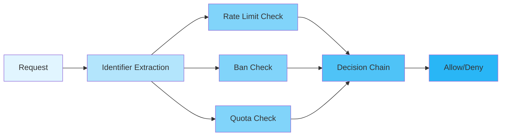
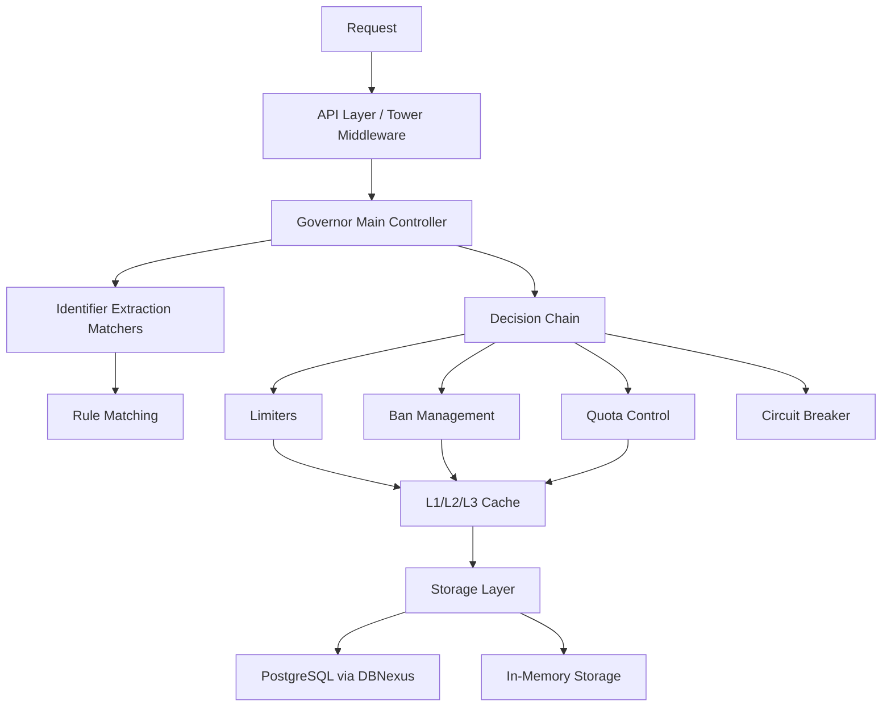
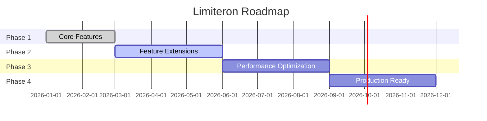

<div align="center">


[](https://github.com/Kirky-X/limiteron/actions/workflows/ci.yml) [](https://crates.io/crates/limiteron) [](https://docs.rs/limiteron) [](https://crates.io/crates/limiteron) [](LICENSE) [](https://www.rust-lang.org/)

[中文](README.md) | **English**

**Rust Unified Flow Control Framework** — Rate limiting, quota management, circuit breaking, and ban management in one solution.

[✨ Features](#-features) • [🚀 Quick Start](#-quick-start) • [📚 Documentation](#-documentation) • [💻 Examples](#-examples) • [🤝 Contributing](#-contributing)

</div>

---

## 📋 Table of Contents

<details open>
<summary>Click to expand</summary>

- [✨ Features](#-features)
- [🚀 Quick Start](#-quick-start)
  - [📦 Installation](#-installation)
  - [💡 Basic Usage](#-basic-usage)
- [🎨 Feature Flags](#-feature-flags)
- [📚 Documentation](#-documentation)
- [💻 Examples](#-examples)
- [🏗️ Architecture](#️-architecture)
- [🎯 Use Cases](#-use-cases)
- [⚙️ Configuration](#️-configuration)
- [🧪 Testing](#-testing)
- [📊 Performance](#-performance)
- [🔒 Security](#-security)
- [🗺️ Roadmap](#️-roadmap)
- [🤝 Contributing](#-contributing)
- [📋 Changelog](#-changelog)
- [📄 License](#-license)
- [🙏 Acknowledgments](#-acknowledgments)
- [📞 Contact & Support](#-contact--support)
- [⭐ Star History](#-star-history)

</details>

---

## ✨ Features

<table>
<tr>
<td width="50%">

### 🎯 Core Features

- ✅ **Multiple Rate Limiting Algorithms** — Token bucket, fixed window, sliding window, concurrency control, GCRA
- ✅ **Ban Management** — IP / User / MAC / Geo bans, automatic bans, priority system (IP > User > MAC > Device > APIKey), YAML file bulk loading with hot reload
- ✅ **Quota Control** — Periodic quota allocation, quota alerts, quota overdraw
- ✅ **Circuit Breaker** — Automatic failover, state recovery, fallback strategy
- ✅ **Identifier Matching** — IP, user ID, device ID, API key, geolocation, device info, custom matchers
- ✅ **Admin REST API** — Ban / quota / status management endpoints

</td>
<td width="50%">

### ⚡ Advanced Features

- 🚀 **High Performance** — Token bucket at 12M+ ops/s, P99 latency < 1µs (see [Performance](#-performance))
- 🔐 **Secure and Reliable** — Rust memory safety, SQL injection protection, log redaction
- 🌐 **Multi-Storage Support** — In-memory storage out of the box; PostgreSQL / SQLite persistence via DBNexus; caching unified through oxcache
- 📦 **Easy to Use** — `#[flow_control]` declarative macro, Tower middleware, clean API
- 📈 **Observability** — Prometheus metrics, OpenTelemetry tracing, audit logging

</td>
</tr>
</table>

### 🎨 Feature Highlights



---

## 🚀 Quick Start

### 📦 Installation

```bash
cargo add limiteron
```

Or add it to your `Cargo.toml` manually:

```toml
[dependencies]
limiteron = { version = "0.3.0-rc.2", features = ["macros"] }
```

Enable a storage backend when persistence is needed:

```toml
[dependencies]
limiteron = { version = "0.3.0-rc.2", features = ["postgres", "macros"] }
```

### 💡 Basic Usage

**Token bucket limiter:**

```rust
use limiteron::limiters::{Limiter, TokenBucketLimiter};

#[tokio::main]
async fn main() -> Result<(), Box<dyn std::error::Error>> {
    // 10 tokens, refill 1 per second
    let limiter = TokenBucketLimiter::new(10, 1);

    match limiter.allow(1).await? {
        true => println!("✅ Request allowed"),
        false => println!("❌ Request rate limited"),
    }
    Ok(())
}
```

**Declarative macro:**

```rust
use limiteron::flow_control;

#[flow_control(rate = "100/s", quota = "10000/m", concurrency = 50)]
async fn api_handler(user_id: &str) -> Result<String, limiteron::error::LimiteronError> {
    Ok(format!("Processing request for user {}", user_id))
}
```

**End-to-end control with Governor:**

```rust
use limiteron::Governor;

let governor = Governor::new().await;
```

<details>
<summary><b>📖 Complete Example</b></summary>

<br>

```rust
use limiteron::limiters::{Limiter, TokenBucketLimiter};

#[tokio::main]
async fn main() -> Result<(), Box<dyn std::error::Error>> {
    // Step 1: Create limiter
    let limiter = TokenBucketLimiter::new(10, 1); // 10 tokens, refill 1 per second

    // Step 2: Rate limit check
    match limiter.allow(1).await {
        Ok(true) => println!("✅ Request allowed"),
        Ok(false) => println!("❌ Request rate limited"),
        Err(e) => println!("❌ Error: {:?}", e),
    }

    // Step 3: Check with cost
    match limiter.allow(2).await {
        Ok(true) => println!("✅ Request with cost 2 allowed"),
        Ok(false) => println!("❌ Request with cost 2 rate limited"),
        Err(e) => println!("❌ Error: {:?}", e),
    }

    Ok(())
}
```

</details>

More examples can be found in the [`examples/`](examples/) directory.

---

## 🎨 Feature Flags

Limiteron enables no optional functionality by default (`default = []`); turn features on as needed:

| Preset | Description | Enabled Features |
|--------|-------------|------------------|
| `minimal` | Core rate limiting (no external storage dependencies) | — |
| `standard` | Core + basic advanced features | `sqlite`, `ban-manager`, `quota-control`, `circuit-breaker` |
| `full` | All features | Everything |

```toml
# Minimal: core rate limiting only
limiteron = { version = "0.3.0-rc.2", features = ["minimal"] }

# Standard: core + basic advanced features
limiteron = { version = "0.3.0-rc.2", features = ["standard"] }

# Full: all features
limiteron = { version = "0.3.0-rc.2", features = ["full"] }
```

<details>
<summary><b>📋 Complete Feature List</b></summary>

<br>

| Feature | Description | Default |
|---------|-------------|---------|
| `postgres` | PostgreSQL storage (DBNexus, mutually exclusive with `sqlite`) | ❌ |
| `sqlite` | SQLite storage (DBNexus embedded driver, default local backend) | ❌ |
| `cache-service` | Unified cache service (DI support) | ❌ |
| `cache-storage` | Cache storage (oxcache Redis integration) | ❌ |
| `lua-script` | Lua script support (oxcache) | ❌ |
| `ban-manager` | Ban management | ❌ |
| `quota-control` | Quota control | ❌ |
| `circuit-breaker` | Circuit breaker | ❌ |
| `fallback` | Fallback strategy | ❌ |
| `custom-limiter` | Custom rate limiter support | ❌ |
| `gcra` | GCRA rate limiting algorithm | ❌ |
| `log-redaction` | Log redaction | ❌ |
| `config-security` | Configuration security validation | ❌ |
| `validation` | Request validation | ❌ |
| `parallel-checker` | Parallel ban checking | ❌ |
| `geo-matching` | Geographic matching | ❌ |
| `device-matching` | Device matching | ❌ |
| `telemetry` | OpenTelemetry tracing | ❌ |
| `monitoring` | Prometheus metrics | ❌ |
| `metrics` | DBNexus metrics export | ❌ |
| `audit-log` | Audit logging | ❌ |
| `macros` | `#[flow_control]` macro support | ❌ |
| `config-watcher` | Configuration hot-reload | ❌ |
| `webhook` | Webhook notifications | ❌ |
| `tower-middleware` | Tower HTTP middleware integration | ❌ |
| `event-system` | Event system | ❌ |
| `multi-tenant` | Multi-tenant support | ❌ |
| `admin-api` | Admin REST API | ❌ |
| `distributed` | Distributed rate limiting support (DistributedLimiter trait + InMemoryDistributedLimiter implementation) | ❌ |
| `kit` | trait-kit AsyncKit integration (LimiteronModule); `LimiteronStorageConfig` injection hooks (`with_storage`/`with_ban_storage`, defaults to Memory for backward compatibility) | ❌ |
| `i18n` | Internationalization support | ❌ |
| `inklog` | inklog log integration | ❌ |
| `test-clock` | Test clock (`MockClock`) for external consumers only: MockClock was removed from the default public API (BREAKING); external property/chaos tests must enable this feature explicitly | ❌ |
| `chaos-testing` | Chaos testing (fault injection and latency injection, test-only) | ❌ |
| `legacy-tests` | Legacy test marker (tests for features not yet implemented) | ❌ |

</details>

> ⚠️ **Declared but unimplemented no-op features**: `adaptive-limiting`, `priority-queue`, and `admission-control` are declared only for downstream compatibility and have no effect when enabled. Do not rely on them for capability detection.

> 📌 **Note**: `postgres` and `sqlite` both go through DBNexus and are mutually exclusive (embedded and server-side drivers cannot coexist in one build), so avoid `--all-features`.

See the `[features]` section of [Cargo.toml](Cargo.toml) for the complete feature list.

---

## 📚 Documentation

| Documentation | Description |
|---------------|-------------|
| [📖 User Guide](docs/USER_GUIDE.md) | Complete tutorial from installation to advanced usage |
| [📘 API Reference](docs/API_REFERENCE.md) | Detailed description of all public APIs |
| [🏗️ Architecture](docs/ARCHITECTURE.md) | Design philosophy and internal implementation |
| [🔒 Security](docs/SECURITY.md) | Security design and best practices |
| [❓ FAQ](docs/FAQ.md) | Frequently asked questions and troubleshooting |
| [🧪 Testing Guide](docs/TESTING.md) | Test categories and commands |
| [📋 Changelog](docs/CHANGELOG.md) | Changes in every release |
| [🤝 Contributing](docs/CONTRIBUTING.md) | How to participate in development |
| [📦 Online API Docs](https://docs.rs/limiteron) | Latest docs generated by docs.rs |

---

## 💻 Examples

**Example 1: Basic Rate Limiting**

```rust
use limiteron::limiters::{Limiter, TokenBucketLimiter};

#[tokio::main]
async fn main() -> Result<(), Box<dyn std::error::Error>> {
    let limiter = TokenBucketLimiter::new(10, 1);

    for i in 0..15 {
        match limiter.allow(1).await {
            Ok(true) => println!("Request {} ✅", i),
            Ok(false) => println!("Request {} ❌", i),
            Err(e) => println!("Request {} Error: {:?}", i, e),
        }
    }

    Ok(())
}
```

<details>
<summary>View Output</summary>

```text
Request 0 ✅
Request 1 ✅
...
Request 9 ✅
Request 10 ❌
...
Request 14 ❌
✅ First 10 requests allowed, remaining rate limited
```

</details>

**Example 2: Using the Macro**

```rust
use limiteron::flow_control;

#[flow_control(rate = "100/s", quota = "10000/m")]
async fn api_handler(user_id: &str) -> Result<String, limiteron::error::LimiteronError> {
    // API business logic
    Ok(format!("Processing request for user {}", user_id))
}

#[tokio::main]
async fn main() -> Result<(), Box<dyn std::error::Error>> {
    let result = api_handler("user123").await?;
    println!("{}", result);
    Ok(())
}
```

The `examples/` directory covers 21 runnable scenarios (`governor_demo`, `ban_manager`, `ban_file_loader`, `ban_http_api`, `circuit_breaker`, `quota_control`, `decision_chain`, `custom_matchers`, `device_geo_matching`, `fallback_demo`, `graceful_shutdown`, `tower_middleware`, `telemetry_demo`, `audit_log_demo`, `authorization_demo`, `validation_demo`, `storage_factory`, `macro_usage`, `matchers_demo`, `rate_limiters`, `simple_rate_limit`):

```bash
# Run a specific example
cargo run -p limiteron-examples --bin governor_demo
```

**[📂 View All Examples →](examples/)**

---

## 🏗️ Architecture



Core modules:

| Module | Path | Description |
|--------|------|-------------|
| Governor | `src/governor.rs` | Main controller, end-to-end flow control |
| Limiters | `src/limiters/` | Rate limiting algorithms (token bucket, fixed window, sliding window, GCRA, concurrency) |
| Matchers | `src/matchers/` | Identifier extraction and rule matching |
| Ban | `src/ban/` | Ban management, file loading, hot reload |
| Quota | `src/quota/` | Quota control |
| Circuit | `src/circuit/` | Circuit breaker |
| Storage | `src/storage/` | Storage traits and in-memory implementation |
| Adapters | `src/adapters/` | DBNexus storage adapters (PostgreSQL) |
| Cache | `src/cache/` | Unified cache service via oxcache |
| DecisionChain | `src/decision_chain/` | Policy decision engine |
| Middleware | `src/middleware/` | Tower HTTP middleware |
| Admin | `src/admin/` | Admin REST API |
| Telemetry | `src/telemetry/` | Metrics and tracing |

<details>
<summary><b>📐 Component Details</b></summary>

<br>

| Component | Description | Status |
|-----------|-------------|--------|
| **Governor** | Main controller, end-to-end flow control | ✅ Stable |
| **Matchers** | Identifier extraction (IP, User ID, Device ID, etc.) | ✅ Stable |
| **Limiters** | Multiple rate limiting algorithms | ✅ Stable |
| **Ban Management** | IP ban, automatic ban | ✅ Stable |
| **Quota Control** | Quota allocation, quota alerts | ✅ Stable |
| **Circuit Breaker** | Automatic failover, state recovery | ✅ Stable |
| **Cache** | L1/L2/L3 cache support | ✅ Stable |
| **Storage Layer** | DBNexus (PostgreSQL / SQLite), in-memory | ✅ Stable |

</details>

<details>
<summary><b>💾 Storage Backends</b></summary>

<br>

Limiteron supports multiple storage backends through trait abstraction for pluggability:

| Storage Backend | Module | Feature | Description |
|----------------|--------|---------|-------------|
| **MemoryStorage** | `src/storage/mod.rs` | (always available) | In-memory storage, suitable for single-instance development and testing |
| **DBNexus Storage Adapter** | `src/adapters/dbnexus_storage.rs` | `postgres` / `sqlite` | Persistence via DBNexus, production-grade storage |

> **Note:** `RedisStorage` and the `redis-storage` feature were removed in v0.2.1. Caching is now unified through oxcache (enable `cache-storage` to access the Redis cache backend).

</details>

For an in-depth design overview, see the [Architecture document](docs/ARCHITECTURE.md).

---

## 🎯 Use Cases

<details>
<summary><b>💼 Enterprise Applications</b></summary>

<br>

```rust
use limiteron::limiters::{Limiter, TokenBucketLimiter};

async fn enterprise_api() -> Result<(), Box<dyn std::error::Error>> {
    let limiter = TokenBucketLimiter::new(100, 10); // 100 tokens, refill 10 per second

    // Rate limiting check
    match limiter.allow(1).await {
        Ok(true) => {
            // Process request
            process_request().await;
        }
        Ok(false) => {
            eprintln!("Rate limit exceeded");
        }
        Err(e) => {
            eprintln!("Error: {:?}", e);
        }
    }

    Ok(())
}

async fn process_request() {
    println!("Processing request...");
}
```

Suitable for enterprise applications requiring high concurrency and reliability.

</details>

<details>
<summary><b>🔧 API Services</b></summary>

<br>

```rust
use limiteron::flow_control;

#[flow_control(rate = "100/s", quota = "10000/m")]
async fn api_handler(user_id: &str) -> Result<String, limiteron::error::LimiteronError> {
    // API business logic
    Ok(format!("Processing request for user {}", user_id))
}
```

Suitable for protecting API services from abuse and DDoS attacks.

</details>

<details>
<summary><b>🌐 Web Applications</b></summary>

<br>

```rust
use limiteron::ban_manager::{BanManager, BanManagerConfig, BanTarget};
use limiteron::adapters::StorageFactory;
use std::sync::Arc;

async fn web_app() -> Result<(), Box<dyn std::error::Error>> {
    // Create storage using DBNexus factory
    let mut factory = StorageFactory::from_dsn("postgresql://localhost/limiteron");
    factory.initialize(None).await?;
    let ban_storage = factory.create_ban_storage().await?;
    let ban_manager = BanManager::with_dependencies(ban_storage, BanManagerConfig::default()).await?;

    // Check if user is banned
    let user_target = BanTarget::UserId("user123".to_string());
    if let Some(ban_detail) = ban_manager.is_banned(&user_target).await? {
        println!("User is banned: {}", ban_detail.reason);
        return Err("User is banned".into());
    }

    // Process request
    println!("Processing request for user123");
    Ok(())
}
```

Suitable for web applications that need to prevent malicious users and crawlers.

</details>

---

## ⚙️ Configuration

Limiteron uses TOML-format configuration files (`config.toml`) with environment variable override support.

<table>
<tr>
<td width="50%">

**TOML Configuration (config.toml)**

```toml
version = "1.0"

[global]
storage = "memory"
cache = "memory"
metrics = "prometheus"

[[rules]]
id = "api_rate_limit"
name = "API Rate Limit"
priority = 100

[rules.matchers]
type = "User"
user_ids = ["*"]

[[rules.limiters]]
type = "TokenBucket"
capacity = 1000
refill_rate = 100

[rules.action]
on_exceed = "reject"
```

</td>
<td width="50%">

**Environment Variable Override**

```bash
# Override global storage
export LIMITERON_GLOBAL_STORAGE=redis
```

**Load Configuration**

```rust
use limiteron::ConfigLoader;

let config = ConfigLoader::load_from_file("config.toml")?;
```

</td>
</tr>
</table>

<details>
<summary><b>🔧 All Configuration Options</b></summary>

<br>

| Option | Type | Default | Description |
|--------|------|---------|-------------|
| `version` | String | "0.1.0" | Configuration version |
| `global.storage` | String | "memory" | Storage type: memory / postgres (via DBNexus) |
| `global.cache` | String | "memory" | Cache type: memory / redis |
| `global.metrics` | String | "prometheus" | Metrics type |
| `rules[].id` | String | - | Rule identifier |
| `rules[].name` | String | - | Rule name |
| `rules[].priority` | u16 | 100 | Rule priority |
| `rules[].limiters[].capacity` | u64 | - | Limiter capacity |
| `rules[].limiters[].refill_rate` | u64 | - | Limiter refill rate |

</details>

**ConfigBuilder (Programmatic)**

```rust
use limiteron::ConfigBuilder;

let config = ConfigBuilder::new()
    .with_storage("memory")
    .with_rule(|rule| {
        rule.id("default")
            .token_bucket(1000, 100)
    })
    .build()?;
```

---

## 🧪 Testing

**Test Status: 2000+ tests all passing ✅**

| Test Type | Count | Status |
|-----------|-------|--------|
| Unit tests | 1700+ | ✅ Pass |
| Integration tests | 161 | ✅ Pass |
| Doc tests | 145+ | ✅ Pass |

```bash
# Run library unit tests (full features)
cargo test --features full --lib

# Run unified integration tests (enable features explicitly)
cargo test --test unified_tests --features "ban-manager,quota-control,circuit-breaker"

# Run benchmarks
cargo bench

# Generate coverage report
cargo tarpaulin --out Html
```

> 📌 `postgres` and `sqlite` are mutually exclusive; `--all-features` triggers a DBNexus compile error — use explicit feature combinations instead.

See the [Testing Guide](docs/TESTING.md) for detailed instructions and the [Coverage Report](docs/COVERAGE_REPORT.md) for coverage data.

---

## 📊 Performance

> **Note:** The following data represents actual benchmark results from comprehensive testing (2026-01-19).

<table>
<tr>
<td width="50%">

**Throughput**

| Limiter Type | Actual | Target | Achievement |
|-------------|--------|--------|-------------|
| TokenBucket | **12M+ ops/s** | 500K ops/s | ✅ 24x |
| FixedWindow | **20M+ ops/s** | 300K ops/s | ✅ 66x |
| ConcurrencyLimiter | **12M+ ops/s** | 200K ops/s | ✅ 60x |

</td>
<td width="50%">

**Latency**

| Percentile | TokenBucket | FixedWindow |
|-----------|-------------|-------------|
| P50 | < 100ns | < 100ns |
| P95 | < 200ns | < 150ns |
| P99 | < 1µs | < 500ns |

</td>
</tr>
</table>

#### Concurrency Test Results

| Test Item | Result | Status |
|-----------|--------|--------|
| Data Consistency | 100% | ✅ Pass |
| High Concurrency Stability | 50/100 concurrent | ✅ Pass |
| Rate Limit Correctness | 1000/1000 | ✅ Pass |

<details>
<summary><b>📈 Detailed Benchmarks</b></summary>

<br>

```bash
# Run performance tests
cd temp/comprehensive_test
./target/release/functional_test    # Functional tests
./target/release/performance_test   # Performance tests
./target/release/concurrency_test   # Concurrency tests
```

**Sample output:**

```text
Functional Tests: 7/7 Pass (100%)
TokenBucket: 12,088,759 ops/s
FixedWindow: 19,920,188 ops/s
ConcurrencyLimiter: 11,891,237 ops/s
Concurrency Test: 100% Data Consistency
```

</details>

---

## 🔒 Security

- ✅ **Memory Safety** — Guaranteed by Rust's ownership model
- ✅ **Input Validation** — IP address, User ID, MAC address validation
- ✅ **SQL Injection Protection** — Parameterized queries via DBNexus / sea-orm
- ✅ **Sensitive Data Protection** — secrecy crate for sensitive data, log redaction support
- ✅ **Audit Logging** — Complete operation tracking
- ✅ **Trusted Proxy Support** — Secure client IP extraction from X-Forwarded-For (only trusted proxies are honored)
- ✅ **SSRF Protection** — Webhook URL validation blocks internal addresses

For the full security design, vulnerability reporting process, and best practices, see the [Security document](docs/SECURITY.md).

---

## 🗺️ Roadmap



<table>
<tr>
<td width="50%">

### ✅ Completed

- [x] Core rate limiting
- [x] Ban management
- [x] Quota control
- [x] Circuit breaker
- [x] Unit and integration tests
- [x] Macro support
- [x] PostgreSQL storage via DBNexus
- [x] RedisStorage backend (v0.2.0, **removed in v0.2.1** — replaced by oxcache-backed cache)
- [x] Governor graceful shutdown & health check (v0.2.0)
- [x] ConfigLoader environment variable override (v0.2.0)
- [x] CircuitBreaker `new()` default constructor (v0.2.0)
- [x] 95%+ test coverage (v0.2.0)
- [x] pangu industrial-grade harness complete (v0.2.0)
- [x] diting full-dimension code review (v0.2.0)
- [x] Documentation & 20 examples (v0.2.0)

</td>
<td width="50%">

### 🚧 In Progress

- [ ] Performance optimization
- [ ] Monitoring and tracing improvements

</td>
</tr>
<tr>
<td width="50%">

### ✅ v0.2.1 Shipped

- [x] Tower middleware integration refinement
- [x] Event system enhancements
- [x] More storage backend test coverage
- [x] Performance benchmark updates
- [x] `RedisStorage` removal (unified through oxcache)

</td>
<td width="50%">

### 🚀 v0.3.0-rc.2 (Current)

- [ ] Distributed rate limiting (cross-instance Redis Lua coordination)
- [ ] Governor shutdown full implementation (background task await/state flush/connection release/Drop trait)
- [ ] MySQL storage support (pending DBNexus support; SQLite is already provided by the `sqlite` feature)
- [ ] HTB hierarchical token bucket
- [ ] Bulkhead isolation

</td>
</tr>
<tr>
<td width="50%">

### 📋 Planned

- [ ] Lua script enhancements
- [ ] Custom matcher extensions
- [ ] Additional storage backends
- [ ] Web UI management interface

</td>
<td width="50%">

### 💡 Future Ideas

- [ ] Machine learning-driven rate limiting
- [ ] Additional rate limiting algorithms
- [ ] Community plugin system

</td>
</tr>
</table>

---

## 🤝 Contributing

Contributions of any kind are welcome! See [CONTRIBUTING.md](docs/CONTRIBUTING.md) for the development environment, TDD workflow, coding conventions, and PR process; see [AGENTS.md](AGENTS.md) for AI-agent development conventions.

<table>
<tr>
<td width="33%" align="center">

### 🐛 Report Issues

Found a bug?<br>
[Create Issue](../../issues)

</td>
<td width="33%" align="center">

### 💡 Feature Requests

Have a suggestion?<br>
[Start Discussion](../../discussions)

</td>
<td width="33%" align="center">

### 🔧 Submit Code

Want to contribute?<br>
[Fork & PR](../../pulls)

</td>
</tr>
</table>

<details>
<summary><b>📝 Contribution Steps</b></summary>

<br>

1. **Fork** the repository
2. **Clone** your fork: `git clone https://github.com/yourusername/limiteron.git`
3. **Create** a branch: `git checkout -b feature/amazing-feature`
4. **Make** your changes
5. **Test** your changes: `cargo test --features full --lib`
6. **Commit** your changes: `git commit -m 'Add amazing feature'`
7. **Push** to branch: `git push origin feature/amazing-feature`
8. **Create** a Pull Request

### Code Style

- Follow Rust standard coding conventions
- Write comprehensive tests
- Update documentation
- Add examples for new features

</details>

---

## 📋 Changelog

See [CHANGELOG.md](docs/CHANGELOG.md) for the full history. Recent releases:

- **0.3.0-rc.2** (2026-09-03) — Documentation sync (version numbers / MSRV 1.85+ / roadmap), workspace dependency path localization, `Cargo.lock` committed to version control
- **0.2.10** (2026-07-22) — Added `tests/e2e_advanced.rs` (76 boundary and edge-case tests), removed unused dependencies, sea-orm upgraded to 2.0 stable
- **0.2.9** (2026-07-18) — `#[flow_control]` macro gains `on_exceed` / `key_prefix` / `tracing` / `metrics` parameters, LimiterManager LRU eviction, fixed TOCTOU rate-limit bypass and key leakage

---

## 📄 License

This project is licensed under the MIT + Commons Clause License. Commercial use requires separate authorization. See [LICENSE](LICENSE). Copyright (c) 2026 Kirky.X.

---

## 🙏 Acknowledgments

- 🌟 **Dependencies** — Built on these excellent projects:
  - [tokio](https://tokio.rs/) — Async runtime
  - [dbnexus](https://github.com/Kirky-X/dbnexus) — Database abstraction layer
  - [oxcache](https://github.com/Kirky-X/oxcache) — Unified cache service
  - [trait-kit](https://github.com/Kirky-X/trait-kit) — Trait integration modules
  - [inklog](https://github.com/Kirky-X/inklog) — Structured logging
  - [dashmap](https://github.com/xacrimon/dashmap) — Concurrent HashMap
  - [lru](https://github.com/jeromefroe/lru-rs) — LRU cache

- 👥 **Contributors** — Thanks to all contributors!
- 💬 **Community** — Special thanks to community members

---

## 📞 Contact & Support

- 🐛 [Issues](https://github.com/Kirky-X/limiteron/issues) — Report bugs and errors
- 💬 [Discussions](https://github.com/Kirky-X/limiteron/discussions) — Ask questions and share ideas
- 📦 [GitHub Repository](https://github.com/Kirky-X/limiteron) — View the source code
- 🤝 Maintainer: Kirky.X

---

## ⭐ Star History

[](https://star-history.com/#Kirky-X/limiteron&Date)

### 💝 Support This Project

If you find this project useful, please consider giving it a ⭐️!

**Built with ❤️ by Kirky.X**
