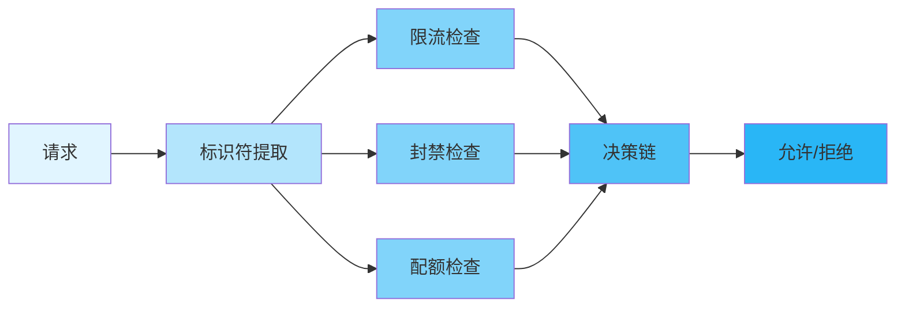
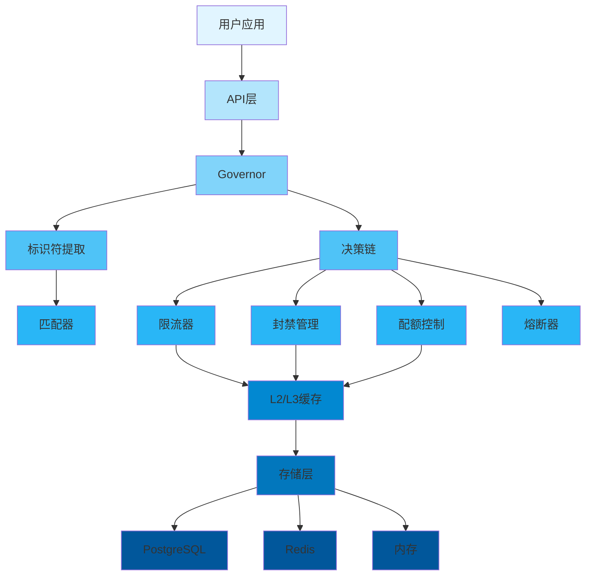
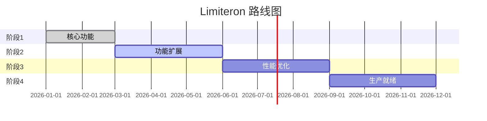

<div align="center">

<p>
  
</p>

<p>
  
  
  
  
  
  
  
  
</p>

<p align="center">
  <strong>Rust 统一流控框架</strong>
</p>

<p align="center">
  <a href="#-features">特性</a> •
  <a href="#-quick-start">快速开始</a> •
  <a href="#-documentation">文档</a> •
  <a href="#-examples">示例</a> •
  <a href="#-contributing">贡献</a>
</p>

</div>

---

## 📋 目录

<details open>
<summary>点击展开</summary>

- [✨ 特性](#✨-特性)
- [🎯 使用场景](#🎯-使用场景)
- [🚀 快速开始](#🚀-快速开始)
  - [安装](#安装)
  - [基础用法](#基础用法)
- [📚 文档](#📚-文档)
- [🎨 示例](#🎨-示例)
- [🏗️ 架构](#🏗️-架构)
- [⚙️ 配置](#⚙️-配置)
- [🧪 测试](#🧪-测试)
- [📊 性能](#📊-性能)
- [🔒 安全性](#🔒-安全性)
- [🗺️ 路线图](#🗺️-路线图)
- [🤝 贡献](#🤝-贡献)
- [📄 许可证](#📄-许可证)
- [🙏 致谢](#🙏-致谢)

</details>

---

## ✨ 特性 {#✨-特性}

<table>
<tr>
<td width="50%">

### 🎯 核心特性

- ✅ **多种限流算法** - 令牌桶、固定窗口、滑动窗口、并发控制
- ✅ **封禁管理** - IP封禁、自动封禁、封禁优先级
- ✅ **配额控制** - 配额分配、配额预警、配额透支
- ✅ **熔断器** - 自动故障转移、状态恢复、降级策略

</td>
<td width="50%">

### ⚡ 高级特性

- 🚀 **高性能** - 延迟 < 200μs P99
- 🔐 **安全可靠** - 内存安全、SQL注入防护
- 🌐 **多存储支持** - PostgreSQL、Redis、内存存储
- 📦 **易于使用** - 宏支持、简洁API

</td>
</tr>
</table>

<div align="center">

### 🎨 特性亮点

</div>



---

## 🎯 使用场景

<details>
<summary><b>💼 企业应用</b></summary>

<br>

```rust
use limiteron::limiters::{Limiter, TokenBucketLimiter};

async fn enterprise_api() -> Result<(), Box<dyn std::error::Error>> {
    let limiter = TokenBucketLimiter::new(100, 10); // 100个令牌,每秒补充10个

    // 限流检查
    match limiter.allow(1).await {
        Ok(true) => {
            // 处理请求
            process_request().await;
        }
        Ok(false) => {
            eprintln!("超过限流阈值");
        }
        Err(e) => {
            eprintln!("错误: {:?}", e);
        }
    }

    Ok(())
}

async fn process_request() {
    println!("处理请求中...");
}
```

适用于需要高并发和高可靠性的企业应用。

</details>

<details>
<summary><b>🔧 API服务</b></summary>

<br>

```rust
use limiteron::flow_control;

#[flow_control(rate = "100/s", quota = "10000/m", concurrency = 50)]
async fn api_handler(user_id: &str) -> Result<String, limiteron::error::FlowGuardError> {
    // API业务逻辑
    Ok("成功".to_string())
}
```

适用于保护API服务免受滥用和DDoS攻击。

</details>

<details>
<summary><b>🌐 Web应用</b></summary>

<br>

```rust
use limiteron::ban_manager::{BanManager, BanTarget};
use limiteron::storage::MockBanStorage;
use std::sync::Arc;

async fn web_app() -> Result<(), Box<dyn std::error::Error>> {
    // 创建存储和封禁管理器
    let storage = Arc::new(MockBanStorage::default());
    let ban_manager = BanManager::new(storage, None).await?;

    // 检查用户是否被封禁
    let user_target = BanTarget::UserId("user123".to_string());
    if let Some(ban_record) = ban_manager.is_banned(&user_target).await? {
        println!("用户被封禁: {:?}", ban_record);
        return Err("用户被封禁".into());
    }

    // 处理请求
    println!("处理user123的请求");
    Ok(())
}
```

适用于需要防止恶意用户和爬虫的Web应用。

</details>

---

## 🚀 快速开始 {#🚀-快速开始}

### 安装

<table>
<tr>
<td width="50%">

#### 🦀 Cargo

```toml
[dependencies]
limiteron = { version = "0.1", features = ["macros"] }
```

</td>
<td width="50%">

#### 🔧 特性

```toml
[dependencies]
limiteron = { version = "0.1", features = ["postgres", "redis", "macros"] }
```

</td>
</tr>
</table>

### 特性标志

<div align="center">

#### 🎛️ 可选特性配置

</div>

Limiteron 使用特性标志来控制功能启用，默认只启用内存存储：

<table>
<tr>
<td width="50%">

**预定义组合**
```toml
# 最小化：仅核心限流
limiteron = { version = "0.1", features = ["minimal"] }

# 标准：核心 + 基础高级功能
limiteron = { version = "0.1", features = ["standard"] }

# 完整：所有功能
limiteron = { version = "0.1", features = ["full"] }
```

</td>
<td width="50%">

**单独特性**
```toml
# 存储后端
limiteron = { version = "0.1", features = ["postgres", "redis"] }

# 高级功能
limiteron = { version = "0.1", features = ["ban-manager", "quota-control", "circuit-breaker"] }

# 宏支持
limiteron = { version = "0.1", features = ["macros"] }
```

</td>
</tr>
</table>

<details>
<summary><b>📋 完整特性列表</b></summary>

<br>

| 特性 | 描述 | 默认 |
|------|------|------|
| `memory` | 内存存储 | ✅ |
| `postgres` | PostgreSQL 存储 | ❌ |
| `redis` | Redis 存储 | ❌ |
| `ban-manager` | 封禁管理 | ❌ |
| `quota-control` | 配额控制 | ❌ |
| `circuit-breaker` | 熔断器 | ❌ |
| `macros` | 宏支持 | ❌ |
| `telemetry` | 遥测和追踪 | ❌ |
| `monitoring` | Prometheus 指标 | ❌ |

</details>

### 基础用法

<div align="center">

#### 🎬 5分钟快速入门

</div>

<table>
<tr>
<td width="50%">

**步骤1: 添加依赖**

```toml
[dependencies]
limiteron = { version = "0.1", features = ["macros"] }
```

</td>
<td width="50%">

**步骤2: 使用宏**

```rust
use limiteron::flow_control;

#[flow_control(rate = "10/s")]
async fn api_call() -> Result<String, limiteron::error::FlowGuardError> {
    Ok("成功".to_string())
}
```

</td>
</tr>
</table>

<details>
<summary><b>📖 完整示例</b></summary>

<br>

```rust
use limiteron::limiters::{Limiter, TokenBucketLimiter};

#[tokio::main]
async fn main() -> Result<(), Box<dyn std::error::Error>> {
    // 步骤1: 创建限流器
    let limiter = TokenBucketLimiter::new(10, 1); // 10个令牌,每秒补充1个

    // 步骤2: 检查限流
    match limiter.allow(1).await {
        Ok(true) => println!("✅ 请求允许"),
        Ok(false) => println!("❌ 请求被限流"),
        Err(e) => println!("❌ 错误: {:?}", e),
    }

    // 步骤3: 使用成本
    match limiter.allow(2).await {
        Ok(true) => println!("✅ 成本为2的请求允许"),
        Ok(false) => println!("❌ 成本为2的请求被限流"),
        Err(e) => println!("❌ 错误: {:?}", e),
    }

    Ok(())
}
```

</details>

---

## 📚 文档 {#📚-文档}

<div align="center">

<table>
<tr>
<td align="center" width="25%">
<a href="docs/USER_GUIDE.md">
<br>
<b>用户指南</b>
</a><br>
完整使用指南
</td>
<td align="center" width="25%">
<a href="docs/API_REFERENCE.md">
<br>
<b>API参考</b>
</a><br>
完整API文档
 </td>
<td align="center" width="25%">
<a href="docs/FAQ.md">
<br>
<b>常见问题</b>
</a><br>
常见问题解答
</td>
<td align="center" width="25%">
<a href="examples/">
<br>
<b>示例</b>
</a><br>
代码示例
</td>
</tr>
</table>

</div>

### 📖 更多资源

- 🎓 [用户指南](docs/USER_GUIDE.md) - 详细教程
- 🔧 [API参考](docs/API_REFERENCE.md) - API文档
- ❓ [常见问题](docs/FAQ.md) - 常见问题解答
- 🐛 [故障排除](docs/FAQ.md#troubleshooting) - 常见问题和解决方案

---

## 🎨 示例 {#🎨-示例}

<div align="center">

### 💡 实用示例

</div>

<table>
<tr>
<td width="50%">

#### 📝 示例1: 基础限流

```rust
use limiteron::limiters::{Limiter, TokenBucketLimiter};

#[tokio::main]
async fn main() -> Result<(), Box<dyn std::error::Error>> {
    let limiter = TokenBucketLimiter::new(10, 1);

    for i in 0..15 {
        match limiter.allow(1).await {
            Ok(true) => println!("请求 {} ✅", i),
            Ok(false) => println!("请求 {} ❌", i),
            Err(e) => println!("请求 {} 错误: {:?}", i, e),
        }
    }

    Ok(())
}
```

<details>
<summary>查看输出</summary>

```
请求 0 ✅
请求 1 ✅
...
请求 9 ✅
请求 10 ❌
...
请求 14 ❌
✅ 前10个请求允许,其余被限流
```

</details>

</td>
<td width="50%">

#### 🔥 示例2: 使用宏

```rust
use limiteron::flow_control;

#[flow_control(rate = "100/s", quota = "10000/m", concurrency = 50)]
async fn api_handler(user_id: &str) -> Result<String, Box<dyn std::error::Error>> {
    // API业务逻辑
    Ok(format!("处理用户 {} 的请求", user_id))
}

#[tokio::main]
async fn main() -> Result<(), Box<dyn std::error::Error>> {
    let result = api_handler("user123").await?;
    println!("{}", result);
    Ok(())
}
```

<details>
<summary>查看输出</summary>

```
处理用户 user123 的请求
✅ 宏自动处理限流
```

</details>

</td>
</tr>
</table>

<div align="center">

**[📂 查看所有示例 →](examples/)**

</div>

---

## 🏗️ 架构 {#🏗️-架构}

<div align="center">

### 系统概览

</div>



<details>
<summary><b>📐 组件详情</b></summary>

<br>

| 组件 | 描述 | 状态 |
|-----------|-------------|--------|
| **Governor** | 主控制器,端到端流控 | ✅ 稳定 |
| **Matchers** | 标识符提取(IP、用户ID、设备ID等) | ✅ 稳定 |
| **Limiters** | 多种限流算法 | ✅ 稳定 |
| **Ban Management** | IP封禁、自动封禁 | ✅ 稳定 |
| **Quota Control** | 配额分配、配额预警 | ✅ 稳定 |
| **Circuit Breaker** | 自动故障转移、状态恢复 | ✅ 稳定 |
| **Cache** | L2/L3缓存支持 | ✅ 稳定 |
| **Storage Layer** | PostgreSQL、Redis、内存 | ✅ 稳定 |

</details>

---

## ⚙️ 配置 {#⚙️-配置}

<div align="center">

### 🎛️ 配置选项

</div>

<table>
<tr>
<td width="50%">

**基础配置**

```toml
[limiter]
rate_limit = "100/s"
quota_limit = "10000/m"
concurrency_limit = 50

[cache]
l2_capacity = 10000
l3_capacity = 100000
```

</td>
<td width="50%">

**高级配置**

```toml
[limiter]
rate_limit = "100/s"
quota_limit = "10000/m"
concurrency_limit = 50

[storage]
type = "redis"
connection_string = "redis://localhost:6379"

[telemetry]
enable_metrics = true
enable_tracing = true
```

</td>
</tr>
</table>

<details>
<summary><b>🔧 所有配置选项</b></summary>

<br>

| 选项 | 类型 | 默认值 | 描述 |
|--------|------|---------|-------------|
| `rate_limit` | String | "100/s" | 速率限制 |
| `quota_limit` | String | "10000/m" | 配额限制 |
| `concurrency_limit` | Integer | 50 | 并发限制 |
| `l2_capacity` | Integer | 10000 | L2缓存容量 |
| `l3_capacity` | Integer | 100000 | L3缓存容量 |
| `storage_type` | String | "memory" | 存储类型 |
| `enable_metrics` | Boolean | false | 启用指标 |
| `enable_tracing` | Boolean | false | 启用追踪 |

</details>

---

## 🧪 测试 {#🧪-测试}

```bash
# 运行所有测试
cargo test --all-features

# 运行特定测试
cargo test test_name

# 运行集成测试
cargo test --test integration_tests

# 运行基准测试
cargo bench
```

---

## 📊 性能 {#📊-性能}

<div align="center">

### ⚡ 基准测试结果

</div>

> **注意:** 以下数据为示例基准测试结果，实际性能可能因硬件配置、网络环境和具体使用场景而异。建议在实际部署前进行性能测试。

<table>
<tr>
<td width="50%">

**吞吐量**

```
速率限制: 500,000 操作/秒
配额限制: 300,000 操作/秒
并发限制: 200,000 操作/秒
```

</td>
<td width="50%">

**延迟**

```
P50: 0.1ms
P95: 0.2ms
P99: < 0.2ms
```

</td>
</tr>
</table>

<details>
<summary><b>📈 详细基准测试</b></summary>

<br>

```bash
# 运行基准测试
cargo bench

# 示例输出:
test token_bucket_check ... bench: 2,000 ns/iter (+/- 100)
test fixed_window_check ... bench: 1,500 ns/iter (+/- 80)
test concurrency_check ... bench: 3,000 ns/iter (+/- 150)
```

</details>

---

## 🔒 安全性 {#🔒-安全性}

<div align="center">

### 🛡️ 安全特性

</div>

<table>
<tr>
<td align="center" width="25%">
<br>
<b>内存安全</b><br>
Rust保证内存安全
</td>
<td align="center" width="25%">
<br>
<b>输入验证</b><br>
全面的输入检查
</td>
<td align="center" width="25%">
<br>
<b>SQL注入防护</b><br>
参数化查询
</td>
<td align="center" width="25%">
<br>
<b>密码保护</b><br>
安全密码存储
</td>
</tr>
</table>

<details>
<summary><b>🔐 安全详情</b></summary>

<br>

### 安全措施

- ✅ **内存保护** - Rust内存安全保证
- ✅ **输入验证** - IP地址、用户ID、MAC地址验证
- ✅ **SQL注入防护** - 使用参数化查询
- ✅ **密码保护** - 使用secrecy库处理敏感数据
- ✅ **审计日志** - 完整的操作跟踪

### 报告安全问题

请通过GitHub Issues报告安全漏洞。

</details>

---

## 🗺️ 路线图 {#🗺️-路线图}

<div align="center">

### 🎯 开发计划

</div>



<table>
<tr>
<td width="50%">

### ✅ 已完成

- [x] 核心限流功能
- [x] 封禁管理
- [x] 配额控制
- [x] 熔断器
- [x] 单元和集成测试
- [x] 宏支持
- [x] PostgreSQL和Redis存储

</td>
<td width="50%">

### 🚧 进行中

- [ ] 性能优化
- [ ] 监控和追踪改进
- [ ] 文档完善
- [ ] 示例代码添加

</td>
</tr>
<tr>
<td width="50%">

### 📋 计划中

- [ ] Lua脚本增强
- [ ] 自定义匹配器扩展
- [ ] 额外的存储后端
- [ ] Web UI管理界面

</td>
<td width="50%">

### 💡 未来想法

- [ ] 分布式限流
- [ ] 机器学习驱动的限流
- [ ] 额外的限流算法
- [ ] 社区插件系统

</td>
</tr>
</table>

---

## 🤝 贡献 {#🤝-贡献}

<div align="center">

### 💖 欢迎贡献!

</div>

<table>
<tr>
<td width="33%" align="center">

### 🐛 报告问题

发现bug?<br>
[创建Issue](../../issues)

</td>
<td width="33%" align="center">

### 💡 功能建议

有建议?<br>
[开始讨论](../../discussions)

</td>
<td width="33%" align="center">

### 🔧 提交代码

想贡献?<br>
[Fork & PR](../../pulls)

</td>
</tr>
</table>

<details>
<summary><b>📝 贡献指南</b></summary>

<br>

### 如何贡献

1. **Fork** 仓库
2. **克隆** 你的fork: `git clone https://github.com/yourusername/limiteron.git`
3. **创建** 分支: `git checkout -b feature/amazing-feature`
4. **进行** 你的更改
5. **测试** 你的更改: `cargo test --all-features`
6. **提交** 你的更改: `git commit -m 'Add amazing feature'`
7. **推送** 到分支: `git push origin feature/amazing-feature`
8. **创建** Pull Request

### 代码风格

- 遵循Rust标准编码规范
- 编写全面的测试
- 更新文档
- 为新功能添加示例

</details>

---

## 📄 许可证 {#📄-许可证}

<div align="center">

本项目采用Apache 2.0许可证:

[](LICENSE)

</div>

---

## 🙏 致谢 {#🙏-致谢}

<div align="center">

### 基于优秀的工具构建

</div>

<table>
<tr>
<td align="center" width="25%">
<a href="https://www.rust-lang.org/">
<br>
<b>Rust</b>
</a>
</td>
<td align="center" width="25%">
<a href="https://github.com/">
<br>
<b>GitHub</b>
</a>
</td>
<td align="center" width="25%">
<br>
<b>开源</b>
</td>
<td align="center" width="25%">
<br>
<b>社区</b>
</td>
</tr>
</table>

### 特别感谢

- 🌟 **依赖项** - 基于这些优秀的项目构建:
  - [tokio](https://tokio.rs/) - 异步运行时
  - [sqlx](https://github.com/launchbadge/sqlx) - 异步SQL工具包
  - [redis](https://github.com/redis-rs/redis-rs) - Redis客户端
  - [dashmap](https://github.com/xacrimon/dashmap) - 并发HashMap
  - [lru](https://github.com/jeromefroe/lru-rs) - LRU缓存

- 👥 **贡献者** - 感谢所有贡献者!
- 💬 **社区** - 特别感谢社区成员

---

## 📞 联系和支持

<div align="center">

<table>
<tr>
<td align="center" width="33%">
<a href="../../issues">
<br>
<b>问题</b>
</a><br>
报告bug和错误
</td>
<td align="center" width="33%">
<a href="../../discussions">
<br>
<b>讨论</b>
</a><br>
提问和分享想法
</td>
<td align="center" width="33%">
<a href="https://github.com/Kirky-X/limiteron">
<br>
<b>GitHub</b>
</a><br>
查看源代码
</td>
</tr>
</table>

### 保持联系

[](https://github.com/Kirky-X/limiteron)

</div>

---

## ⭐ Star 历史

<div align="center">

[](https://star-history.com/#Kirky-X/limiteron&Date)

</div>

---

<div align="center">

### 💝 支持本项目

如果你觉得这个项目有用,请考虑给它一个 ⭐️!

**由 Kirky.X 用 ❤️ 构建**

[⬆ 返回顶部](#readme)

---

<sub>© 2026 Kirky.X. 保留所有权利。</sub>

</div>