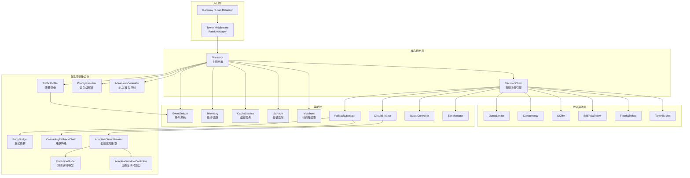
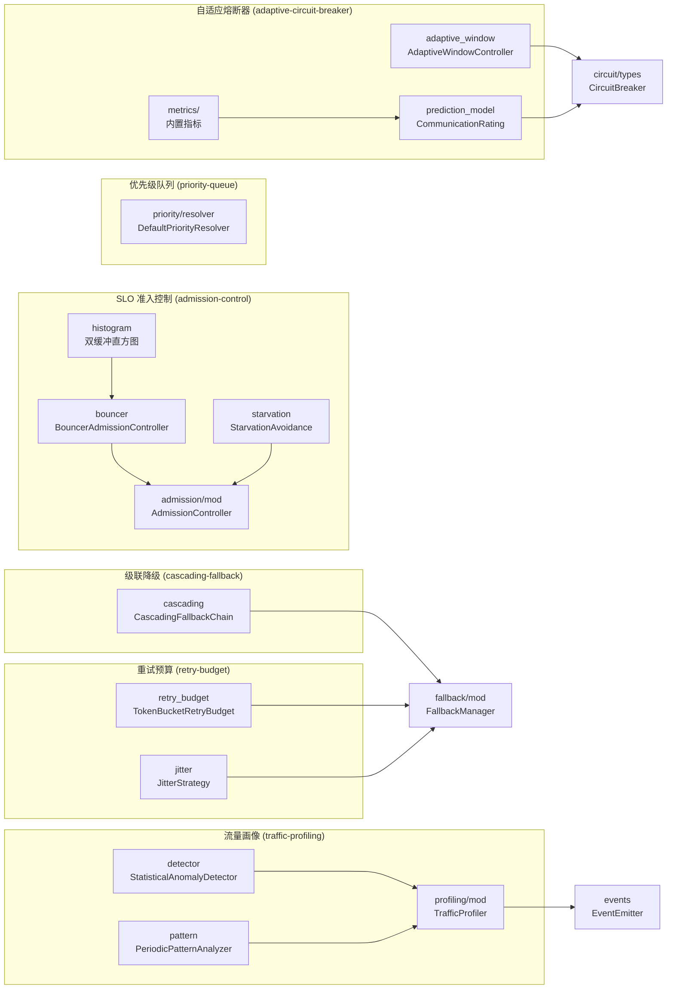
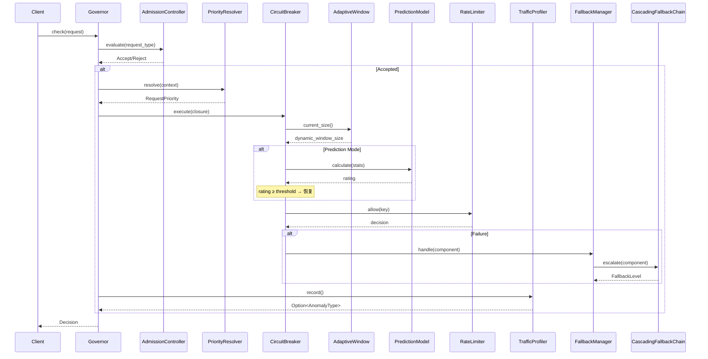
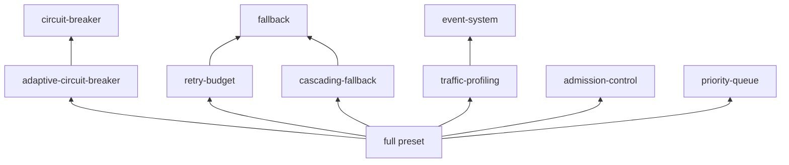

# Limiteron 架构文档

### 完整 API 文档

[🏠 首页](../README.md) • [📚 变更日志](CHANGELOG.md) • [📘 API 参考](API_REFERENCE.md) • [🧪 测试指南](TESTING.md)

---

## 整体架构

## 自适应流量优化模块架构

### 模块依赖关系

### 数据流

## 新增模块详细说明

### 自适应滑动窗口 (`src/circuit/adaptive_window.rs`)

**Feature**: `adaptive-circuit-breaker`（依赖 `circuit-breaker`）

**职责**：根据实时请求速率动态调整熔断器滑动窗口大小。

**核心算法**：
1. 指数平滑：`λ_smoothed = (1-γ)·λ_prev + γ·λ_raw`
2. 目标窗口：`W_target = clip(α·λ_smoothed, W_min, W_max)`
3. 滞后判断：`|W_target - W_current| / W_current > ε` 时才更新

**并发模型**：`AtomicU64`（请求计数）+ `parking_lot::RwLock`（平滑速率/窗口大小）

### 预测型熔断器 (`src/circuit/prediction_model.rs`, `src/circuit/metrics/`)

**Feature**: `adaptive-circuit-breaker`

**职责**：基于加权性能指标计算通信评分，驱动熔断器智能恢复。

**评分公式**：`rating = Σ(c_pos·m_pos) + Σ(c_neg·(1-m_neg))` ∈ [0, 1]

**内置指标**：
| 指标 | 文件 | 方向 | 计算 |
|------|------|------|------|
| FailureRateMetric | `metrics/failure_rate.rs` | Negative | failures / total |
| SlowCallRateMetric | `metrics/slow_call_rate.rs` | Negative | slow_calls / total |
| PermittedCallRateMetric | `metrics/permitted_call_rate.rs` | Positive | permitted / total |
| ConsecutiveFailureStreakMetric | `metrics/consecutive_streak.rs` | Negative | streak / threshold |

### 级联降级 (`src/fallback/cascading.rs`)

**Feature**: `cascading-fallback`（依赖 `fallback`）

**降级级别**：Normal → L1CacheOnly → StaticResponse → FailOpen → FailClosed

**并发模型**：`HashMap<ComponentType, FallbackLevel>` + `parking_lot::RwLock`

### 重试预算 (`src/fallback/retry_budget.rs`) + Jitter (`src/fallback/jitter.rs`)

**Feature**: `retry-budget`（依赖 `fallback`, `dep:rand`）

**重试预算**：令牌桶算法，`AtomicU64` 存储 + `parking_lot::Mutex` 保护补充。

**Jitter 策略**：
| 策略 | 公式 |
|------|------|
| FullJitter | `random(0, base_delay)` |
| EqualJitter | `base_delay/2 + random(0, base_delay/2)` |
| DecorrelatedJitter | `min(max_delay, random(base_delay, prev_delay·3))` |

### SLO 准入控制 (`src/admission/`)

**Feature**: `admission-control`

**核心组件**：
- `BouncerAdmissionController`：基于 EWT/ERT 公式的准入决策
- 双缓冲直方图（`histogram.rs`）：active (VecDeque) 写入 + frozen (Vec) 排序读取
- 饥饿避免（`starvation.rs`）：时间窗口内拒绝率监控 + 降级触发

### 优先级队列 (`src/priority/`)

**Feature**: `priority-queue`

**核心组件**：
- `DefaultPriorityResolver`：基于 RequestContext 的 path/user_id/tenant 规则匹配
- `PriorityConfig`：Critical/High/Normal/Low 比例配置 + 饥饿避免策略

### 流量画像 (`src/profiling/`)

**Feature**: `traffic-profiling`（依赖 `event-system`）

**核心组件**：
- `StatisticalAnomalyDetector`：Z-score (|z|>threshold) + IQR 双重检测
- `PeriodicPatternAnalyzer`：自相关函数 (ACF) 检测周期性 + 线性回归趋势检测
- `DefaultTrafficProfiler`：组合 detector + pattern analyzer

## Feature 依赖总览

| Feature | 依赖 | 新增模块 |
|---------|------|----------|
| `adaptive-circuit-breaker` | `circuit-breaker` | `circuit/adaptive_window`, `circuit/prediction_model`, `circuit/metrics/` |
| `retry-budget` | `fallback`, `dep:rand` | `fallback/retry_budget`, `fallback/jitter` |
| `cascading-fallback` | `fallback` | `fallback/cascading` |
| `admission-control` | — | `admission/` |
| `priority-queue` | — | `priority/` |
| `traffic-profiling` | `event-system` | `profiling/` |
