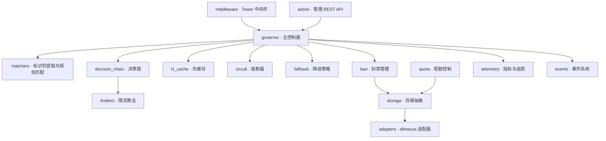
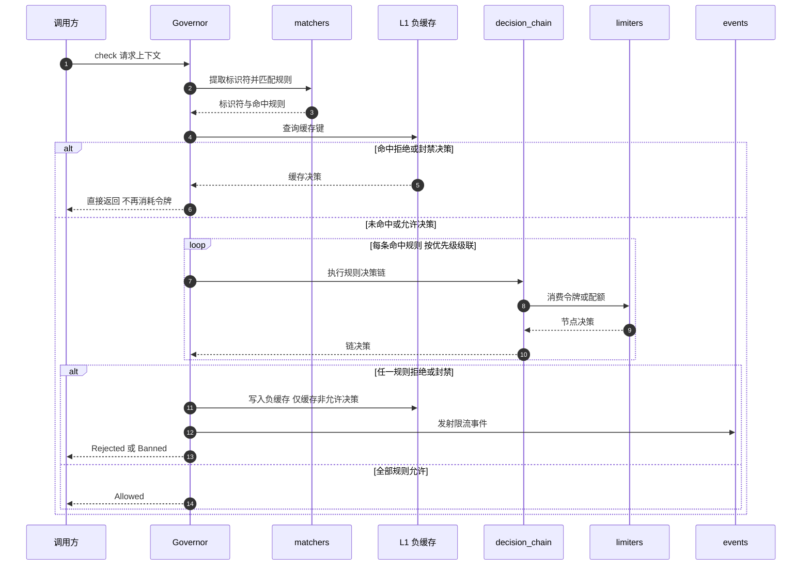
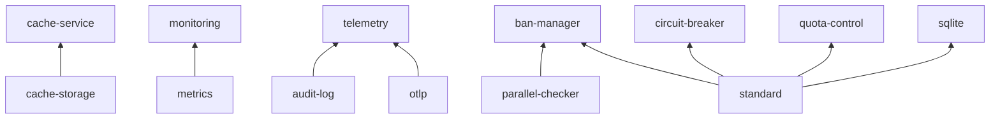

# 🏗️ Limiteron 架构文档

本文档描述 Limiteron 的整体架构、模块划分与扩展机制，帮助读者理解框架的内部实现。模块事实以 `src/` 源码为准；API 细节见 [API 参考](API_REFERENCE.md)。

[🏠 首页](../README.md) • [📋 更新日志](CHANGELOG.md) • [🧪 测试指南](TESTING.md) • [🔒 安全文档](SECURITY.md)

---

## 📋 目录

📑 目录

- [🏛️ 整体架构](#️-整体架构)
- [🎯 核心决策流程](#-核心决策流程)
- [🧱 模块职责](#-模块职责)
- [💾 存储与缓存](#-存储与缓存)
- [🧩 特性依赖总览](#-特性依赖总览)
- [🔌 扩展机制](#-扩展机制)

---

## 🏛️ 整体架构

Limiteron 采用分层架构：接入层（Tower 中间件、Admin API）将流量交给 **Governor** 主控制器；Governor 经 **matchers** 提取标识符并匹配规则，再沿规则各自的 **decision_chain** 决策链级联执行，链上节点为 **limiters** 中的限流算法实例；封禁、配额、熔断、降级作为领域组件参与决策；状态经 **storage** 抽象落地，默认内存实现，生产可切换 **adapters** 提供的 dbnexus（PostgreSQL / SQLite / MySQL）持久化；**telemetry** 与 **events** 提供指标、追踪与事件外发。

---

## 🎯 核心决策流程

一次 `Governor::check(context)` 的完整决策路径（提炼自 `src/governor.rs`）：

关键语义（均可在源码中对应）：

- **规则匹配只计算一次**，命中规则贯穿整个检查流程
- **负缓存 fail-closed**：仅拒绝/封禁决策入 L1 缓存，"允许"决策永不入缓存，任何请求都必须真实执行限流检查
- **级联执行**：任一规则拒绝即拒绝，全部允许才放行
- 启用 `parallel-checker` 时，封禁检查先于缓存读取执行，被封禁标识符无法借缓存绕过

---

## 🧱 模块职责

| 模块 | 路径 | 职责 |
|------|------|------|
| Governor | `src/governor.rs` | 主控制器：标识符提取、规则匹配、级联决策、统计与自省 |
| Limiters | `src/limiters/` | 令牌桶、滑动/分片滑动/固定窗口、并发、GCRA、HTB、AIMD 自适应、配额限流器、批量令牌预取 |
| Matchers | `src/matchers/` | 标识符提取器、规则匹配引擎、自定义匹配器注册表 |
| DecisionChain | `src/decision_chain/` | 按优先级级联的责任链与链级统计 |
| Ban | `src/ban/` | 封禁类型、YAML 文件加载与热重载 |
| Quota | `src/quota/` | 配额控制器与周期窗口 |
| Circuit | `src/circuit/` | 熔断器（Closed / Open / HalfOpen 三状态机） |
| Fallback | `src/fallback.rs` | 降级策略管理器 |
| Bulkhead | `src/bulkhead.rs` | 舱壁隔离：按资源组分池与独立并发预算（`bulkhead` 特性） |
| Storage | `src/storage/` | `Storage` / `BanStorage` / `QuotaStorage` trait、内存实现、并行封禁检查器 |
| Adapters | `src/adapters/` | dbnexus 存储适配器与 `StorageFactory`（DSN 创建） |
| Cache | `src/cache/` | oxcache 统一缓存服务 |
| L1 Cache | `src/l1_cache.rs` | 负缓存：仅缓存拒绝/封禁决策 |
| Events | `src/events/` | 事件发射/分发、Outbox、Webhook 签名、封禁同步 |
| Middleware | `src/middleware/` | Tower Layer / Service、限流响应头 |
| Admin | `src/admin/` | 管理 REST API 服务器、RBAC、K8s 探针 |
| Telemetry | `src/telemetry/` | Prometheus 指标、OTLP 导出 |
| Logging | `src/logging/` | 审计日志（HMAC 链式签名）与日志脱敏 |
| Validation | `src/validation.rs` | IP / 用户 ID / MAC / API Key 输入校验（`validation` 特性） |
| Config | `src/config/` | `FlowControlConfig`、`ConfigBuilder`、`ConfigLoader` |
| Macros | `macros/`、`src/macros.rs` | `#[flow_control]` 声明式宏（`macros` 特性） |
| Integrations | `src/integrations/` | dbnexus / oxcache / trait-kit / inklog / confers 端口实现 |
| Tenant | `src/tenant/` | 多租户复合决策键（`multi-tenant` 特性） |

---

## 💾 存储与缓存

| 后端 | 模块 | 特性 | 说明 |
|------|------|------|------|
| MemoryStorage | `src/storage/storage_impl.rs` | 始终可用 | 内存存储，同时实现 `Storage` / `BanStorage` / `QuotaStorage`，适合单机开发与测试 |
| dbnexus 适配器 | `src/adapters/` | `postgres` / `sqlite` / `mysql`（互斥） | 经 dbnexus 持久化，`StorageFactory` 从 DSN 创建 |
| oxcache 缓存 | `src/cache/` | `cache-service` / `cache-storage` | 统一缓存服务，Redis 后端经 oxcache 接入 |
| Redis Lua 原子操作 | `src/oxcache_lua.rs` | `lua-script` | 令牌桶/滑动窗口/固定窗口/配额脚本经 oxcache `eval_lua` 原子执行，支撑分布式限流 |

> **说明**：`RedisStorage` 与 `redis-storage` 特性已在 v0.2.1 移除，缓存统一经 oxcache 管理。`postgres` / `sqlite` / `mysql` 三种 dbnexus 驱动互斥，不可共存于同一构建。

---

## 🧩 特性依赖总览

特性体系按类别组织（完整清单见 [Cargo.toml](../Cargo.toml) 的 `[features]` 段与 [README 特性标志](../README.md#-特性标志)）：

| 类别 | 代表特性 | 说明 |
|------|---------|------|
| 预设 | `minimal` / `standard` / `full` | minimal 即 `default = []`（无外部存储依赖）；standard 为 SQLite 组合；full 覆盖除 CLI 外的主要能力 |
| 存储 | `postgres` / `sqlite` / `mysql` | dbnexus 驱动，三者互斥 |
| 缓存 | `cache-service` / `cache-storage` / `lua-script` | oxcache 集成 |
| 算法 | `gcra` / `adaptive-limiting` | GCRA 限流、AIMD 自适应并发 |
| 安全 | `log-redaction` / `config-security` / `validation` | 脱敏、配置校验、输入校验 |
| 可观测 | `telemetry` / `monitoring` / `metrics` / `audit-log` / `otlp` | 指标、追踪、审计；`metrics` 隐含 `monitoring`，`audit-log` / `otlp` 隐含 `telemetry` |
| 控制面 | `admin-api` / `cli` | 管理 REST API 与 `limiteron-cli` |
| 事件 | `event-system` / `webhook` / `ban-sync` | 事件订阅与 Outbox；`webhook` 签名外发与 `ban-sync` 跨实例广播需与 `event-system` 组合启用 |
| 生态 | `kit` / `i18n` / `inklog` / `config-confers`(-reload) | trait-kit、ICU4X、inklog、confers 集成 |

> **兼容声明**：`priority-queue` 与 `admission-control` 仅为下游兼容保留的特性声明，启用无任何效果。

---

## 🔌 扩展机制

| 扩展点 | 机制 | 说明 |
|--------|------|------|
| 自定义限流算法 | 实现 `Limiter` trait | `allow` / `peek` / `remaining` / `check`；决策链与中间件无差别使用 |
| 自定义匹配器 | 实现 `CustomMatcher` trait | 经 `CustomMatcherRegistry` 注册，支持 Header / 时间窗等组合 |
| 自定义存储后端 | 实现 `Storage` / `BanStorage` / `QuotaStorage` | 以 `Arc<dyn Trait>` 注入，内存实现可作参考 |
| 自定义提取器 | 实现 `IdentifierExtractor` trait | 加入 `CompositeExtractor` 参与标识符提取 |
| 授权 | 实现 `AuthorizationProvider` trait | 挂接到封禁管理的写操作授权链 |
| 事件 | `EventEmitter` / `EventHandler` | 事件订阅、Transactional Outbox、Webhook 外发（HMAC 签名） |
| 声明式接入 | `#[flow_control]` 宏 | `rate` / `quota` / `concurrency` / `on_exceed` / `key_prefix` 等参数，编译期生成限流包装 |
| 配置热更新 | `POST /api/v1/config` | 原子换配置：同步重建规则匹配器与决策链、失效 L1 缓存并记录历史；`config-watcher` 提供文件监听热重载 |
| 分布式 | `DistributedLimiter` trait | 内存实现开箱即用；Redis 实现经 Lua 脚本跨实例协调（`distributed` + `lua-script`） |
