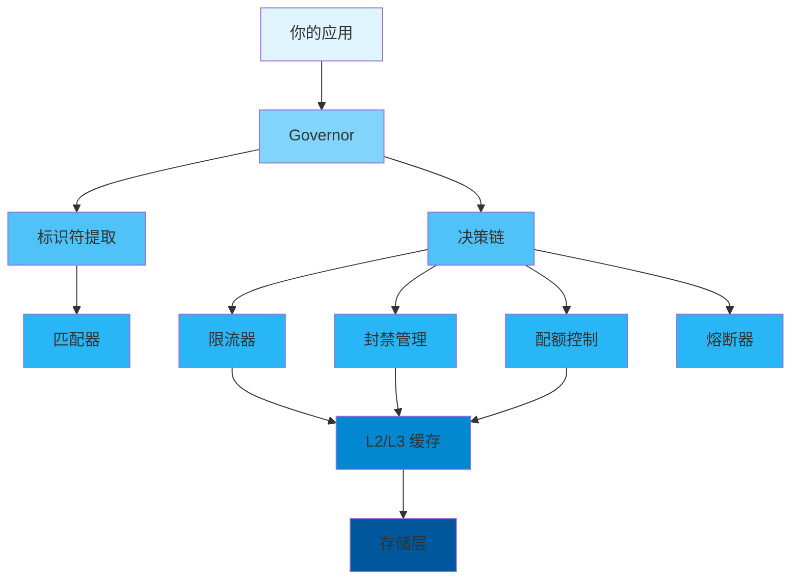

<div align="center">

# 📖 用户指南

### Limiteron 完整使用指南

[🏠 首页](../README.md) • [📚 文档](README.md) • [🎯 示例](../examples/) • [❓ 常见问题](FAQ.md)

---

</div>

## 📋 目录

- [简介](#简介)
- [快速开始](#快速开始)
  - [前置要求](#前置要求)
  - [安装](#安装)
  - [第一步](#第一步)
- [核心概念](#核心概念)
- [基本使用](#基本使用)
  - [初始化](#初始化)
  - [配置](#配置)
  - [基本操作](#基本操作)
- [高级使用](#高级使用)
  - [自定义配置](#自定义配置)
  - [性能调优](#性能调优)
  - [错误处理](#错误处理)
- [最佳实践](#最佳实践)
- [常见模式](#常见模式)
- [故障排除](#故障排除)
- [下一步](#下一步)

---

## 简介

<div align="center">

### 🎯 你将学到什么

</div>

<table>
<tr>
<td width="25%" align="center">
<br>
<b>快速开始</b><br>
5 分钟上手
</td>
<td width="25%" align="center">
<br>
<b>配置</b><br>
自定义配置
</td>
<td width="25%" align="center">
<br>
<b>最佳实践</b><br>
学习正确的方法
</td>
<td width="25%" align="center">
<br>
<b>高级主题</b><br>
掌握细节
</td>
</tr>
</table>

**Limiteron** 是一个 Rust 统一流量控制框架，帮助你保护应用免受滥用和 DDoS 攻击。本指南将带你从基础设置到高级使用模式。

> 💡 **提示**: 本指南假设你具备基本的 Rust 知识。如果你是 Rust 新手，建议先学习 Rust 基础语法。

---

## 快速开始

### 前置要求

在开始之前，确保你已安装以下内容：

<table>
<tr>
<td width="50%">

**必需**
- ✅ Rust 1.75+ (stable)
- ✅ Cargo (随 Rust 一起安装)
- ✅ Git

</td>
<td width="50%">

**可选**
- 🔧 支持 Rust 的 IDE
- 🔧 Docker（用于容器化部署）
- 🔧 PostgreSQL（用于持久化存储）
- 🔧 Redis（用于缓存和分布式限流）

</td>
</tr>
</table>

<details>
<summary><b>🔍 验证你的安装</b></summary>

```bash
# 检查 Rust 版本
rustc --version
# 预期: rustc 1.75.0 (或更高)

# 检查 Cargo 版本
cargo --version
# 预期: cargo 1.75.0 (或更高)

# 检查 Git 版本
git --version
# 预期: git version 2.x.x
```

</details>

### 安装

<div align="center">

#### 选择你的安装方法

</div>

<table>
<tr>
<td width="50%">

**📦 使用 Cargo（推荐）**

```bash
# 添加到 Cargo.toml
[dependencies]
limiteron = "1.0"

# 或通过命令安装
cargo add limiteron
```

</td>
<td width="50%">

**🐙 从源码安装**

```bash
git clone https://github.com/kirkyx/limiteron
cd limiteron
cargo build --release
```

</td>
</tr>
</table>

<details>
<summary><b>🌐 其他安装方法</b></summary>

**启用特性**
```toml
[dependencies]
limiteron = { version = "1.0", features = ["postgres", "redis"] }
```

**本地开发**
```bash
# 使用本地版本
[dependencies]
limiteron = { path = "/path/to/limiteron" }
```

</details>

### 第一步

让我们用一个简单的 "Hello World" 来验证你的安装：

```rust
use limiteron::limiters::TokenBucketLimiter;

#[tokio::main]
async fn main() -> Result<(), Box<dyn std::error::Error>> {
    // 创建限流器
    let mut limiter = TokenBucketLimiter::new(10, 1);
    let key = "user123";

    // 检查限流
    match limiter.check(key).await {
        Ok(_) => println!("✅ Limiteron 已就绪！"),
        Err(_) => println!("❌ 请求被限流"),
    }

    Ok(())
}
```

<details>
<summary><b>🎬 运行示例</b></summary>

```bash
# 创建新项目
cargo new hello-limiteron
cd hello-limiteron

# 添加依赖
cargo add limiteron

# 将上面的代码复制到 src/main.rs

# 运行！
cargo run
```

**预期输出:**
```
✅ Limiteron 已就绪！
```

</details>

---

## 核心概念

理解这些核心概念将帮助你有效地使用这个库。

<div align="center">

### 🧩 关键组件

</div>



### 1️⃣ 限流器

**是什么**: 控制请求速率的组件。

**为什么重要**: 保护服务免受滥用和 DDoS 攻击。

**示例:**
```rust
use limiteron::limiters::TokenBucketLimiter;

let limiter = TokenBucketLimiter::new(10, 1); // 10 个令牌，每秒补充 1 个
limiter.check("user123").await?;
```

<details>
<summary><b>📚 了解更多</b></summary>

详细说明：
- **令牌桶**: 桶中固定数量的令牌，请求消耗令牌，定期补充
- **固定窗口**: 在固定时间窗口内限制请求数
- **滑动窗口**: 使用滑动时间窗口提供更精确的限流
- **并发控制**: 限制同时处理的请求数

</details>

### 2️⃣ 封禁管理

**是什么**: 管理恶意用户和 IP 的封禁。

**关键特性:**
- ✅ IP 封禁
- ✅ 用户封禁
- ✅ 自动封禁
- ✅ 封禁优先级

**示例:**
```rust
use limiteron::BanManager;

let ban_manager = BanManager::new().await?;
ban_manager.ban("192.168.1.100", "恶意请求", 3600).await?;
```

### 3️⃣ 配额控制

**是什么**: 在特定时间窗口内限制总请求数。

<table>
<tr>
<td width="50%">

**传统方法**
```rust
// 手动计数
let mut count = 0;
count += 1;
if count > limit {
    return Err("超过配额");
}
```

</td>
<td width="50%">

**我们的方法**
```rust
// 自动管理
let quota = QuotaController::new(10000, 60);
quota.consume("user123").await?;
```

</td>
</tr>
</table>

---

## 基本使用

### 初始化

每个应用在使用前必须初始化限流器：

```rust
use limiteron::limiters::TokenBucketLimiter;

#[tokio::main]
async fn main() -> Result<(), Box<dyn std::error::Error>> {
    // 简单初始化
    let limiter = TokenBucketLimiter::new(10, 1);

    // 或使用 Governor
    use limiteron::{Governor, FlowControlConfig};
    let governor = Governor::new(FlowControlConfig::default()).await?;

    Ok(())
}
```

<div align="center">

| 方法 | 使用场景 | 性能 | 复杂度 |
|--------|----------|-------------|------------|
| `TokenBucketLimiter` | 快速开始，开发 | ⚡ 快 | 🟢 简单 |
| `Governor` | 生产，自定义需求 | ⚡⚡ 优化 | 🟡 中等 |

</div>

### 配置

<details open>
<summary><b>⚙️ 配置选项</b></summary>

```rust
use limiteron::{Governor, FlowControlConfig};

let config = FlowControlConfig {
    rate_limit: Some("100/s".to_string()),
    quota_limit: Some("10000/m".to_string()),
    concurrency_limit: Some(50),
    ..Default::default()
};

let governor = Governor::new(config).await?;
```

</details>

<table>
<tr>
<th>选项</th>
<th>类型</th>
<th>默认值</th>
<th>描述</th>
</tr>
<tr>
<td><code>rate_limit</code></td>
<td>Option&lt;String&gt;</td>
<td>None</td>
<td>速率限制（如 "100/s"）</td>
</tr>
<tr>
<td><code>quota_limit</code></td>
<td>Option&lt;String&gt;</td>
<td>None</td>
<td>配额限制（如 "10000/m"）</td>
</tr>
<tr>
<td><code>concurrency_limit</code></td>
<td>Option&lt;u64&gt;</td>
<td>None</td>
<td>并发限制</td>
</tr>
</table>

### 基本操作

<div align="center">

#### 📝 限流操作

</div>

<table>
<tr>
<td width="50%">

**检查限流**
```rust
let limiter = TokenBucketLimiter::new(10, 1);
match limiter.check(key).await {
    Ok(_) => println!("✅ 允许"),
    Err(_) => println!("❌ 拒绝"),
}
```

**封禁用户**
```rust
let ban_manager = BanManager::new().await?;
ban_manager.ban("user123", "恶意", 3600).await?;
```

</td>
<td width="50%">

**配额消费**
```rust
let quota = QuotaController::new(10000, 60);
quota.consume("user123").await?;
```

**熔断检查**
```rust
let breaker = CircuitBreaker::new(5, 30);
breaker.check().await?;
```

</td>
</tr>
</table>

<details>
<summary><b>🎯 完整示例</b></summary>

```rust
use limiteron::{Governor, FlowControlConfig};

#[tokio::main]
async fn main() -> Result<(), Box<dyn std::error::Error>> {
    let governor = Governor::new(FlowControlConfig::default()).await?;

    // 检查请求
    let decision = governor.check_request("user123", "/api/v1/users").await?;
    if decision.is_allowed() {
        println!("✅ 请求允许");
        // 处理请求
    } else {
        println!("❌ 请求被拒绝: {:?}", decision);
    }

    Ok(())
}
```

</details>

---

## 高级使用

### 自定义配置

对于生产环境，你需要细粒度的控制：

```rust
use limiteron::{Governor, FlowControlConfig};

let config = FlowControlConfig {
    rate_limit: Some("100/s".to_string()),
    quota_limit: Some("10000/m".to_string()),
    concurrency_limit: Some(50),
    enable_metrics: true,
    enable_tracing: true,
    ..Default::default()
};

let governor = Governor::new(config).await?;
```

<details>
<summary><b>🎛️ 性能配置</b></summary>

<table>
<tr>
<th>配置</th>
<th>使用场景</th>
<th>吞吐量</th>
<th>延迟</th>
<th>内存</th>
</tr>
<tr>
<td><b>低延迟</b></td>
<td>实时应用</td>
<td>中等</td>
<td>⚡ 非常低</td>
<td>高</td>
</tr>
<tr>
<td><b>高吞吐</b></td>
<td>批处理</td>
<td>⚡ 非常高</td>
<td>中等</td>
<td>中等</td>
</tr>
<tr>
<td><b>平衡</b></td>
<td>通用</td>
<td>高</td>
<td>低</td>
<td>中等</td>
</tr>
<tr>
<td><b>低内存</b></td>
<td>资源受限</td>
<td>低</td>
<td>中等</td>
<td>⚡ 非常低</td>
</tr>
</table>

</details>

### 性能调优

<div align="center">

#### ⚡ 优化策略

</div>

**1. 使用缓存**

```rust
use limiteron::L2Cache;

let cache = L2Cache::new(10000, 3600)?;
// 缓存会自动提高性能
```

**2. 批量操作**

<table>
<tr>
<td width="50%">

❌ **低效**
```rust
for item in items {
    limiter.check(&item.id).await?;
}
```

</td>
<td width="50%">

✅ **高效**
```rust
// 使用共享的 limiter 实例
for item in items {
    limiter.check(&item.id).await?;
}
```

</td>
</tr>
</table>

**3. 使用宏**

```rust
use limiteron::flow_control;

#[flow_control(rate = "100/s")]
async fn api_handler(user_id: &str) -> Result<String, FlowGuardError> {
    // 宏自动处理限流
    Ok("Success".to_string())
}
```

### 错误处理

<div align="center">

#### 🚨 优雅地处理错误

</div>

```rust
use limiteron::error::FlowGuardError;

async fn handle_request() -> Result<(), FlowGuardError> {
    match limiter.check(key).await {
        Ok(_) => {
            println!("✅ 请求允许");
            Ok(())
        }
        Err(FlowGuardError::RateLimitExceeded(msg)) => {
            println!("⚠️ 速率限制: {}", msg);
            Ok(())
        }
        Err(FlowGuardError::Banned(msg)) => {
            eprintln!("❌ 已封禁: {}", msg);
            Err(FlowGuardError::Banned(msg))
        }
        Err(e) => {
            eprintln!("❌ 错误: {:?}", e);
            Err(e)
        }
    }
}
```

<details>
<summary><b>📋 错误类型</b></summary>

| 错误类型 | 描述 | 恢复策略 |
|------------|-------------|-------------------|
| `RateLimitExceeded` | 超过速率限制 | 等待重试 |
| `QuotaExceeded` | 超过配额限制 | 等待下一个时间窗口 |
| `Banned` | 已被封禁 | 联系管理员 |
| `CircuitBreakerOpen` | 熔断器已打开 | 等待恢复 |
| `InvalidInput` | 无效输入 | 验证输入 |

</details>

---

## 最佳实践

<div align="center">

### 🌟 遵循这些指南

</div>

### ✅ DO's

<table>
<tr>
<td width="50%">

**尽早初始化**
```rust
#[tokio::main]
async fn main() {
    // 在开始时初始化
    let governor = Governor::new(FlowControlConfig::default()).await.unwrap();

    // 然后使用
    do_work().await;
}
```

</td>
<td width="50%">

**使用全局实例**
```rust
// 确保所有请求共享同一个 limiter 实例
lazy_static! {
    static ref LIMITER: TokenBucketLimiter = TokenBucketLimiter::new(10, 1);
}
```

</td>
</tr>
<tr>
<td width="50%">

**正确处理错误**
```rust
match limiter.check(key).await {
    Ok(_) => process(),
    Err(e) => handle_error(e),
}
```

</td>
<td width="50%">

**使用宏简化代码**
```rust
#[flow_control(rate = "100/s")]
async fn api_handler() -> Result<String, FlowGuardError> {
    // 宏自动处理限流
    Ok("Success".to_string())
}
```

</td>
</tr>
</table>

### ❌ DON'Ts

<table>
<tr>
<td width="50%">

**不要忽略错误**
```rust
// ❌ 不好
let _ = limiter.check(key).await;

// ✅ 好
limiter.check(key).await?;
```

</td>
<td width="50%">

**不要在循环中创建 limiter**
```rust
// ❌ 不好
for request in requests {
    let limiter = TokenBucketLimiter::new(10, 1);
    limiter.check(key).await?;
}

// ✅ 好
let limiter = TokenBucketLimiter::new(10, 1);
for request in requests {
    limiter.check(key).await?;
}
```

</td>
</tr>
</table>

### 💡 提示和技巧

> **🔥 性能提示**: 在生产环境启用 release 模式优化:
> ```bash
> cargo build --release
> ```

> **🔒 安全提示**: 永远不要硬编码敏感数据:
> ```rust
> // ❌ 不好
> let redis_url = "redis://:password@localhost:6379";
>
> // ✅ 好
> let redis_url = env::var("REDIS_URL")?;
> ```

> **📊 监控提示**: 在生产环境启用指标:
> ```rust
> FlowControlConfig {
>     enable_metrics: true,
>     ..Default::default()
> }
> ```

---

## 常见模式

### 模式 1: API 保护

```rust
use limiteron::flow_control;

#[flow_control(rate = "100/s", quota = "10000/m")]
async fn api_handler(user_id: &str) -> Result<String, FlowGuardError> {
    // API 业务逻辑
    Ok(format!("处理用户 {}", user_id))
}
```

### 模式 2: 分布式限流

```rust
use limiteron::redis_storage::RedisStorage;

let storage = RedisStorage::new("redis://localhost:6379").await?;
let limiter = TokenBucketLimiter::with_storage(storage, 10, 1);
```

### 模式 3: 多级限流

```rust
use limiteron::decision_chain::DecisionChain;

let chain = DecisionChain::new()
    .add_limiter(rate_limiter)
    .add_limiter(quota_limiter)
    .add_limiter(concurrency_limiter);

let decision = chain.check(key).await?;
```

---

## 故障排除

<details>
<summary><b>❓ 问题: 限流不生效</b></summary>

**解决方案:**
```rust
// 确保使用全局共享的 limiter 实例
lazy_static! {
    static ref LIMITER: TokenBucketLimiter = TokenBucketLimiter::new(10, 1);
}

// 或使用宏
#[flow_control(rate = "10/s")]
async fn handler() -> Result<(), FlowGuardError> {
    Ok(())
}
```

</details>

<details>
<summary><b>❓ 问题: 性能比预期慢</b></summary>

**诊断:**
1. 启用调试日志
2. 检查配置设置
3. 使用缓存

**解决方案:**
```rust
// 使用缓存
let cache = L2Cache::new(10000, 3600)?;
```

</details>

<details>
<summary><b>❓ 问题: 内存使用过高</b></summary>

**解决方案:**
```rust
// 减少缓存大小
let cache = L2Cache::new(1000, 3600)?;
```

</details>

<div align="center">

**💬 还需要帮助？** [创建 issue](../../issues)

</div>

---

## 下一步

<div align="center">

### 🎯 继续你的学习之旅

</div>

<table>
<tr>
<td width="33%" align="center">
<a href="../examples/">
<br>
<b>💻 示例</b>
</a><br>
实际代码示例
</td>
<td width="33%" align="center">
<a href="API_REFERENCE.md">
<br>
<b>📚 API 参考</b>
</a><br>
完整 API 文档
</td>
<td width="33%" align="center">
<a href="FAQ.md">
<br>
<b>❓ 常见问题</b>
</a><br>
常见问题解答
</td>
</tr>
</table>

---

<div align="center">

**[📖 API 参考](API_REFERENCE.md)** • **[❓ 常见问题](FAQ.md)** • **[🐛 报告问题](../../issues)**

由项目团队制作

[⬆ 返回顶部](#-用户指南)

</div>