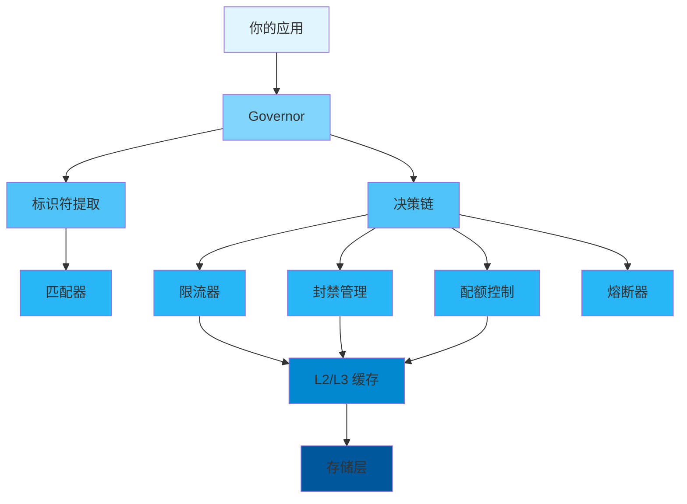

<div align="center">

# 📖 用户指南

### Limiteron 完整使用指南

[🏠 首页](../README.md) • [📚 文档](README.md) • [🎯 示例](../examples/) • [❓ 常见问题](FAQ.md)

---

</div>

## 📋 目录

- [简介](#简介)
- [快速开始](#快速开始)
  - [前置要求](#前置要求)
  - [安装](#安装)
  - [第一步](#第一步)
- [核心概念](#核心概念)
- [基本使用](#基本使用)
  - [初始化](#初始化)
  - [配置](#配置)
  - [基本操作](#基本操作)
- [高级使用](#高级使用)
  - [自定义配置](#自定义配置)
  - [性能调优](#性能调优)
  - [错误处理](#错误处理)
- [最佳实践](#最佳实践)
- [常见模式](#常见模式)
- [故障排除](#故障排除)
- [下一步](#下一步)

---

## 简介

<div align="center">

### 🎯 你将学到什么

</div>

<table>
<tr>
<td width="25%" align="center">
<br>
<b>快速开始</b><br>
5 分钟上手
</td>
<td width="25%" align="center">
<br>
<b>配置</b><br>
自定义配置
</td>
<td width="25%" align="center">
<br>
<b>最佳实践</b><br>
学习正确的方法
</td>
<td width="25%" align="center">
<br>
<b>高级主题</b><br>
掌握细节
</td>
</tr>
</table>

**Limiteron** 是一个 Rust 统一流量控制框架，帮助你保护应用免受滥用和 DDoS 攻击。本指南将带你从基础设置到高级使用模式。

> 💡 **提示**: 本指南假设你具备基本的 Rust 知识。如果你是 Rust 新手，建议先学习 Rust 基础语法。

---

## 快速开始

### 前置要求

在开始之前，确保你已安装以下内容：

<table>
<tr>
<td width="50%">

**必需**
- ✅ Rust 1.75+ (stable)
- ✅ Cargo (随 Rust 一起安装)
- ✅ Git

</td>
<td width="50%">

**可选**
- 🔧 支持 Rust 的 IDE
- 🔧 Docker（用于容器化部署）
- 🔧 PostgreSQL（用于持久化存储）
- 🔧 Redis（用于缓存，通过 oxcache 集成）

</td>
</tr>
</table>

<details>
<summary><b>🔍 验证你的安装</b></summary>

```bash
# 检查 Rust 版本
rustc --version
# 预期: rustc 1.75.0 (或更高)

# 检查 Cargo 版本
cargo --version
# 预期: cargo 1.75.0 (或更高)

# 检查 Git 版本
git --version
# 预期: git version 2.x.x
```

</details>

### 安装

<div align="center">

#### 选择你的安装方法

</div>

<table>
<tr>
<td width="50%">

**📦 使用 Cargo（推荐）**

```bash
# 添加到 Cargo.toml
[dependencies]
limiteron = { version = "0.3", features = ["macros"] }

# 或通过命令安装
cargo add limiteron --features macros
```

</td>
<td width="50%">

**🐙 从源码安装**

```bash
git clone https://github.com/kirkyx/limiteron
cd limiteron
cargo build --release
```

</td>
</tr>
</table>

<details>
<summary><b>🌐 其他安装方法</b></summary>

**启用特性**
```toml
[dependencies]
limiteron = { version = "0.3", features = ["postgres", "ban-manager"] }
```

**本地开发**
```bash
# 使用本地版本
[dependencies]
limiteron = { path = "/path/to/limiteron" }
```

</details>

### 第一步

让我们用一个简单的 "Hello World" 来验证你的安装：

```rust
use limiteron::limiters::{Limiter, TokenBucketLimiter};

#[tokio::main]
async fn main() -> Result<(), Box<dyn std::error::Error>> {
    // 创建限流器
    let limiter = TokenBucketLimiter::new(10, 1);

    // 检查限流
    match limiter.allow(1).await {
        Ok(true) => println!("✅ Limiteron 已就绪！"),
        Ok(false) => println!("❌ 请求被限流"),
        Err(e) => println!("❌ 错误: {:?}", e),
    }

    Ok(())
}
```

<details>
<summary><b>🎬 运行示例</b></summary>

```bash
# 创建新项目
cargo new hello-limiteron
cd hello-limiteron

# 添加依赖
cargo add limiteron --features macros

# 将上面的代码复制到 src/main.rs

# 运行！
cargo run
```

**预期输出:**
```
✅ Limiteron 已就绪！
```

</details>

---

## 核心概念

理解这些核心概念将帮助你有效地使用这个库。

<div align="center">

### 🧩 关键组件

</div>


```mermaid
graph TD
    A[你的应用] --> B[Governor]
    B --> C[标识符提取]
    B --> D[决策链]
    C --> E[匹配器]
    D --> F[限流器]
    D --> G[封禁管理]
    D --> H[配额控制]
    D --> I[熔断器]
    F --> J[L2/L3 缓存]
    G --> J
    H --> J
    J --> K[存储层]

    style A fill:#e1f5ff
    style B fill:#81d4fa
    style C fill:#4fc3f7
    style D fill:#4fc3f7
    style E fill:#29b6f6
    style F fill:#29b6f6
    style G fill:#29b6f6
    style H fill:#29b6f6
    style I fill:#29b6f6
    style J fill:#0288d1
    style K fill:#01579b
```

### 1️⃣ 限流器

**是什么**: 控制请求速率的组件。

**为什么重要**: 保护服务免受滥用和 DDoS 攻击。

**示例:**
```rust
use limiteron::limiters::TokenBucketLimiter;

let limiter = TokenBucketLimiter::new(10, 1); // 10 个令牌，每秒补充 1 个
limiter.check("user123").await?;
```

<details>
<summary><b>📚 了解更多</b></summary>

详细说明：
- **令牌桶**: 桶中固定数量的令牌，请求消耗令牌，定期补充
- **固定窗口**: 在固定时间窗口内限制请求数
- **滑动窗口**: 使用滑动时间窗口提供更精确的限流
- **并发控制**: 限制同时处理的请求数

</details>

### 2️⃣ 封禁管理

**是什么**: 管理恶意用户和 IP 的封禁。

**关键特性:**
- ✅ IP 封禁
- ✅ 用户封禁
- ✅ MAC 封禁
- ✅ Geo 地理位置封禁（按国家代码，ISO 3166-1 alpha-2）
- ✅ 自动封禁
- ✅ 封禁优先级
- ✅ 从 YAML 文件批量加载（支持热重载）

**示例:**
```rust
use limiteron::ban::{BanManager, BanManagerConfig, BanTarget, BanSource};
use limiteron::adapters::StorageFactory;
use std::sync::Arc;
use std::time::Duration;

let mut factory = StorageFactory::from_dsn("postgresql://localhost/limiteron");
factory.initialize(None).await?;
let ban_storage = factory.create_ban_storage().await?;
let ban_manager = BanManager::with_dependencies(ban_storage, BanManagerConfig::default()).await?;

// IP 封禁
let ip_target = BanTarget::Ip("192.168.1.100".to_string());
ban_manager.create_ban(
    ip_target,
    "恶意请求".to_string(),
    BanSource::Manual { operator: "admin".to_string() },
    serde_json::json!({}),
    Some(Duration::from_secs(3600)),
).await?;

// Geo 地理位置封禁（按国家代码）
let geo_target = BanTarget::Geo { country_code: "CN".to_string() };
ban_manager.create_ban(
    geo_target,
    "地区封禁".to_string(),
    BanSource::Manual { operator: "admin".to_string() },
    serde_json::json!({}),
    None, // 使用退避算法自动计算时长
).await?;
```

<details>
<summary><b>📚 BanTarget 类型详解</b></summary>

`BanTarget` 支持 4 种封禁目标类型，serde 序列化格式为 `{"type":"...","value":...}`：

| 变体 | serde type | value 格式 | 示例 |
|------|-----------|-----------|------|
| `Ip(String)` | `"ip"` | IP 字符串 | `{"type":"ip","value":"192.168.1.1"}` |
| `UserId(String)` | `"user"` | 用户 ID | `{"type":"user","value":"user123"}` |
| `Mac(String)` | `"mac"` | MAC 地址 | `{"type":"mac","value":"00:1a:2b:3c:4d:5e"}` |
| `Geo { country_code }` | `"geo"` | 对象 | `{"type":"geo","value":{"country_code":"CN"}}` |

> **注意**: Geo 的 `country_code` 必须是大写 2 字母 ISO 3166-1 alpha-2 格式（如 `"CN"`、`"US"`），小写或非 2 字母会触发 `ValidationError`。

</details>

### 3️⃣ 配额控制

**是什么**: 在特定时间窗口内限制总请求数。

<table>
<tr>
<td width="50%">

**传统方法**
```rust
// 手动计数
let mut count = 0;
count += 1;
if count > limit {
    return Err("超过配额");
}
```

</td>
<td width="50%">

**我们的方法**
```rust
// 自动管理
use limiteron::quota::{QuotaController, QuotaConfig};

let config = QuotaConfig {
    limit: 10000,
    window_secs: 60,
    ..Default::default()
};
let quota = QuotaController::builder().with_config(config).build()?;
if let Err(e) = quota.consume("user123", "api_resource", 1).await {
    println!("配额消费失败: {}", e);
}
```

</td>
</tr>
</table>

---

## 基本使用

### 初始化

每个应用在使用前必须初始化限流器：

```rust
use limiteron::limiters::TokenBucketLimiter;

#[tokio::main]
async fn main() -> Result<(), Box<dyn std::error::Error>> {
    // 简单初始化
    let limiter = TokenBucketLimiter::new(10, 1);

    // 或使用 Governor（推荐使用 builder 模式）
    use limiteron::{Governor, FlowControlConfig};
    use limiteron::adapters::StorageFactory;
    use std::sync::Arc;

    let mut factory = StorageFactory::from_dsn("postgresql://localhost/limiteron");
    factory.initialize(None).await?;
    let storage = factory.create_storage().await?;
    let ban_storage = factory.create_ban_storage().await?;

    let governor = Governor::builder()
        .with_storage(storage)
        .with_ban_storage(ban_storage)
        .build()
        .await?;

    Ok(())
}
```

<div align="center">

| 方法 | 使用场景 | 性能 | 复杂度 |
|--------|----------|-------------|------------|
| `TokenBucketLimiter` | 快速开始，开发 | ⚡ 快 | 🟢 简单 |
| `Governor` | 生产，自定义需求 | ⚡⚡ 优化 | 🟡 中等 |

</div>

### 配置

<details open>
<summary><b>⚙️ 配置选项</b></summary>

```rust
use limiteron::{Governor, FlowControlConfig, ConfigBuilder};

// 使用 ConfigBuilder 创建配置
let config = ConfigBuilder::new()
    .with_storage("memory")
    .with_rule(|rule| {
        rule.id("default")
            .token_bucket(100, 10)
})
    .build()?;

// 创建存储
let mut factory = StorageFactory::from_dsn("postgresql://localhost/limiteron");
factory.initialize(None).await?;
let storage = factory.create_storage().await?;
let ban_storage = factory.create_ban_storage().await?;

// 创建 Governor
let governor = Governor::builder()
    .with_config(config)
    .with_storage(storage)
    .with_ban_storage(ban_storage)
    .build()
    .await?;
```

</details>

<table>
<tr>
<th>选项</th>
<th>类型</th>
<th>默认值</th>
<th>描述</th>
</tr>
<tr>
<td><code>version</code></td>
<td>String</td>
<td>"0.1.0"</td>
<td>配置版本号</td>
</tr>
<tr>
<td><code>global.storage</code></td>
<td>String</td>
<td>"memory"</td>
<td>存储类型 (memory/postgres)</td>
</tr>
<tr>
<td><code>global.cache</code></td>
<td>String</td>
<td>"memory"</td>
<td>缓存类型 (memory/redis/none)</td>
</tr>
<tr>
<td><code>rules</code></td>
<td>Vec&lt;Rule&gt;</td>
<td>[]</td>
<td>限流规则列表</td>
</tr>
</table>

### 基本操作

<div align="center">

#### 📝 限流操作

</div>

<table>
<tr>
<td width="50%">

**检查限流**
```rust
let limiter = TokenBucketLimiter::new(10, 1);
match limiter.allow(1).await {
    Ok(true) => println!("✅ 允许"),
    Ok(false) => println!("❌ 拒绝"),
    Err(e) => println!("❌ 错误: {:?}", e),
}
```

**封禁用户**
```rust
use limiteron::ban::{BanManager, BanManagerConfig, BanTarget, BanSource};
use limiteron::adapters::StorageFactory;
use std::sync::Arc;
use std::time::Duration;

let mut factory = StorageFactory::from_dsn("postgresql://localhost/limiteron");
factory.initialize(None).await?;
let ban_storage = factory.create_ban_storage().await?;
let ban_manager = BanManager::with_dependencies(ban_storage, BanManagerConfig::default()).await?;
let target = BanTarget::UserId("user123".to_string());
ban_manager.create_ban(
    target,
    "恶意".to_string(),
    BanSource::Manual { operator: "admin".to_string() },
    serde_json::json!({}),
    Some(Duration::from_secs(3600)),
).await?;
```

</td>
<td width="50%">

**配额消费**
```rust
use limiteron::quota::{QuotaController, QuotaConfig};

let config = QuotaConfig::default();
let quota = QuotaController::builder().with_config(config).build()?;
quota.consume("user123", "api_resource", 1).await?;
```

**熔断检查**
```rust
use limiteron::circuit::{CircuitBreaker, CircuitBreakerConfig};

let breaker = CircuitBreaker::new(CircuitBreakerConfig::default());
let state = breaker.get_state().await;
```

</td>
</tr>
</table>

<details>
<summary><b>🎯 完整示例</b></summary>

```rust
use limiteron::{Governor, FlowControlConfig, Decision};
use limiteron::adapters::StorageFactory;
use limiteron::matchers::RequestContext;

#[tokio::main]
async fn main() -> Result<(), Box<dyn std::error::Error>> {
    // 创建存储
    let mut factory = StorageFactory::from_dsn("postgresql://localhost/limiteron");
    factory.initialize(None).await?;
    let storage = factory.create_storage().await?;
    let ban_storage = factory.create_ban_storage().await?;

    // 创建 Governor
    let governor = Governor::builder()
        .with_storage(storage)
        .with_ban_storage(ban_storage)
        .build()
        .await?;

    // 检查请求
    let context = RequestContext::builder()
        .identifier("user123")
        .path("/api/v1/users")
        .method("GET")
        .build();

    let decision = governor.check(&context).await?;
    match decision {
        Decision::Allowed(_) => {
            println!("✅ 请求允许");
            // 处理请求
        }
        Decision::Rejected(reason) => {
            println!("❌ 请求被拒绝: {}", reason);
        }
        Decision::Banned(info) => {
            println!("❌ 请求被封禁: {}", info.reason());
        }
    }

    Ok(())
}
```

</details>

---

## 高级使用

### 自定义配置

对于生产环境，你需要细粒度的控制：

```rust
use limiteron::{Governor, FlowControlConfig, ConfigBuilder};
use limiteron::adapters::StorageFactory;
use std::sync::Arc;

// 使用 ConfigBuilder 创建配置
let config = ConfigBuilder::new()
    .with_storage("memory")
    .with_rule(|rule| {
        rule.id("api_rate_limit")
            .name("API Rate Limit")
            .priority(100)
            .token_bucket(100, 10)
    })
    .build()?;

// 创建存储
let mut factory = StorageFactory::from_dsn("postgresql://localhost/limiteron");
factory.initialize(None).await?;
let storage = factory.create_storage().await?;
let ban_storage = factory.create_ban_storage().await?;

// 创建 Governor
let governor = Governor::builder()
    .with_config(config)
    .with_storage(storage)
    .with_ban_storage(ban_storage)
    .build()
    .await?;
```

<details>
<summary><b>🎛️ 性能配置</b></summary>

<table>
<tr>
<th>配置</th>
<th>使用场景</th>
<th>吞吐量</th>
<th>延迟</th>
<th>内存</th>
</tr>
<tr>
<td><b>低延迟</b></td>
<td>实时应用</td>
<td>中等</td>
<td>⚡ 非常低</td>
<td>高</td>
</tr>
<tr>
<td><b>高吞吐</b></td>
<td>批处理</td>
<td>⚡ 非常高</td>
<td>中等</td>
<td>中等</td>
</tr>
<tr>
<td><b>平衡</b></td>
<td>通用</td>
<td>高</td>
<td>低</td>
<td>中等</td>
</tr>
<tr>
<td><b>低内存</b></td>
<td>资源受限</td>
<td>低</td>
<td>中等</td>
<td>⚡ 非常低</td>
</tr>
</table>

</details>

### 性能调优

<div align="center">

#### ⚡ 优化策略

</div>

**1. 使用缓存**

```rust
use limiteron::L1Cache;

let cache = L2Cache::new(10000, 3600)?;
// 缓存会自动提高性能
```

**2. 批量操作**

<table>
<tr>
<td width="50%">

❌ **低效**
```rust
for item in items {
    limiter.check(&item.id).await?;
}
```

</td>
<td width="50%">

✅ **高效**
```rust
// 使用共享的 limiter 实例
for item in items {
    limiter.check(&item.id).await?;
}
```

</td>
</tr>
</table>

**3. 使用宏**

```rust
use limiteron::flow_control;

#[flow_control(rate = "100/s")]
async fn api_handler(user_id: &str) -> Result<String, LimiteronError> {
    // 宏自动处理限流
    Ok("Success".to_string())
}
```

### 性能基准

> **测试环境**: Linux WSL2, Release 优化模式
> **测试时间**: 2026-01-19

#### 吞吐量测试

| 限流器类型 | 吞吐量 | 目标 | 达标率 |
|-----------|--------|------|--------|
| TokenBucket | **12M+ ops/s** | 500K ops/s | ✅ 24x |
| FixedWindow | **20M+ ops/s** | 300K ops/s | ✅ 66x |
| ConcurrencyLimiter | **12M+ ops/s** | 200K ops/s | ✅ 60x |

#### 延迟测试

| 指标 | TokenBucket | FixedWindow |
|------|-------------|-------------|
| P50 延迟 | < 100ns | < 100ns |
| P95 延迟 | < 200ns | < 150ns |
| P99 延迟 | < 1µs | < 500ns |

#### 并发测试

| 测试项目 | 结果 | 状态 |
|---------|------|------|
| 串行 vs 并发一致性 | 差异 0 | ✅ 通过 |
| 高并发稳定性 | 50/100 并发 | ✅ 通过 |
| 限流正确性 | 100% 一致 | ✅ 通过 |

#### 内存使用

| 组件 | 内存占用 | 说明 |
|------|----------|------|
| TokenBucket | ~1KB | 原子计数器 |
| L2Cache | ~10KB/万条 | 可配置容量 |
| MemoryStorage | ~5KB/万条 | HashMap 实现 |

<details>
<summary><b>📊 详细测试报告</b></summary>

```
功能测试结果:
  TokenBucket      - 通过 (3µs)
  SlidingWindow    - 通过 (2µs)
  FixedWindow      - 通过 (3µs)
  ConcurrencyLimiter - 通过 (51ms)
  L2Cache          - 通过 (107µs)
  MemoryStorage    - 通过 (8µs)
  CircuitBreaker   - 通过 (1.3s)

性能测试结果:
  TokenBucket      - 12,088,759 ops/s (目标: 500,000)
  FixedWindow      - 19,920,188 ops/s (目标: 300,000)
  ConcurrencyLimiter - 11,891,237 ops/s (目标: 200,000)

并发测试结果:
  串行执行         - 34,540,883 ops/s
  并发执行         - 17,646,145 ops/s
  加速比           - 0.51x
  数据一致性       - 100%
```

</details>

### 错误处理

<div align="center">

#### 🚨 优雅地处理错误

</div>

```rust
use limiteron::error::LimiteronError;

async fn handle_request() -> Result<(), LimiteronError> {
    match limiter.allow(1).await {
        Ok(true) => {
            println!("✅ 请求允许");
            Ok(())
        }
        Ok(false) => {
            println!("⚠️ 请求被限流");
            Ok(())
        }
        Err(LimiteronError::LimitError(msg)) => {
            println!("⚠️ 限流错误: {}", msg);
            Ok(())
        }
        Err(LimiteronError::BanError(msg)) => {
            eprintln!("❌ 已封禁: {}", msg);
            Err(LimiteronError::BanError(msg))
        }
        Err(e) => {
            eprintln!("❌ 错误: {:?}", e);
            Err(e)
        }
    }
}
```

<details>
<summary><b>📋 错误类型</b></summary>

| 错误类型 | 描述 | 恢复策略 |
|------------|-------------|-------------------|
| `LimitError` | 限流错误 | 等待重试 |
| `RateLimitExceeded` | 超过速率限制 | 等待重试 |
| `QuotaExceeded` | 超过配额限制 | 等待下一个时间窗口 |
| `BanError` | 已被封禁 | 联系管理员 |
| `CircuitBreakerError` | 熔断器已打开 | 等待恢复 |
| `ValidationError` | 无效输入 | 验证输入 |
| `ConfigError` | 配置错误 | 检查配置 |

</details>

---

## 最佳实践

<div align="center">

### 🌟 遵循这些指南

</div>

### ✅ DO's

<table>
<tr>
<td width="50%">

**尽早初始化**
```rust
use limiteron::Governor;
use limiteron::adapters::StorageFactory;

#[tokio::main]
async fn main() {
    // 在开始时初始化存储
    let mut factory = StorageFactory::from_dsn("postgresql://localhost/limiteron");
    factory.initialize(None).await.unwrap();
    let storage = factory.create_storage().await.unwrap();
    let ban_storage = factory.create_ban_storage().await.unwrap();

    // 创建 Governor
    let governor = Governor::builder()
        .with_storage(storage)
        .with_ban_storage(ban_storage)
        .build()
        .await
        .unwrap();

    // 然后使用
    do_work(governor).await;
}
```

</td>
<td width="50%">

**使用全局实例**
```rust
// 确保所有请求共享同一个 limiter 实例
lazy_static! {
    static ref LIMITER: TokenBucketLimiter = TokenBucketLimiter::new(10, 1);
}
```

</td>
</tr>
<tr>
<td width="50%">

**正确处理错误**
```rust
match limiter.check(key).await {
    Ok(_) => process(),
    Err(e) => handle_error(e),
}
```

</td>
<td width="50%">

**使用宏简化代码**
```rust
#[flow_control(rate = "100/s")]
async fn api_handler() -> Result<String, LimiteronError> {
    // 宏自动处理限流
    Ok("Success".to_string())
}
```

</td>
</tr>
</table>

### ❌ DON'Ts

<table>
<tr>
<td width="50%">

**不要忽略错误**
```rust
// ❌ 不好
let _ = limiter.check(key).await;

// ✅ 好
limiter.check(key).await?;
```

</td>
<td width="50%">

**不要在循环中创建 limiter**
```rust
// ❌ 不好
for request in requests {
    let limiter = TokenBucketLimiter::new(10, 1);
    limiter.check(key).await?;
}

// ✅ 好
let limiter = TokenBucketLimiter::new(10, 1);
for request in requests {
    limiter.check(key).await?;
}
```

</td>
</tr>
</table>

### 💡 提示和技巧

> **🔥 性能提示**: 在生产环境启用 release 模式优化:
> ```bash
> cargo build --release
> ```

> **🔒 安全提示**: 永远不要硬编码敏感数据:
> ```rust
> // ❌ 不好
> let redis_url = "redis://:password@localhost:6379";
>
> // ✅ 好
> let redis_url = env::var("REDIS_URL")?;
> ```

> **📊 监控提示**: 在生产环境启用指标:
> ```rust
> FlowControlConfig {
>     enable_metrics: true,
>     ..Default::default()
> }
> ```

---

## 常见模式

### 模式 1: API 保护

```rust
use limiteron::flow_control;

#[flow_control(rate = "100/s", quota = "10000/m")]
async fn api_handler(user_id: &str) -> Result<String, LimiteronError> {
    // API 业务逻辑
    Ok(format!("处理用户 {}", user_id))
}
```

### 模式 2: 从 YAML 文件批量加载封禁（BanFileLoader）

```rust
use limiteron::ban::{BanFileLoader, BanManager};

let ban_manager = BanManager::new().await?;
let loader = BanFileLoader::new("config/bans.yaml");

// 一次性加载（单条失败不中断整体加载）
let result = loader.load_once(&ban_manager).await?;
println!("加载成功 {} 条，失败 {} 条", result.success_count, result.failure_count);
for err in &result.errors {
    eprintln!("失败: {} - {}", err.target_desc, err.error);
}

// 启用文件变更热重载（需要 `config-watcher` feature，500ms debounce）
loader.start_watching(ban_manager.clone()).await?;

// 停止监听（也可通过 Drop 自动停止）
loader.stop_watching().await;
```

**YAML 文件格式** (`config/bans.yaml`)：

```yaml
bans:
  - target:
      type: ip
      value: "192.168.1.1"
    reason: "恶意请求"
    duration_secs: 3600  # 可选，null = 使用退避算法
  - target:
      type: geo
      value:
        country_code: "CN"
    reason: "地区封禁"
    # duration_secs 省略 = 使用退避算法自动计算
  - target:
      type: user
      value: "abuser123"
    reason: "滥用行为"
    duration_secs: null
```

> **安全提示**: BanFileLoader 内置 YAML 炸弹防护，文件大小上限 2MB，超限返回 `ConfigError`。

### 模式 3: 多级限流

```rust
use limiteron::decision_chain::DecisionChain;

let chain = DecisionChain::new()
    .add_limiter(rate_limiter)
    .add_limiter(quota_limiter)
    .add_limiter(concurrency_limiter);

let decision = chain.check(key).await?;
```

### 模式 4: 通过 Admin REST API 管理封禁

启用 `admin-api` feature 后，可通过 HTTP 端点管理封禁。所有端点需要 `Authorization: Bearer <api_key>` 头部认证。

**创建封禁** (`POST /api/v1/ban`)：

```bash
curl -X POST http://localhost:8080/api/v1/ban \
  -H "Authorization: Bearer your-api-key" \
  -H "Content-Type: application/json" \
  -d '{
    "target": {"type": "geo", "value": {"country_code": "CN"}},
    "reason": "地区封禁",
    "operator": "admin-alice",
    "duration_secs": 3600
  }'
# 成功返回 201 Created，body 包含 {id, ban_times, expires_at, is_manual}
```

支持的 target 类型：`ip` / `user` / `mac` / `geo`。`operator` 和 `duration_secs` 可选（省略时 `operator="admin-api"`，`duration_secs` 使用退避算法）。

**解除封禁** (`DELETE /api/v1/ban/{target}`)：

```bash
# 显式指定 type 解封 MAC/Geo 目标
curl -X DELETE "http://localhost:8080/api/v1/ban/CN?type=geo" \
  -H "Authorization: Bearer your-api-key" \
  -H "Content-Type: application/json" \
  -d '{"reason": "解封", "operator": "admin-alice"}'

# 不指定 type 时自动推断（IP 优先，回退 UserId）
curl -X DELETE "http://localhost:8080/api/v1/ban/192.168.1.1" \
  -H "Authorization: Bearer your-api-key"
```

`?type=` 支持 `ip` / `user` / `mac` / `geo`；未提供时按 IP 优先自动推断。

---

## 故障排除

<details>
<summary><b>❓ 问题: 限流不生效</b></summary>

**解决方案:**
```rust
// 确保使用全局共享的 limiter 实例
lazy_static! {
    static ref LIMITER: TokenBucketLimiter = TokenBucketLimiter::new(10, 1);
}

// 或使用宏
#[flow_control(rate = "10/s")]
async fn handler() -> Result<(), LimiteronError> {
    Ok(())
}
```

</details>

<details>
<summary><b>❓ 问题: 性能比预期慢</b></summary>

**诊断:**
1. 启用调试日志
2. 检查配置设置
3. 使用缓存

**解决方案:**
```rust
// 使用缓存
let cache = L2Cache::new(10000, 3600)?;
```

</details>

<details>
<summary><b>❓ 问题: 内存使用过高</b></summary>

**解决方案:**
```rust
// 减少缓存大小
let cache = L2Cache::new(1000, 3600)?;
```

</details>

<div align="center">

**💬 还需要帮助？** [创建 issue](../../issues)

</div>

---

## 下一步

<div align="center">

### 🎯 继续你的学习之旅

</div>

<table>
<tr>
<td width="33%" align="center">
<a href="../examples/">
<br>
<b>💻 示例</b>
</a><br>
实际代码示例
</td>
<td width="33%" align="center">
<a href="API_REFERENCE.md">
<br>
<b>📚 API 参考</b>
</a><br>
完整 API 文档
</td>
<td width="33%" align="center">
<a href="FAQ.md">
<br>
<b>❓ 常见问题</b>
</a><br>
常见问题解答
</td>
</tr>
</table>

---

<div align="center">

**[📖 API 参考](API_REFERENCE.md)** • **[❓ 常见问题](FAQ.md)** • **[🐛 报告问题](../../issues)**

由项目团队制作

[⬆ 返回顶部](#-用户指南)

</div>
