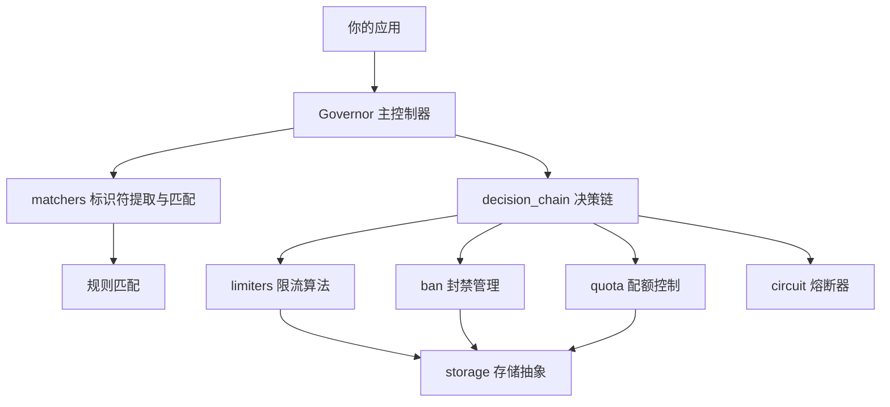

# 📖 Limiteron 用户指南

本指南是 Limiteron（Rust 统一流量控制框架）的完整使用教程，覆盖从安装、核心概念到进阶用法、最佳实践与故障排查的全部内容。快速概览请见 [README](../README.md)，API 细节请见 [API 参考](API_REFERENCE.md)。

[🏠 首页](../README.md) • [💻 示例](../examples/) • [❓ 常见问题](FAQ.md)

---

## 📋 目录

<details open>
<summary>📑 目录</summary>

- [✨ 简介](#-简介)
- [🚀 快速开始](#-快速开始)
  - [前置要求](#前置要求)
  - [安装](#安装)
  - [第一步](#第一步)
- [🧩 核心概念](#-核心概念)
- [📖 基本使用](#-基本使用)
  - [初始化](#初始化)
  - [配置](#配置)
  - [基本操作](#基本操作)
- [⚙️ 进阶使用](#️-进阶使用)
  - [程序化构建配置](#程序化构建配置)
  - [L1 负缓存调优](#l1-负缓存调优)
  - [性能基准](#性能基准)
  - [错误处理](#错误处理)
- [🌟 最佳实践](#-最佳实践)
- [🔁 常见模式](#-常见模式)
- [🔧 故障排除](#-故障排除)
- [🗺️ 下一步](#️-下一步)

</details>

---

## ✨ 简介

**Limiteron** 是一个 Rust 统一流量控制框架，帮助你保护应用免受滥用与突发流量冲击。本指南将带你从基础设置走到进阶使用模式。

| 你将学到 | 内容 |
|---------|------|
| 🚀 快速开始 | 5 分钟接入第一种限流器 |
| ⚙️ 配置 | 程序化构建与 TOML 文件两种方式 |
| 🌟 最佳实践 | 初始化、实例共享与错误处理 |
| 🔧 高级主题 | 决策链、文件封禁加载与 Admin API |

> 💡 **提示**：本指南假设你具备基本的 Rust 异步编程知识（`tokio`、`async/await`）。

---

## 🚀 快速开始

### 前置要求

在开始之前，确保你已安装以下内容：

| 类别 | 项目 |
|------|------|
| 必需 | Rust 1.97.1+（[rust-toolchain.toml](../rust-toolchain.toml) 统一锁定）、Cargo、Git |
| 可选 | 支持 Rust 的 IDE、Docker（容器化部署）、PostgreSQL / MySQL / SQLite（经 dbnexus 持久化存储）、Redis（经 oxcache 缓存集成） |

<details>
<summary><b>🔍 验证你的安装</b></summary>

```bash
# 检查 Rust 版本
rustc --version
# 预期: rustc 1.97.1 或更高

# 检查 Cargo 版本
cargo --version

# 检查 Git 版本
git --version
```

</details>

### 安装

```bash
cargo add limiteron --features macros
```

或在 `Cargo.toml` 中手动添加（版本与 [Cargo.toml](../Cargo.toml) 当前发布线一致）：

```toml
[dependencies]
limiteron = { version = "0.3.0-rc.3", features = ["macros"] }
```

<details>
<summary><b>🌐 其他安装方式</b></summary>

**按需启用特性**

```toml
[dependencies]
limiteron = { version = "0.3.0-rc.3", features = ["sqlite", "ban-manager"] }
```

> ⚠️ `postgres` / `sqlite` / `mysql` 三种存储驱动互斥，请勿使用 `--all-features`，应使用显式特性组合。默认特性为空（`default = []`），核心限流零外部存储依赖。

**本地路径依赖**

```toml
[dependencies]
limiteron = { path = "/path/to/limiteron" }
```

</details>

### 第一步

用一个最小示例验证安装（对应仓库示例 [`simple_rate_limit.rs`](../examples/src/bin/simple_rate_limit.rs)）：

```rust
use limiteron::limiters::{Limiter, TokenBucketLimiter};

#[tokio::main]
async fn main() -> Result<(), Box<dyn std::error::Error>> {
    // 容量 10，每秒补充 1 个令牌
    let limiter = TokenBucketLimiter::new(10, 1);

    match limiter.allow(1).await {
        Ok(true) => println!("✅ Limiteron 已就绪"),
        Ok(false) => println!("❌ 请求被限流"),
        Err(e) => println!("❌ 错误: {:?}", e),
    }

    Ok(())
}
```

<details>
<summary><b>🎬 运行步骤</b></summary>

```bash
# 创建新项目
cargo new hello-limiteron
cd hello-limiteron

# 添加依赖
cargo add limiteron

# 将上面的代码复制到 src/main.rs 后运行
cargo run
```

**预期输出:**

```text
✅ Limiteron 已就绪
```

</details>

---

## 🧩 核心概念

理解这些核心概念将帮助你有效地使用这个库。


```mermaid
flowchart TD
    APP["你的应用"] --> GV["Governor 主控制器"]
    GV --> ME["matchers 标识符提取与匹配"]
    GV --> DC["decision_chain 决策链"]
    ME --> RU["规则匹配"]
    DC --> LM["limiters 限流算法"]
    DC --> BN["ban 封禁管理"]
    DC --> QU["quota 配额控制"]
    DC --> CI["circuit 熔断器"]
    LM --> ST["storage 存储抽象"]
    BN --> ST
    QU --> ST
```

### 1️⃣ 限流器

**是什么**：控制请求速率的组件，全部实现统一的 `Limiter` trait。

**为什么重要**：以固定成本保护下游服务，是流量治理的第一道防线。

```rust
use limiteron::limiters::{Limiter, TokenBucketLimiter};

let limiter = TokenBucketLimiter::new(10, 1); // 10 个令牌，每秒补充 1 个
limiter.check("user123").await?;
```

<details>
<summary><b>📚 了解更多</b></summary>

`src/limiters/` 提供的限流算法：

| 算法 | 类型 | 适用场景 |
|------|------|---------|
| 令牌桶 | `TokenBucketLimiter` | 允许一定突发，长期速率受控 |
| 滑动窗口 | `SlidingWindowLimiter`（已弃用导出） | 精确窗口计数 |
| 分片滑动窗口 | `ShardedSlidingWindowLimiter` | 高并发下的精确窗口计数 |
| 固定窗口 | `FixedWindowLimiter` | 实现最简单、吞吐最高 |
| 并发控制 | `ConcurrencyLimiter` | 限制同时处理的请求数 |
| GCRA | `GcraLimiter`（`gcra` 特性） | 信元速率算法、平滑限流 |
| HTB 分层令牌桶 | `HierarchicalTokenBucket` | 父子带宽借用、分类限速 |
| AIMD 自适应 | `AdaptiveConcurrencyLimiter`（`adaptive-limiting` 特性） | 按延迟/错误率反馈调窗 |

</details>

### 2️⃣ 封禁管理

**是什么**：管理恶意用户、IP 与地区的封禁。

**关键特性：**

- IP / 用户 ID / MAC 目标封禁与 CIDR 网段封禁
- Geo 地理位置封禁（按国家代码，ISO 3166-1 alpha-2）
- 封禁优先级体系（IP 最高）
- 指数退避的自动封禁时长
- 从 YAML 文件批量加载，支持热重载（`config-watcher` 特性）

```rust
use limiteron::adapters::StorageFactory;
use limiteron::ban::{BanManager, BanManagerConfig, BanSource, BanTarget};
use std::time::Duration;

let mut factory = StorageFactory::from_dsn("postgresql://localhost/limiteron");
factory.initialize(None).await?;
let ban_storage = factory.create_ban_storage().await?;
let ban_manager = BanManager::with_dependencies(ban_storage, BanManagerConfig::default()).await?;

// IP 封禁
let ip_target = BanTarget::Ip("192.168.1.100".to_string());
ban_manager.create_ban(
    ip_target,
    "恶意请求".to_string(),
    BanSource::Manual { operator: "admin".to_string() },
    serde_json::json!({}),
    Some(Duration::from_secs(3600)),
).await?;

// Geo 地理位置封禁（按国家代码）
let geo_target = BanTarget::Geo { country_code: "CN".to_string() };
ban_manager.create_ban(
    geo_target,
    "地区封禁".to_string(),
    BanSource::Manual { operator: "admin".to_string() },
    serde_json::json!({}),
    None, // None 表示使用退避算法自动计算时长
).await?;
```

<details>
<summary><b>📚 BanTarget 类型详解</b></summary>

`BanTarget` 支持 5 种封禁目标变体，serde 序列化格式为 `{"type":"...","value":...}`：

| 变体 | serde type | value 格式 | 示例 |
|------|-----------|-----------|------|
| `Ip(String)` | `"ip"` | IP 字符串 | `{"type":"ip","value":"192.168.1.1"}` |
| `UserId(String)` | `"user"` | 用户 ID | `{"type":"user","value":"user123"}` |
| `Mac(String)` | `"mac"` | MAC 地址 | `{"type":"mac","value":"00:1a:2b:3c:4d:5e"}` |
| `Geo { country_code }` | `"geo"` | 对象 | `{"type":"geo","value":{"country_code":"CN"}}` |
| `Cidr(String)` | `"cidr"` | 网段字符串 | `{"type":"cidr","value":"10.0.0.0/8"}` |

> **注意**：Geo 的 `country_code` 必须是大写 2 字母 ISO 3166-1 alpha-2 格式（如 `"CN"`、`"US"`），小写或非 2 字母会触发 `ValidationError`。CIDR 查询语义：IP 精确未命中时按最长前缀匹配网段封禁记录。

</details>

### 3️⃣ 配额控制

**是什么**：在特定时间窗口内限制总消耗量。

```rust
use limiteron::quota::{QuotaConfig, QuotaController};

let config = QuotaConfig {
    limit: 10000,
    window_size: 60, // 窗口大小（秒）
    ..Default::default()
};
let quota = QuotaController::builder().with_config(config).build()?;

match quota.consume("user123", "api_resource", 1).await {
    Ok(result) => println!("剩余配额: {}", result.remaining),
    Err(e) => println!("配额消费失败: {}", e),
}
```

---

## 📖 基本使用

### 初始化

每个应用在使用前需要初始化存储与 Governor：

```rust
use limiteron::Governor;
use limiteron::adapters::StorageFactory;

#[tokio::main]
async fn main() -> Result<(), Box<dyn std::error::Error>> {
    // 方式一：极简初始化（默认内存存储，开箱即用）
    let governor = Governor::new().await?;

    // 方式二：builder 模式，注入持久化存储
    let mut factory = StorageFactory::from_dsn("postgresql://localhost/limiteron");
    factory.initialize(None).await?;
    let storage = factory.create_storage().await?;
    let ban_storage = factory.create_ban_storage().await?;

    let governor = Governor::builder()
        .with_storage(storage)
        .with_ban_storage(ban_storage)
        .build()
        .await?;

    Ok(())
}
```

| 方式 | 使用场景 | 复杂度 |
|------|---------|--------|
| `Governor::new()` | 快速开始、开发与测试 | 🟢 简单 |
| `Governor::builder()` | 生产环境、自定义存储与可观测组件 | 🟡 中等 |

### 配置

Limiteron 支持两种配置方式：**程序化构建**（`ConfigBuilder`）与 **TOML 文件加载**（`ConfigLoader`，支持环境变量覆盖，见 [API 参考](API_REFERENCE.md#配置加载)）。

```rust
use limiteron::config::{ConfigBuilder, StorageType};

// 程序化构建：至少一条规则，且规则需包含匹配器与限流器
let config = ConfigBuilder::new()
    .with_storage(StorageType::Memory)
    .with_rule(|rule| {
        rule.id("api_limit")
            .name("API 限流")
            .priority(100)
            .user_matcher(vec!["user123".to_string()])
            .token_bucket(100, 10)
    })
    .build()?;

// 构建后可通过 Governor::builder().with_config(config) 注入
```

<details>
<summary><b>⚙️ 配置文件核心字段</b></summary>

| 字段 | 类型 | 默认值 | 描述 |
|------|------|--------|------|
| `version` | String | `"0.1.0"` | 配置版本号 |
| `global.storage` | `StorageType` | `Memory` | 存储后端（memory / postgresql / redis） |
| `global.cache` | `CacheBackend` | `Memory` | 缓存后端（memory / redis / none） |
| `global.metrics` | `MetricsBackend` | `Prometheus` | 指标后端（prometheus / statsd / none） |
| `global.trusted_proxies` | `TrustedProxyConfig` | 关闭 | 可信代理配置（安全提取客户端 IP） |
| `rules` | `Vec<Rule>` | `[]` | 限流规则列表（每条含 id / name / priority / matchers / limiters） |

</details>

### 基本操作

| 操作 | 入口 | 说明 |
|------|------|------|
| 限流检查 | `Limiter::allow(cost)` | 消费令牌/额度，返回布尔决策 |
| 请求上下文检查 | `Governor::check(&RequestContext)` | 标识符提取、规则匹配与级联决策 |
| 封禁管理 | `BanManager::create_ban` / `is_banned` / `delete_ban` | 封禁生命周期 |
| 配额消费 | `QuotaController::consume` | 按用户与资源消费配额 |
| 熔断状态 | `CircuitBreaker::get_state()` | 查询熔断器当前状态 |

```rust
// 限流检查
let limiter = TokenBucketLimiter::new(10, 1);
match limiter.allow(1).await {
    Ok(true) => println!("✅ 允许"),
    Ok(false) => println!("❌ 拒绝"),
    Err(e) => println!("❌ 错误: {:?}", e),
}
```

```rust
// 封禁用户
ban_manager.delete_ban(&BanTarget::UserId("user123".to_string()), "admin".to_string()).await?;
```

```rust
// 配额消费
quota.consume("user123", "api_resource", 1).await?;
```

```rust
// 熔断状态
let state = breaker.get_state().await;
println!("熔断器状态: {:?}", state);
```

<details>
<summary><b>🎯 完整示例：Governor 决策</b></summary>

```rust
use limiteron::adapters::StorageFactory;
use limiteron::error::Decision;
use limiteron::matchers::RequestContext;

#[tokio::main]
async fn main() -> Result<(), Box<dyn std::error::Error>> {
    let mut factory = StorageFactory::from_dsn("postgresql://localhost/limiteron");
    factory.initialize(None).await?;
    let storage = factory.create_storage().await?;
    let ban_storage = factory.create_ban_storage().await?;

    let governor = Governor::builder()
        .with_storage(storage)
        .with_ban_storage(ban_storage)
        .build()
        .await?;

    // 构造请求上下文（标识符经 header 提取）
    let context = RequestContext::new()
        .with_header("X-User-Id", "user123")
        .with_path("/api/v1/users")
        .with_method("GET");

    let decision = governor.check(&context).await?;
    match decision {
        Decision::Allowed(meta) => {
            println!("✅ 请求允许，剩余: {}", meta.remaining);
        }
        Decision::Rejected(meta) => {
            println!("❌ 请求被拒绝: {}，{} 秒后重试", meta.reason, meta.retry_after);
        }
        Decision::Banned(info) => {
            println!("❌ 请求被封禁: {}", info.reason());
        }
    }

    Ok(())
}
```

</details>

---

## ⚙️ 进阶使用

### 程序化构建配置

生产环境中规则通常由 TOML 文件加载（`ConfigLoader::load_from_file_with_env` 支持环境变量覆盖），动态场景下也可以程序化构建后经 `Governor::builder().with_config(...)` 注入，或通过 `POST /api/v1/config` 热更新（见 [API 参考](API_REFERENCE.md#admin-rest-api)）。

<details>
<summary><b>🎛️ 性能配置取舍</b></summary>

| 取向 | 使用场景 | 吞吐量 | 延迟 | 内存 |
|------|---------|--------|------|------|
| 低延迟 | 实时应用 | 中等 | ⚡ 非常低 | 高 |
| 高吞吐 | 批处理 | ⚡ 非常高 | 中等 | 中等 |
| 平衡 | 通用 | 高 | 低 | 中等 |
| 低内存 | 资源受限 | 低 | 中等 | ⚡ 非常低 |

</details>

### L1 负缓存调优

Governor 内置 L1 负缓存：**仅缓存拒绝/封禁决策**，"允许"决策永不入缓存，任何请求都必须真实执行限流与封禁检查。缓存行为可通过 builder 调整：

```rust
use limiteron::l1_cache::L1CacheConfig;
use limiteron::Governor;
use std::time::Duration;

let governor = Governor::builder()
    .with_l1_cache_enabled(true)
    // 默认 TTL 60 秒，最大 1000 条
    .with_l1_cache_config(L1CacheConfig::new(Duration::from_secs(60), 1000))
    .build()
    .await?;
```

减少缓存条目上限即可降低缓存内存占用。

### 性能基准

> **测试环境**：Linux WSL2，Release 优化模式；**测试时间**：2026-01-19。

#### 吞吐量测试

| 限流器类型 | 吞吐量 | 目标 | 达标率 |
|-----------|--------|------|--------|
| TokenBucket | **12M+ ops/s** | 500K ops/s | ✅ 24x |
| FixedWindow | **20M+ ops/s** | 300K ops/s | ✅ 66x |
| ConcurrencyLimiter | **12M+ ops/s** | 200K ops/s | ✅ 60x |

#### 延迟测试

| 指标 | TokenBucket | FixedWindow |
|------|-------------|-------------|
| P50 延迟 | < 100ns | < 100ns |
| P95 延迟 | < 200ns | < 150ns |
| P99 延迟 | < 1µs | < 500ns |

#### 并发测试

| 测试项目 | 结果 | 状态 |
|---------|------|------|
| 串行 vs 并发一致性 | 差异 0 | ✅ 通过 |
| 高并发稳定性 | 50/100 并发 | ✅ 通过 |
| 限流正确性 | 100% 一致 | ✅ 通过 |

<details>
<summary><b>📊 详细测试数据</b></summary>

```text
功能测试结果:
  TokenBucket        - 通过 (3µs)
  SlidingWindow      - 通过 (2µs)
  FixedWindow        - 通过 (3µs)
  ConcurrencyLimiter - 通过 (51ms)
  MemoryStorage      - 通过 (8µs)
  CircuitBreaker     - 通过 (1.3s)

性能测试结果:
  TokenBucket        - 12,088,759 ops/s (目标: 500,000)
  FixedWindow        - 19,920,188 ops/s (目标: 300,000)
  ConcurrencyLimiter - 11,891,237 ops/s (目标: 200,000)

并发测试结果:
  串行执行           - 34,540,883 ops/s
  并发执行           - 17,646,145 ops/s
  数据一致性         - 100%
```

</details>

复现方式：`cargo bench --features full`（基准设施见 [README](../README.md#-性能)）。

### 错误处理

```rust
use limiteron::error::LimiteronError;

async fn handle_request(limiter: &limiteron::limiters::TokenBucketLimiter) {
    match limiter.allow(1).await {
        Ok(true) => println!("✅ 请求允许"),
        Ok(false) => println!("⚠️ 请求被限流"),
        Err(LimiteronError::LimitError(msg)) => {
            println!("⚠️ 限流错误: {}", msg);
        }
        Err(LimiteronError::BanError(msg)) => {
            eprintln!("❌ 已封禁: {}", msg);
        }
        Err(e) => {
            eprintln!("❌ 错误: {:?}", e);
        }
    }
}
```

<details>
<summary><b>📋 常用错误类型</b></summary>

| 错误类型 | 描述 | 恢复策略 |
|----------|------|---------|
| `LimitError` | 限流错误 | 等待重试 |
| `RateLimitExceeded` | 超过速率限制 | 等待重试 |
| `QuotaExceeded` | 超过配额限制 | 等待下一个时间窗口 |
| `ConcurrencyLimitExceeded` | 超过并发限制 | 等待占用释放 |
| `Throttled` | 宏 throttle 排队超时 | 稍后重试 |
| `BanError` | 已被封禁 | 联系管理员 |
| `CircuitBreakerError` | 熔断器已打开 | 等待恢复 |
| `ValidationError` | 无效输入 | 修正输入 |
| `ConfigError` | 配置错误 | 检查配置 |

完整变体列表见 [API 参考](API_REFERENCE.md#错误处理)。

</details>

---

## 🌟 最佳实践

### ✅ 推荐做法

| 做法 | 说明 |
|------|------|
| **尽早初始化** | 在应用启动时创建存储与 Governor，避免请求路径上的冷启动开销 |
| **共享限流器实例** | 所有限流器与 Governor 均为 `Send + Sync`，应跨请求复用同一实例；在循环内新建实例会使限流失效 |
| **正确处理错误** | `allow()` 返回 `Ok(false)` 表示被限流，应返回 429 类响应而非静默吞掉 |
| **使用宏简化接入** | `#[flow_control]` 声明式宏自动生成限流包装代码 |

```rust
// 使用 LazyLock 保证全局共享同一限流器实例
use limiteron::limiters::TokenBucketLimiter;
use std::sync::LazyLock;

static LIMITER: LazyLock<TokenBucketLimiter> = LazyLock::new(|| TokenBucketLimiter::new(10, 1));
```

```rust
use limiteron::flow_control;

#[flow_control(rate = "100/s")]
async fn api_handler(user_id: &str) -> Result<String, limiteron::error::LimiteronError> {
    // 宏自动处理限流
    Ok("Success".to_string())
}
```

### ❌ 避免做法

```rust
// ❌ 不好：忽略检查结果
let _ = limiter.check(key).await;

// ✅ 好：传播或显式处理
limiter.check(key).await?;
```

```rust
// ❌ 不好：循环内创建限流器，每次都是全新桶
for request in requests {
    let limiter = TokenBucketLimiter::new(10, 1);
    limiter.check(key).await?;
}

// ✅ 好：实例提到循环外
let limiter = TokenBucketLimiter::new(10, 1);
for request in requests {
    limiter.check(key).await?;
}
```

### 💡 提示和技巧

> **🔥 性能提示**：生产环境使用 release 模式构建。
>
> ```bash
> cargo build --release
> ```

> **🔒 安全提示**：不要在代码中硬编码数据库连接串或密钥，经环境变量注入；启用 `log-redaction` 与 `audit-log` 特性保护敏感数据。安全设计详见[安全文档](SECURITY.md)。

> **📊 监控提示**：启用 `monitoring` / `metrics` 特性后，Governor 的 allow / reject / ban 三点指标自动接入 Prometheus。

---

## 🔁 常见模式

### 模式 1：API 保护

```rust
use limiteron::flow_control;

#[flow_control(rate = "100/s", quota = "10000/m", concurrency = 50)]
async fn api_handler(user_id: &str) -> Result<String, limiteron::error::LimiteronError> {
    Ok(format!("处理用户 {}", user_id))
}
```

### 模式 2：从 YAML 文件批量加载封禁（BanFileLoader）

```rust
use limiteron::ban::{BanFileLoader, BanManager};

let mut ban_manager = BanManager::new().await?;
let loader = BanFileLoader::new("config/bans.yaml");

// 一次性加载（单条失败不中断整体加载）
let result = loader.load_once(&ban_manager).await?;
println!("加载成功 {} 条，失败 {} 条", result.success_count, result.failure_count);
for err in &result.errors {
    eprintln!("失败: {} - {}", err.target_desc, err.error);
}

// 启用文件变更热重载（需要 `config-watcher` 特性，500ms debounce）
loader.start_watching(ban_manager.clone()).await?;

// 停止监听（loader 被 drop 时也会自动停止）
loader.stop_watching().await;
```

**YAML 文件格式**（`config/bans.yaml`）：

```yaml
bans:
  - target:
      type: ip
      value: "192.168.1.1"
    reason: "恶意请求"
    duration_secs: 3600  # 可选，null = 使用退避算法
  - target:
      type: geo
      value:
        country_code: "CN"
    reason: "地区封禁"
    # duration_secs 省略 = 使用退避算法自动计算
  - target:
      type: user
      value: "abuser123"
    reason: "滥用行为"
    duration_secs: null
```

> **安全提示**：BanFileLoader 内置 YAML 炸弹防护，文件大小上限 2MB，超限返回 `ConfigError`。

### 模式 3：决策链组合多个限流器

```rust
use limiteron::decision_chain::{DecisionChain, DecisionNode};
use limiteron::limiters::TokenBucketLimiter;
use std::sync::Arc;

let rate_node = DecisionNode::with_dependencies(
    "rate".to_string(),
    "速率限制".to_string(),
    Arc::new(TokenBucketLimiter::new(100, 10)),
    100, // 优先级，数值越大越先检查
);
let quota_node = DecisionNode::with_dependencies(
    "quota".to_string(),
    "配额限制".to_string(),
    Arc::new(quota_limiter),
    90,
);

let chain = DecisionChain::builder()
    .add_node(rate_node)
    .add_node(quota_node)
    .build();

// 按优先级级联执行，任一节点拒绝即拒绝
let decision = chain.check().await?;
```

### 模式 4：通过 Admin REST API 管理封禁

启用 `admin-api` 特性后，可通过 HTTP 端点管理封禁。所有端点需要 `Authorization: Bearer <api_key>` 头部认证。

**创建封禁**（`POST /api/v1/ban`）：

```bash
curl -X POST http://localhost:8080/api/v1/ban \
  -H "Authorization: Bearer your-api-key" \
  -H "Content-Type: application/json" \
  -d '{
    "target": {"type": "geo", "value": {"country_code": "CN"}},
    "reason": "地区封禁",
    "operator": "admin-alice",
    "duration_secs": 3600
  }'
# 成功返回 201 Created，body 包含 {id, ban_times, expires_at, is_manual}
```

支持的 target 类型：`ip` / `user` / `mac` / `geo` / `cidr`。`operator` 与 `duration_secs` 可选（省略时 `operator="admin-api"`，`duration_secs` 走退避算法）。

**解除封禁**（`DELETE /api/v1/ban/{target}`）：

```bash
# 显式指定 type 解封 MAC/Geo 目标
curl -X DELETE "http://localhost:8080/api/v1/ban/CN?type=geo" \
  -H "Authorization: Bearer your-api-key" \
  -H "Content-Type: application/json" \
  -d '{"reason": "解封", "operator": "admin-alice"}'

# 不指定 type 时自动推断（合法 IP 优先，回退 UserId）
curl -X DELETE "http://localhost:8080/api/v1/ban/192.168.1.1" \
  -H "Authorization: Bearer your-api-key"
```

全部端点与状态码见 [API 参考](API_REFERENCE.md#admin-rest-api)。

---

## 🔧 故障排除

<details>
<summary><b>❓ 问题：限流不生效</b></summary>

**原因**：每次请求都创建了新的限流器实例，或限流器实例未跨请求共享。

**解决方案**：

```rust
use limiteron::limiters::TokenBucketLimiter;
use std::sync::LazyLock;

// 使用全局共享的 limiter 实例
static LIMITER: LazyLock<TokenBucketLimiter> = LazyLock::new(|| TokenBucketLimiter::new(10, 1));

// 或使用宏
use limiteron::flow_control;

#[flow_control(rate = "10/s")]
async fn handler() -> Result<(), limiteron::error::LimiteronError> {
    Ok(())
}
```

</details>

<details>
<summary><b>❓ 问题：性能比预期慢</b></summary>

**诊断步骤**：

1. 确认使用 release 模式运行（`cargo run --release`）
2. 检查是否为每个请求重建了限流器或存储实例
3. 检查存储后端：内存存储最快，持久化存储受网络与数据库影响

</details>

<details>
<summary><b>❓ 问题：内存使用过高</b></summary>

**解决方案**：

- 调低 L1 负缓存的条目上限（`L1CacheConfig::new` 的第二个参数）
- 限流器管理器自带 LRU 淘汰（容量 100,000 条），恶意 key 不会无限累积
- 持久化场景检查数据库连接池上限配置

</details>

**还需要帮助？** [创建 issue](https://github.com/Kirky-X/limiteron/issues) 或查阅[常见问题](FAQ.md)。

---

## 🗺️ 下一步

| 资源 | 说明 |
|------|------|
| [💻 示例](../examples/) | 21 个可运行示例，覆盖全部核心能力 |
| [📚 API 参考](API_REFERENCE.md) | 全部公开 API 的签名与语义 |
| [❓ 常见问题](FAQ.md) | 按主题汇总的问答 |
| [🏗️ 架构文档](ARCHITECTURE.md) | 设计理念、模块划分与扩展机制 |
| [🔒 安全文档](SECURITY.md) | 安全设计与漏洞报告流程 |

---

[🏠 返回首页](../README.md) • [📖 API 参考](API_REFERENCE.md) • [❓ 常见问题](FAQ.md)
